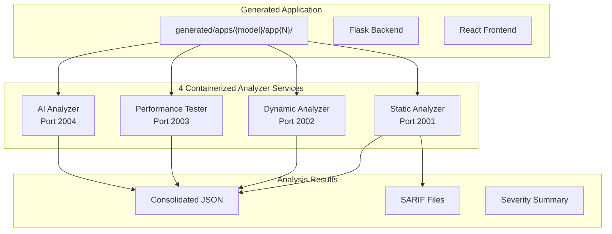
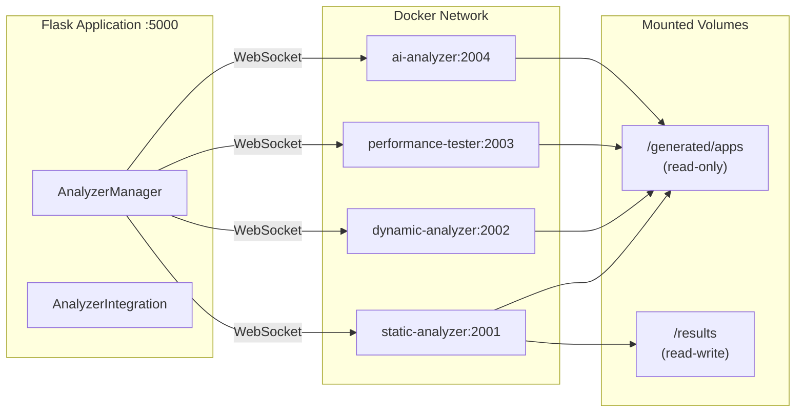
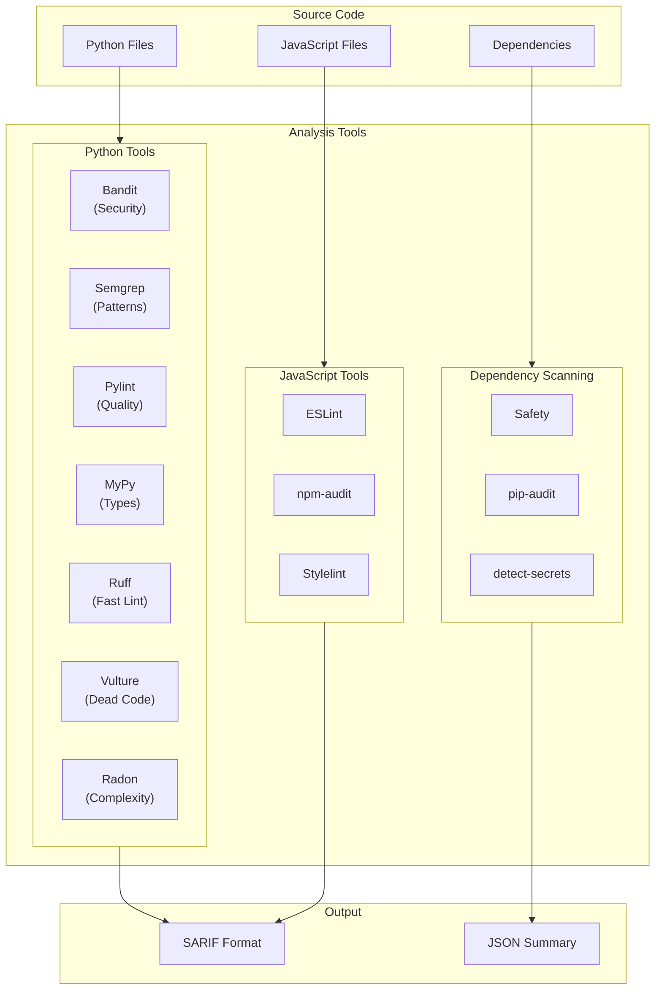
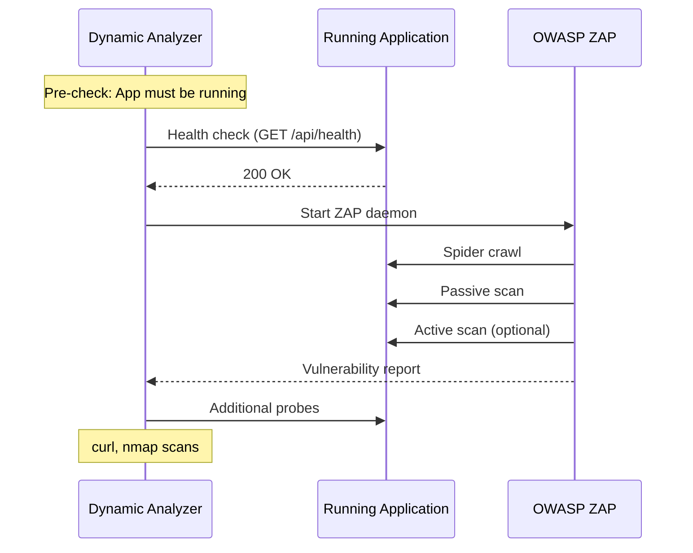
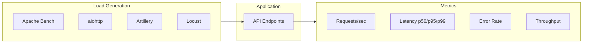
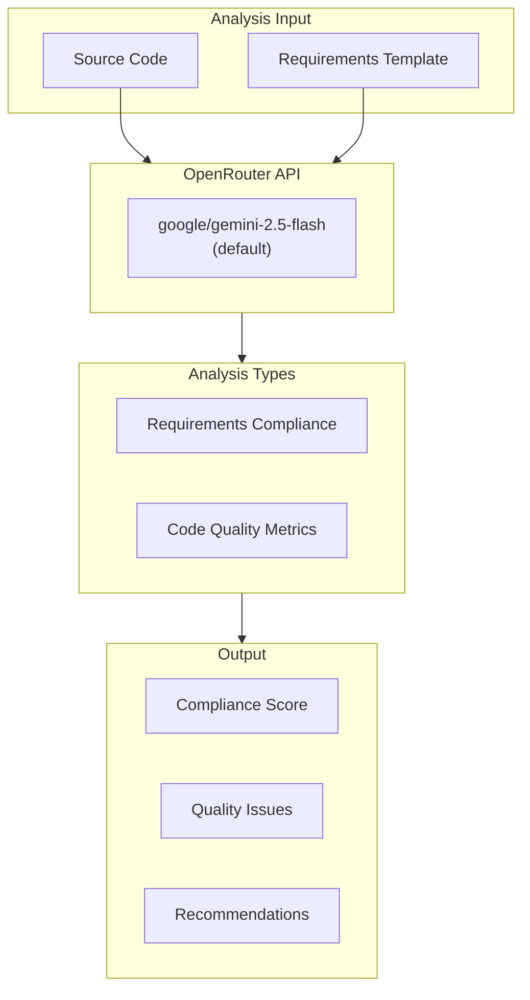
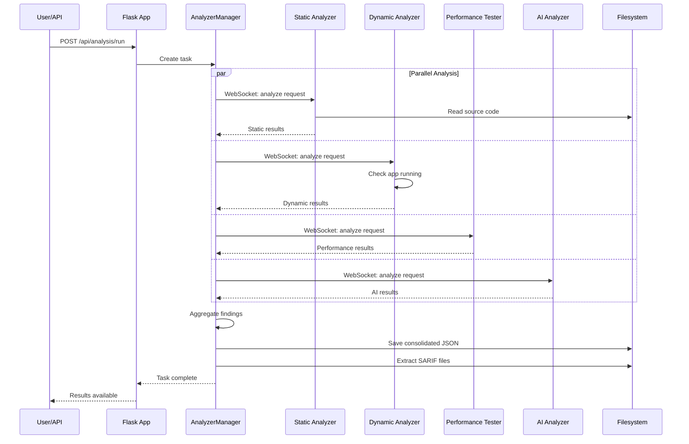
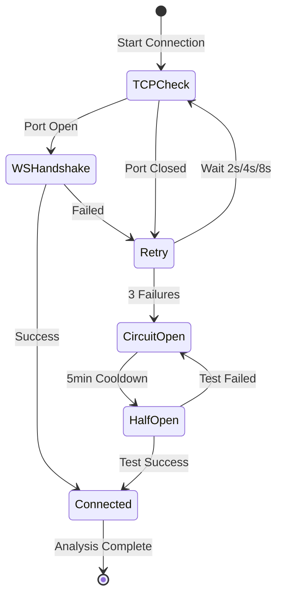

# Analysis Pipeline

This document describes the containerized analysis system that evaluates generated web applications across security, code quality, performance, and requirements compliance dimensions.

## Architecture Overview



## Service Architecture



## Analysis Services

### Static Analyzer (Port 2001)

Performs code analysis **without executing** the application.



#### Tool Inventory

| Tool | Language | Purpose | Output Format |
|------|----------|---------|---------------|
| **Bandit** | Python | Security vulnerabilities | SARIF |
| **Semgrep** | Multi | Pattern-based security rules | SARIF |
| **Pylint** | Python | Code quality, style | JSON |
| **MyPy** | Python | Static type checking | JSON |
| **Ruff** | Python | Fast Python linting | SARIF |
| **Vulture** | Python | Dead code detection | JSON |
| **Radon** | Python | Cyclomatic complexity | JSON |
| **Safety** | Python | Dependency CVE scanning | JSON |
| **pip-audit** | Python | Package vulnerability audit | JSON |
| **detect-secrets** | Multi | Credential/secret detection | JSON |
| **ESLint** | JS/TS | JavaScript linting | SARIF |
| **npm-audit** | JS | NPM package vulnerabilities | JSON |
| **Stylelint** | CSS | CSS/Tailwind linting | JSON |

**Total: 13 static analysis tools**

### Dynamic Analyzer (Port 2002)

Performs runtime security testing against **running applications**.



#### Tool Inventory

| Tool | Purpose | Scan Types |
|------|---------|------------|
| **OWASP ZAP** | Web vulnerability scanner | Quick (passive), Baseline (spider+passive), Full (spider+active) |
| **curl** | HTTP endpoint probing | Header analysis, SSL checks |
| **nmap** | Port/service scanning | Port enumeration, service detection |

**Total: 3 dynamic analysis tools**

### Performance Tester (Port 2003)

Measures application performance under load.



#### Tool Inventory

| Tool | Purpose | Always Available |
|------|---------|------------------|
| **Apache Bench (ab)** | HTTP benchmarking | ✅ Yes |
| **aiohttp** | Async Python load testing | ✅ Yes (built-in) |
| **Artillery** | Modern load testing | ❌ Optional |
| **Locust** | Distributed load testing | ❌ Optional |

**Total: 4 performance testing tools (2 always available)**

### AI Analyzer (Port 2004)

LLM-based analysis for requirements compliance and code quality assessment.



#### Analysis Metrics

| Metric | Description |
|--------|-------------|
| **Requirements Coverage** | % of template requirements implemented |
| **API Conformance** | Endpoints matching specification |
| **Error Handling Coverage** | Exception handling patterns |
| **Type Safety** | Type annotations present |
| **Code Organization** | Module/function structure |
| **Documentation** | Comments and docstrings |
| **Anti-Pattern Detection** | Common bad practices |
| **Security Practices** | Input validation, sanitization |

## Analysis Execution Flow



## Results Storage

```
results/{model_slug}/app{N}/task_{id}/
├── {model}_app{N}_task_{id}_{timestamp}.json   # Consolidated results
├── manifest.json                                # Task metadata
├── sarif/                                       # SARIF files (extracted)
│   ├── static_bandit.sarif.json
│   ├── static_semgrep.sarif.json
│   ├── static_eslint.sarif.json
│   └── static_ruff.sarif.json
└── services/                                    # Per-service snapshots
    ├── static.json
    ├── dynamic.json
    ├── performance.json
    └── ai.json
```

### Consolidated JSON Structure

```json
{
  "metadata": {
    "model_slug": "openai_gpt-4",
    "app_number": 1,
    "task_id": "task_abc123",
    "timestamp": "2025-12-30T10:00:00Z",
    "analyzer_version": "1.0.0"
  },
  "summary": {
    "total_findings": 25,
    "severity_breakdown": {
      "critical": 0,
      "high": 3,
      "medium": 12,
      "low": 10
    },
    "tools_used": ["bandit", "semgrep", "eslint", "pylint"]
  },
  "tools": {
    "bandit": {
      "status": "success",
      "findings_count": 5,
      "execution_time": 2.3,
      "sarif_file": "sarif/static_bandit.sarif.json"
    },
    "semgrep": {
      "status": "success",
      "findings_count": 8,
      "execution_time": 4.1,
      "sarif_file": "sarif/static_semgrep.sarif.json"
    }
  },
  "findings": [
    {
      "tool": "bandit",
      "rule_id": "B201",
      "severity": "medium",
      "message": "Possible SQL injection",
      "file": "backend/services.py",
      "line": 42,
      "cwe": "CWE-89"
    }
  ]
}
```

## Severity Mapping

### CWE Integration

Findings are mapped to Common Weakness Enumeration (CWE) categories:

| CWE | Category | Example Tools |
|-----|----------|---------------|
| CWE-89 | SQL Injection | Bandit, Semgrep |
| CWE-79 | XSS | Semgrep, ESLint |
| CWE-798 | Hardcoded Credentials | detect-secrets, Bandit |
| CWE-502 | Deserialization | Bandit, Semgrep |
| CWE-94 | Code Injection | Semgrep |

### OWASP Top 10 Mapping

Dynamic analysis findings map to OWASP Top 10 (2021):

| OWASP | Category | ZAP Alerts |
|-------|----------|------------|
| A01 | Broken Access Control | Authentication bypass |
| A02 | Cryptographic Failures | Weak SSL, missing HTTPS |
| A03 | Injection | SQL, Command injection |
| A05 | Security Misconfiguration | Missing headers, verbose errors |
| A07 | XSS | Reflected, Stored XSS |

### Severity Normalization

Different tools use different severity scales. Findings are normalized to:

| Normalized | Bandit | Semgrep | ESLint | ZAP |
|------------|--------|---------|--------|-----|
| CRITICAL | HIGH + confidence HIGH | ERROR | - | High (CVSS ≥9) |
| HIGH | HIGH | WARNING | error | Medium-High |
| MEDIUM | MEDIUM | INFO | warn | Medium |
| LOW | LOW | - | - | Low |
| INFO | - | - | info | Informational |

## Tool Status Handling

### Linter Exit Code Behavior

**Important**: Linters like ESLint return exit code 1 when they find issues. This is **expected behavior**, not a failure:

| Exit Code | ESLint Meaning | System Interpretation |
|-----------|----------------|----------------------|
| 0 | No issues found | `status: "no_issues"` |
| 1 | Issues found (valid JSON output) | `status: "success"` |
| 2+ | Tool error | `status: "error"` |

### Tool Status Values

| Status | Meaning |
|--------|---------|
| `success` | Tool ran, findings reported |
| `no_issues` | Tool ran, no findings |
| `error` | Tool failed to execute |
| `skipped` | Tool not applicable (e.g., no Python files) |
| `timeout` | Tool exceeded time limit |

## Connection Resilience



### Retry Configuration

| Setting | Value |
|---------|-------|
| Max retries | 3 |
| Backoff delays | 2s, 4s, 8s |
| Circuit breaker cooldown | 5 minutes |
| Pre-flight health check | Required |

## Resource Limits

Docker container resource allocation:

| Service | Memory | CPU |
|---------|--------|-----|
| static-analyzer | 1GB | 0.5 |
| dynamic-analyzer | 1GB | 0.5 |
| performance-tester | 2GB | 1.0 |
| ai-analyzer | 2GB | 1.0 |

## Timeout Configuration

| Variable | Default | Purpose |
|----------|---------|---------|
| `STATIC_ANALYSIS_TIMEOUT` | 1800s (30min) | Static tool execution |
| `SECURITY_ANALYSIS_TIMEOUT` | 1800s (30min) | Dynamic scanning |
| `PERFORMANCE_TIMEOUT` | 1800s (30min) | Load testing duration |
| `AI_ANALYSIS_TIMEOUT` | 2400s (40min) | LLM API calls |

## CLI Usage

```bash
# Start all analyzer containers
python analyzer/analyzer_manager.py start

# Check service health
python analyzer/analyzer_manager.py health

# Run comprehensive analysis
python analyzer/analyzer_manager.py analyze openai_gpt-4 1 comprehensive

# Run specific tools only
python analyzer/analyzer_manager.py analyze openai_gpt-4 1 static --tools bandit,eslint

# View results
python analyzer/analyzer_manager.py list-results --model openai_gpt-4
python analyzer/analyzer_manager.py show-result openai_gpt-4 1

# Batch analysis
python analyzer/analyzer_manager.py batch models.json
```

## Related Documentation

- [Generation Process](./GENERATION_PROCESS.md) - How apps are generated
- [Template Specification](./TEMPLATE_SPECIFICATION.md) - Requirement templates
- [Architecture Overview](./ARCHITECTURE.md) - System architecture
- [Troubleshooting](./TROUBLESHOOTING.md) - Common issues
