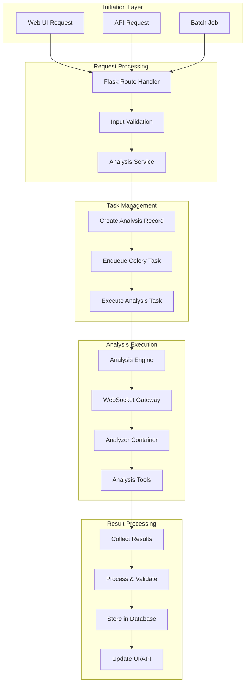
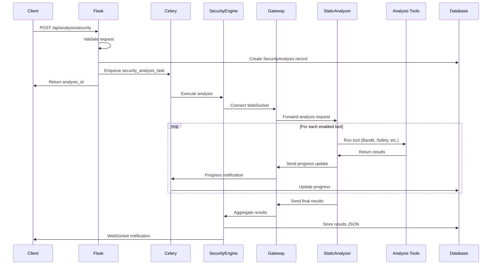
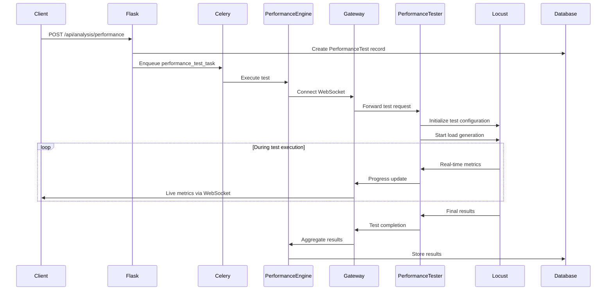
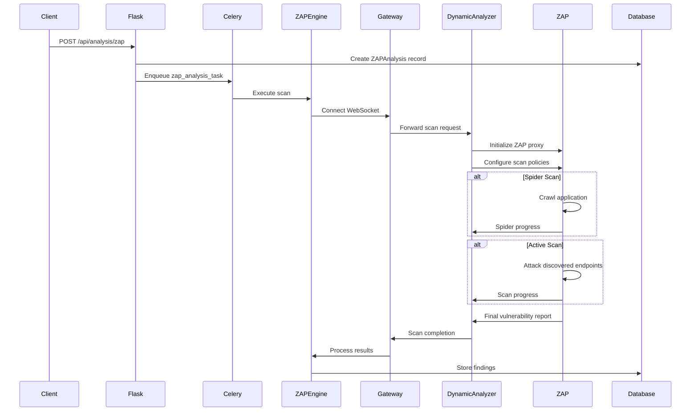
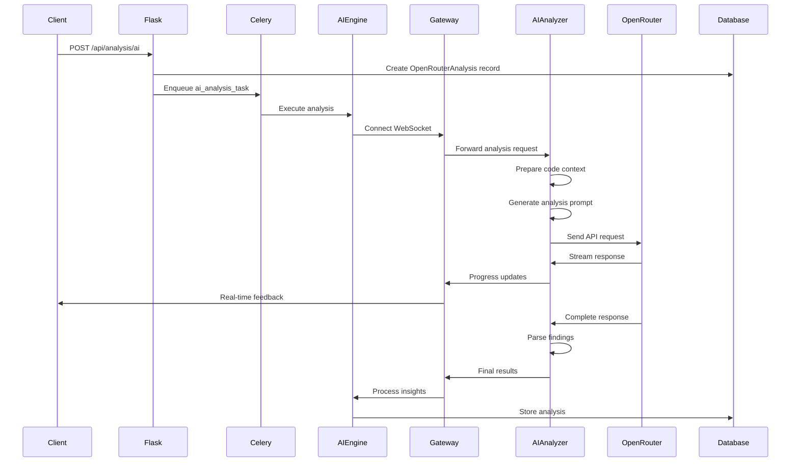
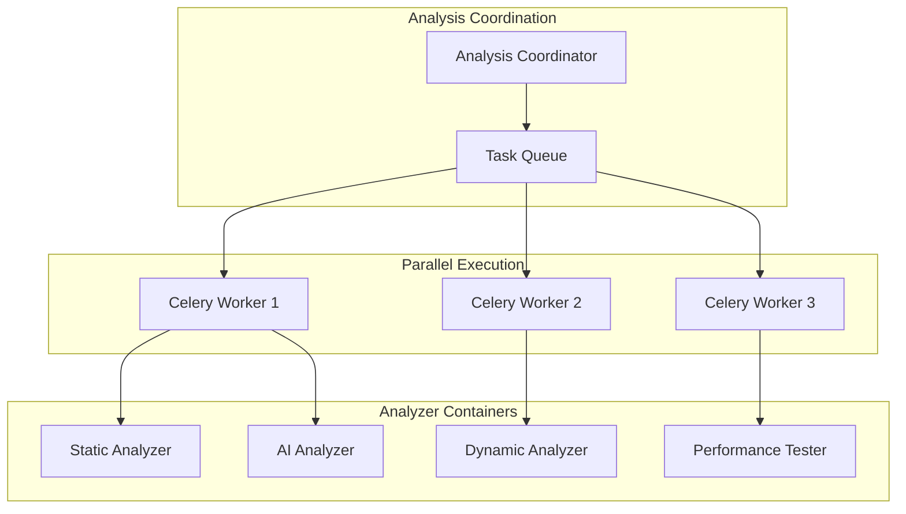

# Analysis Pipeline

Complete technical documentation of the analysis pipeline, from request initiation to result storage.

## Pipeline Overview


```mermaid
graph TB
    subgraph "Initiation Layer"
        UI[Web UI Request]
        API[API Request]
        Batch[Batch Job]
    end
    
    subgraph "Request Processing"
        Route[Flask Route Handler]
        Validation[Input Validation]
        Service[Analysis Service]
    end
    
    subgraph "Task Management"
        TaskCreation[Create Analysis Record]
        QueueTask[Enqueue Celery Task]
        TaskExecution[Execute Analysis Task]
    end
    
    subgraph "Analysis Execution"
        Engine[Analysis Engine]
        Gateway[WebSocket Gateway]
        Container[Analyzer Container]
        Tools[Analysis Tools]
    end
    
    subgraph "Result Processing"
        ResultCollection[Collect Results]
        DataProcessing[Process & Validate]
        Storage[Store in Database]
        Notification[Update UI/API]
    end
    
    UI --> Route
    API --> Route
    Batch --> Route
    Route --> Validation
    Validation --> Service
    Service --> TaskCreation
    TaskCreation --> QueueTask
    QueueTask --> TaskExecution
    TaskExecution --> Engine
    Engine --> Gateway
    Gateway --> Container
    Container --> Tools
    Tools --> ResultCollection
    ResultCollection --> DataProcessing
    DataProcessing --> Storage
    Storage --> Notification
```

## Analysis Types

### 1. Security Analysis

**Purpose**: Identify security vulnerabilities and coding issues in generated applications.

**Tools Integrated**:
- **Bandit**: Python security linter
- **Safety**: Python dependency vulnerability scanner
- **ESLint**: JavaScript security and quality linting
- **PyLint**: Python code quality analysis
- **Semgrep**: Multi-language static analysis (optional)

**Analysis Flow**:

```mermaid
sequenceDiagram
    participant Client
    participant Flask
    participant Celery
    participant SecurityEngine
    participant Gateway
    participant StaticAnalyzer
    participant Tools as Analysis Tools
    
    Client->>Flask: POST /api/analysis/security
    Flask->>Flask: Validate request
    Flask->>Database: Create SecurityAnalysis record
    Flask->>Celery: Enqueue security_analysis_task
    Flask->>Client: Return analysis_id
    
    Celery->>SecurityEngine: Execute analysis
    SecurityEngine->>Gateway: Connect WebSocket
    Gateway->>StaticAnalyzer: Forward analysis request
    
    loop For each enabled tool
        StaticAnalyzer->>Tools: Run tool (Bandit, Safety, etc.)
        Tools->>StaticAnalyzer: Return results
        StaticAnalyzer->>Gateway: Send progress update
        Gateway->>Celery: Progress notification
        Celery->>Database: Update progress
    end
    
    StaticAnalyzer->>Gateway: Send final results
    Gateway->>SecurityEngine: Aggregate results
    SecurityEngine->>Database: Store results JSON
    SecurityEngine->>Client: WebSocket notification
```

**Configuration Options**:
```python
{
    "tools": {
        "bandit_enabled": True,
        "bandit_config": {
            "tests": [],  # Run all tests
            "skips": ["B101"],  # Skip assert_used
            "confidence": "low",
            "severity": "low"
        },
        "safety_enabled": True,
        "safety_config": {
            "ignore": [],  # Vulnerability IDs to ignore
            "output": "json"
        },
        "eslint_enabled": True,
        "pylint_enabled": True
    },
    "global_config": {
        "severity_threshold": "medium",
        "max_issues_per_tool": 1000,
        "timeout_minutes": 30,
        "parallel_execution": True
    }
}
```

### 2. Performance Testing

**Purpose**: Evaluate application performance under various load conditions.

**Testing Framework**: Locust-based load testing

**Test Types**:
- **Load Testing**: Normal expected load
- **Stress Testing**: Beyond normal capacity
- **Spike Testing**: Sudden load increases

**Analysis Flow**:

```mermaid
sequenceDiagram
    participant Client
    participant Flask
    participant Celery
    participant PerformanceEngine
    participant Gateway
    participant PerformanceTester
    participant Locust
    
    Client->>Flask: POST /api/analysis/performance
    Flask->>Database: Create PerformanceTest record
    Flask->>Celery: Enqueue performance_test_task
    
    Celery->>PerformanceEngine: Execute test
    PerformanceEngine->>Gateway: Connect WebSocket
    Gateway->>PerformanceTester: Forward test request
    
    PerformanceTester->>Locust: Initialize test configuration
    PerformanceTester->>Locust: Start load generation
    
    loop During test execution
        Locust->>PerformanceTester: Real-time metrics
        PerformanceTester->>Gateway: Progress update
        Gateway->>Client: Live metrics via WebSocket
    end
    
    Locust->>PerformanceTester: Final results
    PerformanceTester->>Gateway: Test completion
    Gateway->>PerformanceEngine: Aggregate results
    PerformanceEngine->>Database: Store results
```

**Metrics Collected**:
- Requests per second (RPS)
- Response time percentiles (50th, 95th, 99th)
- Error rates by endpoint
- Concurrent user handling
- Resource utilization
- Throughput measurements

### 3. ZAP Security Scanning

**Purpose**: Dynamic application security testing using OWASP ZAP.

**Scan Types**:
- **Spider Scan**: Discover application endpoints
- **Active Scan**: Probe for vulnerabilities
- **Passive Scan**: Analyze traffic without attacking

**Analysis Flow**:

```mermaid
sequenceDiagram
    participant Client
    participant Flask
    participant Celery
    participant ZAPEngine
    participant Gateway
    participant DynamicAnalyzer
    participant ZAP
    
    Client->>Flask: POST /api/analysis/zap
    Flask->>Database: Create ZAPAnalysis record
    Flask->>Celery: Enqueue zap_analysis_task
    
    Celery->>ZAPEngine: Execute scan
    ZAPEngine->>Gateway: Connect WebSocket
    Gateway->>DynamicAnalyzer: Forward scan request
    
    DynamicAnalyzer->>ZAP: Initialize ZAP proxy
    DynamicAnalyzer->>ZAP: Configure scan policies
    
    alt Spider Scan
        ZAP->>ZAP: Crawl application
        ZAP->>DynamicAnalyzer: Spider progress
    end
    
    alt Active Scan
        ZAP->>ZAP: Attack discovered endpoints
        ZAP->>DynamicAnalyzer: Scan progress
    end
    
    ZAP->>DynamicAnalyzer: Final vulnerability report
    DynamicAnalyzer->>Gateway: Scan completion
    Gateway->>ZAPEngine: Process results
    ZAPEngine->>Database: Store findings
```

**Vulnerability Categories**:
- **High Risk**: Critical security flaws
- **Medium Risk**: Significant vulnerabilities
- **Low Risk**: Minor security issues
- **Informational**: Best practice recommendations

### 4. AI Analysis

**Purpose**: Intelligent code review using advanced language models.

**Supported Models**:
- OpenAI (GPT-4, GPT-3.5)
- Anthropic (Claude)
- Other OpenRouter-compatible models

**Analysis Flow**:

```mermaid
sequenceDiagram
    participant Client
    participant Flask
    participant Celery
    participant AIEngine
    participant Gateway
    participant AIAnalyzer
    participant OpenRouter
    
    Client->>Flask: POST /api/analysis/ai
    Flask->>Database: Create OpenRouterAnalysis record
    Flask->>Celery: Enqueue ai_analysis_task
    
    Celery->>AIEngine: Execute analysis
    AIEngine->>Gateway: Connect WebSocket
    Gateway->>AIAnalyzer: Forward analysis request
    
    AIAnalyzer->>AIAnalyzer: Prepare code context
    AIAnalyzer->>AIAnalyzer: Generate analysis prompt
    AIAnalyzer->>OpenRouter: Send API request
    
    OpenRouter->>AIAnalyzer: Stream response
    AIAnalyzer->>Gateway: Progress updates
    Gateway->>Client: Real-time feedback
    
    OpenRouter->>AIAnalyzer: Complete response
    AIAnalyzer->>AIAnalyzer: Parse findings
    AIAnalyzer->>Gateway: Final results
    Gateway->>AIEngine: Process insights
    AIEngine->>Database: Store analysis
```

**Analysis Dimensions**:
- Code quality assessment
- Security vulnerability identification
- Architecture review
- Performance optimization suggestions
- Best practice recommendations
- Maintainability scoring

## WebSocket Communication Protocol

### Message Format

All WebSocket messages follow a standardized format:

```json
{
  "type": "message_type",
  "analysis_id": "unique_identifier",
  "timestamp": "2025-09-16T10:30:00Z",
  "data": {
    // Message-specific payload
  }
}
```

### Message Types

#### Progress Updates
```json
{
  "type": "progress_update",
  "analysis_id": "sec_001",
  "timestamp": "2025-09-16T10:30:00Z",
  "data": {
    "status": "running",
    "current_step": "bandit_scan",
    "progress_percentage": 35,
    "completed_steps": ["initialization", "file_discovery"],
    "remaining_steps": ["safety_check", "eslint_scan", "report_generation"],
    "estimated_completion": "2025-09-16T10:35:00Z"
  }
}
```

#### Status Changes
```json
{
  "type": "status_change",
  "analysis_id": "sec_001",
  "timestamp": "2025-09-16T10:35:00Z",
  "data": {
    "old_status": "running",
    "new_status": "completed",
    "success": true,
    "duration": 300.5
  }
}
```

#### Error Notifications
```json
{
  "type": "error",
  "analysis_id": "sec_001",
  "timestamp": "2025-09-16T10:33:00Z",
  "data": {
    "error_type": "timeout",
    "message": "Analysis timed out after 30 minutes",
    "recoverable": false,
    "suggested_action": "Retry with increased timeout"
  }
}
```

#### Tool Results
```json
{
  "type": "tool_result",
  "analysis_id": "sec_001",
  "timestamp": "2025-09-16T10:32:00Z",
  "data": {
    "tool_name": "bandit",
    "status": "completed",
    "issues_found": 5,
    "execution_time": 45.2,
    "summary": {
      "critical": 1,
      "high": 2,
      "medium": 2,
      "low": 0
    }
  }
}
```

## Result Storage Schema

### Analysis Result Structure

All analysis results are stored using a consistent JSON schema:

```json
{
  "metadata": {
    "analysis_id": "sec_001",
    "analysis_type": "security",
    "application_id": 1,
    "model_slug": "openai_gpt-4",
    "app_number": 1,
    "started_at": "2025-09-16T10:00:00Z",
    "completed_at": "2025-09-16T10:08:45Z",
    "duration": 525.3,
    "configuration": {
      // Analysis-specific configuration
    }
  },
  "summary": {
    "status": "completed",
    "success": true,
    "total_issues": 15,
    "severity_breakdown": {
      "critical": 2,
      "high": 5,
      "medium": 6,
      "low": 2
    },
    "tools_executed": 4,
    "tools_failed": 0
  },
  "results": {
    "bandit": {
      "status": "completed",
      "execution_time": 45.2,
      "issues": [
        {
          "test_id": "B101",
          "severity": "high",
          "confidence": "high",
          "filename": "app.py",
          "line_number": 25,
          "code": "eval(user_input)",
          "message": "Use of eval detected",
          "more_info": "https://bandit.readthedocs.io/..."
        }
      ]
    },
    "safety": {
      "status": "completed",
      "execution_time": 12.1,
      "vulnerabilities": [
        {
          "id": "CVE-2021-12345",
          "package": "requests",
          "version": "2.25.0",
          "severity": "high",
          "description": "Security vulnerability in requests",
          "fixed_version": "2.25.1"
        }
      ]
    }
  },
  "artifacts": {
    "reports": [
      {
        "type": "html",
        "filename": "security_report.html",
        "size": 2048576,
        "path": "/results/sec_001/security_report.html"
      }
    ],
    "raw_outputs": [
      {
        "tool": "bandit",
        "filename": "bandit_output.json",
        "path": "/results/sec_001/bandit_output.json"
      }
    ]
  }
}
```

### Database Schema Mapping

Results are stored in database tables with JSON columns:

```python
class SecurityAnalysis(db.Model):
    id = db.Column(db.Integer, primary_key=True)
    application_id = db.Column(db.Integer, db.ForeignKey('generated_applications.id'))
    
    # Status and timing
    status = db.Column(db.Enum(AnalysisStatus), default=AnalysisStatus.PENDING)
    started_at = db.Column(db.DateTime(timezone=True))
    completed_at = db.Column(db.DateTime(timezone=True))
    
    # Summary metrics (denormalized for queries)
    total_issues = db.Column(db.Integer, default=0)
    critical_severity_count = db.Column(db.Integer, default=0)
    high_severity_count = db.Column(db.Integer, default=0)
    medium_severity_count = db.Column(db.Integer, default=0)
    low_severity_count = db.Column(db.Integer, default=0)
    
    # JSON storage for detailed results
    results_json = db.Column(db.Text)  # Complete results structure
    metadata_json = db.Column(db.Text)  # Analysis metadata
    
    # Configuration used
    config_json = db.Column(db.Text)  # Analysis configuration
```

## Error Handling and Recovery

### Error Types

#### Validation Errors
- Invalid application ID
- Missing required parameters
- Malformed configuration

#### Execution Errors
- Tool execution failures
- Timeout errors
- Resource exhaustion
- Network connectivity issues

#### System Errors
- Database connection failures
- WebSocket disconnections
- Container unavailability

### Recovery Strategies

#### Automatic Retry
```python
@celery.task(bind=True, max_retries=3, default_retry_delay=60)
def security_analysis_task(self, analysis_id):
    try:
        # Analysis execution
        pass
    except RetryableError as exc:
        # Exponential backoff
        countdown = 60 * (2 ** self.request.retries)
        raise self.retry(exc=exc, countdown=countdown)
    except NonRetryableError:
        # Mark as failed and don't retry
        mark_analysis_failed(analysis_id)
```

#### Graceful Degradation
- Continue with available tools if some fail
- Partial results better than no results
- Clear error reporting to users

#### State Recovery
- Analysis state persisted in database
- Resume capability after system restart
- Cleanup of orphaned processes

## Performance Optimization

### Concurrent Execution


```mermaid
graph TB
    subgraph "Analysis Coordination"
        Coordinator[Analysis Coordinator]
        Queue[Task Queue]
    end
    
    subgraph "Parallel Execution"
        Worker1[Celery Worker 1]
        Worker2[Celery Worker 2]
        Worker3[Celery Worker 3]
    end
    
    subgraph "Analyzer Containers"
        Static[Static Analyzer]
        Dynamic[Dynamic Analyzer]
        Performance[Performance Tester]
        AI[AI Analyzer]
    end
    
    Coordinator --> Queue
    Queue --> Worker1
    Queue --> Worker2
    Queue --> Worker3
    
    Worker1 --> Static
    Worker2 --> Dynamic
    Worker3 --> Performance
    Worker1 --> AI
```

### Resource Management

**Container Limits**:
- Memory: 2GB per analyzer container
- CPU: 1 core per container
- Disk: 10GB for results storage

**Queue Management**:
- Priority-based task scheduling
- Resource-aware task assignment
- Load balancing across workers

**Caching Strategies**:
- Model metadata caching
- Analysis configuration caching
- Result artifact caching

## Monitoring and Observability

### Metrics Collection

**Analysis Metrics**:
- Analysis completion rates
- Average execution time per type
- Error rates by analysis type
- Resource utilization

**System Metrics**:
- Container health status
- Queue depth and processing rates
- Database performance
- WebSocket connection counts

### Logging Strategy

**Structured Logging**:
```python
logger.info("Analysis started",
    analysis_id=analysis_id,
    analysis_type="security",
    application_id=app_id,
    user_id=user_id,
    configuration=config_summary)
```

**Log Aggregation**:
- Centralized log collection
- Real-time log streaming
- Error alert integration

This comprehensive analysis pipeline documentation provides the technical foundation for understanding and extending the platform's analysis capabilities.