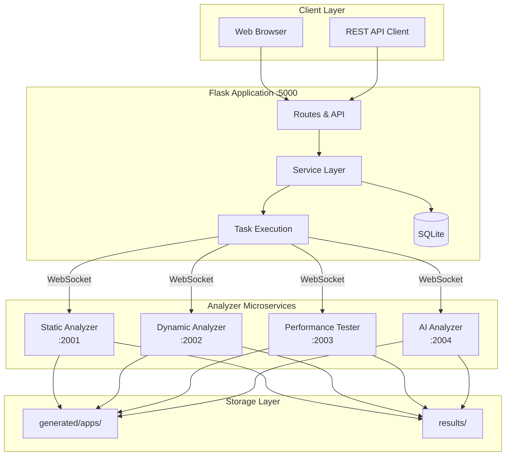
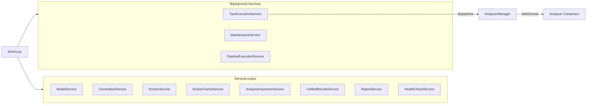
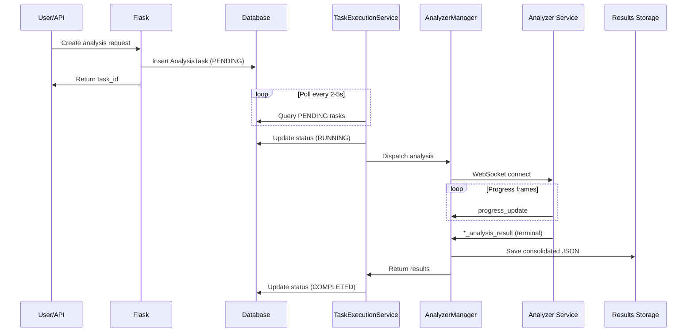
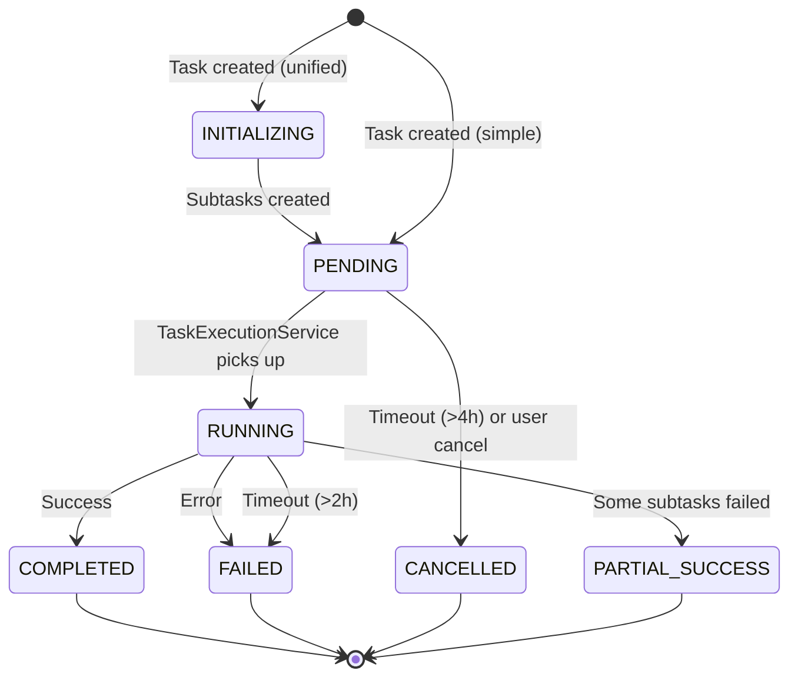
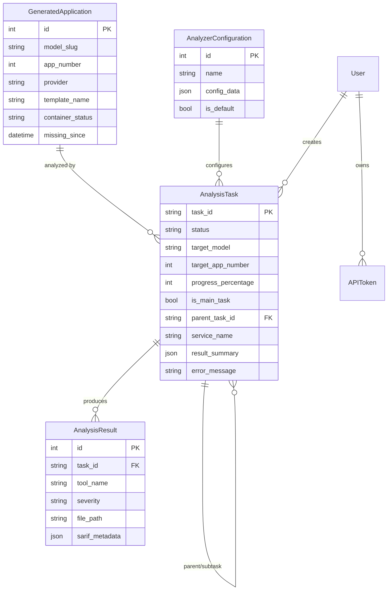
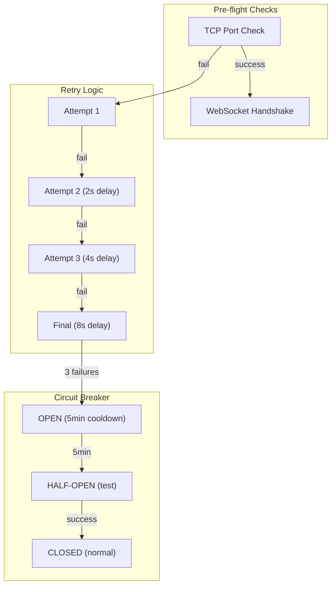
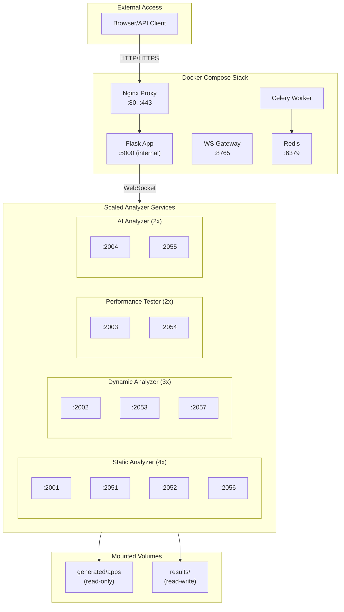
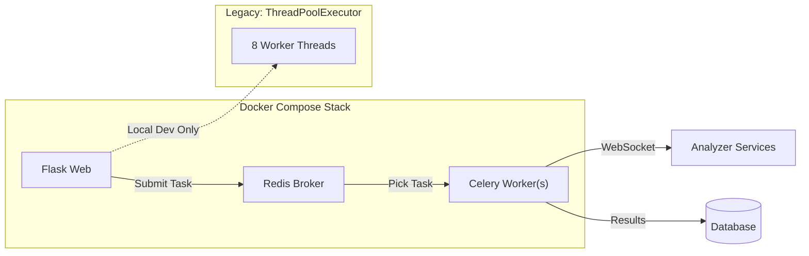

# Architecture Overview

ThesisAppRework is a Flask-based web application with containerized microservices for analyzing AI-generated applications. The system evaluates code quality, security, performance, and requirements compliance.

## System Architecture



## Component Details

### Flask Application

| Component | Location | Purpose |
|-----------|----------|---------|
| Entry Point | [src/main.py](../src/main.py) | Server startup, logging |
| App Factory | [src/app/factory.py](../src/app/factory.py) | Initialization, DI setup |
| Service Locator | [src/app/services/service_locator.py](../src/app/services/service_locator.py) | Dependency injection |
| Models | [src/app/models/](../src/app/models/) | SQLAlchemy ORM |
| Routes | [src/app/routes/](../src/app/routes/) | Web endpoints |
| API | [src/app/api/](../src/app/api/) | REST API endpoints |

### Analyzer Services

| Service | Port | Tools | Source |
|---------|------|-------|--------|
| Static | 2001 | Bandit, Semgrep, ESLint, Pylint, Ruff, MyPy | [analyzer/services/static-analyzer/](../analyzer/services/static-analyzer/) |
| Dynamic | 2002 | OWASP ZAP, nmap, curl probes | [analyzer/services/dynamic-analyzer/](../analyzer/services/dynamic-analyzer/) |
| Performance | 2003 | Locust, aiohttp, Apache ab | [analyzer/services/performance-tester/](../analyzer/services/performance-tester/) |
| AI | 2004 | OpenRouter LLM analysis | [analyzer/services/ai-analyzer/](../analyzer/services/ai-analyzer/) |

## Service Layer



### Background Services

| Service | Purpose | Polling | Default |
|---------|---------|---------|---------|
| TaskExecutionService | Executes PENDING analysis tasks | 2s (test) / 5s (prod) | Auto-start |
| MaintenanceService | Cleanup orphans, stuck tasks | Manual/hourly | **Manual** |
| PipelineExecutionService | Automation pipelines | 2s (test) / 3s (prod) | Auto-start |

> **Note**: MaintenanceService is manual by default as of Nov 2025. Run via `./start.ps1 -Mode Maintenance` or set `MAINTENANCE_AUTO_START=true`.

See [BACKGROUND_SERVICES.md](./BACKGROUND_SERVICES.md) for detailed configuration and debugging.

## Data Flow

### Analysis Task Lifecycle



### Task Status Lifecycle



## Database Schema



## Communication Patterns

### WebSocket Protocol

Analyzer services communicate via WebSocket using a shared protocol defined in [analyzer/shared/protocol.py](../analyzer/shared/protocol.py).

| Message Type | Direction | Purpose |
|--------------|-----------|---------|
| `*_analysis_request` | Client→Service | Start analysis |
| `progress_update` | Service→Client | Progress % |
| `*_analysis_result` | Service→Client | Final result |
| `error` | Service→Client | Error details |

### Connection Resilience (Dec 2025)

The system implements robust connection handling for analyzer services:



| Feature | Behavior |
|---------|----------|
| Pre-flight checks | TCP port + WebSocket handshake before starting subtasks |
| Exponential backoff | 2s → 4s → 8s delays between retries |
| Circuit breaker | 3 consecutive failures → 5-minute cooldown |
| Auto-recovery | Services available again after cooldown or first success |

### REST API Authentication

Bearer token authentication via `Authorization: Bearer <token>` header. Tokens managed through User → API Access in the web UI.

## Deployment Architecture



### Nginx Reverse Proxy

| Port | Protocol | Purpose |
|------|----------|--------|
| 80 | HTTP | Redirect to HTTPS or direct access |
| 443 | HTTPS | Secure access with self-signed cert |

### Scaled Analyzer Replicas

For high-throughput analysis, analyzer services run multiple replicas with load balancing:

| Service | Replicas | Port Range | Load Balancing |
|---------|----------|------------|----------------|
| static-analyzer | 4 | 2001, 2051-2052, 2056 | `STATIC_ANALYZER_URLS` env var |
| dynamic-analyzer | 3 | 2002, 2053, 2057 | `DYNAMIC_ANALYZER_URLS` env var |
| performance-tester | 2 | 2003, 2054 | `PERF_TESTER_URLS` env var |
| ai-analyzer | 2 | 2004, 2055 | `AI_ANALYZER_URLS` env var |

> **Note**: Load balancing is configured via comma-separated URLs in environment variables. The `AnalyzerPool` service distributes requests across available replicas.

### Container Resources

| Service | Memory | CPU | Replicas |
|---------|--------|-----|----------|
| nginx | 128MB | 0.1 | 1 |
| web (Flask) | 2GB | 1.0 | 1 |
| redis | 256MB | 0.2 | 1 |
| gateway | 256MB | 0.2 | 1 |
| static-analyzer | 1GB | 0.5 | 4 |
| dynamic-analyzer | 1GB | 0.5 | 3 |
| performance-tester | 2GB | 1.0 | 2 |
| ai-analyzer | 2GB | 1.0 | 2 |
| celery-worker | 1GB | 1.0 | 1 |

## Results Storage

```
results/
└── {model_slug}/
    └── app{N}/
        └── task_{id}/
            ├── {model}_app{N}_task_{id}_{timestamp}.json  # Consolidated
            ├── manifest.json                              # Metadata
            ├── sarif/                                     # SARIF files
            │   ├── static_bandit.sarif.json
            │   └── static_semgrep.sarif.json
            └── services/                                  # Per-service
                ├── static.json
                ├── dynamic.json
                └── ai.json
```

See [analyzer/README.md](../analyzer/README.md) for detailed result format documentation.

## Environment Configuration

| Variable | Purpose | Default |
|----------|---------|---------|
| `OPENROUTER_API_KEY` | AI analyzer authentication | Required |
| `SECRET_KEY` | Flask session encryption | Required |
| `DATABASE_URL` | Database connection | `sqlite:///src/data/thesis_app.db` |
| **Celery Configuration** | | |
| `USE_CELERY_ANALYSIS` | Use Celery for task processing | `true` (Docker) |
| `CELERY_BROKER_URL` | Redis broker URL | `redis://redis:6379/0` |
| `CELERY_RESULT_BACKEND` | Task result storage | `redis://redis:6379/0` |
| **Analyzer Settings** | | |
| `ANALYZER_ENABLED` | Enable analyzer integration | `true` |
| `ANALYZER_AUTO_START` | Auto-start containers | `false` |
| `MAINTENANCE_AUTO_START` | Auto-start cleanup service | `false` |
| **Logging** | | |
| `LOG_LEVEL` | Logging verbosity | `INFO` |
| **Timeouts (seconds)** | | |
| `STATIC_ANALYSIS_TIMEOUT` | Static tool timeout | `1800` |
| `SECURITY_ANALYSIS_TIMEOUT` | Security tool timeout | `1800` |
| `PERFORMANCE_TIMEOUT` | Performance test timeout | `1800` |
| `AI_ANALYSIS_TIMEOUT` | AI analysis timeout | `2400` |
| `TASK_TIMEOUT` | Overall task timeout | `1800` |
| **Retry Configuration** | | |
| `PREFLIGHT_MAX_RETRIES` | Pre-flight check retry attempts | `3` |
| `TRANSIENT_FAILURE_MAX_RETRIES` | Transient failure recovery attempts | `3` |
| **Container Health** | | |
| Container health wait | Pipeline timeout waiting for healthy containers | `180s` |
| Healthcheck start_period | Docker delay before first health check | `15s` |
| Healthcheck interval | Time between health checks | `30s` |
| **Startup Cleanup** | | |
| `STARTUP_CLEANUP_ENABLED` | Enable startup task cleanup | `true` |
| `STARTUP_CLEANUP_RUNNING_TIMEOUT` | RUNNING task timeout at startup (min) | `120` |
| `STARTUP_CLEANUP_PENDING_TIMEOUT` | PENDING task timeout at startup (min) | `240` |

## Task Execution

The system uses **Celery with Redis** for distributed task execution. This is the default and recommended approach for both development and production.



| Mode | Environment | Use Case |
|------|-------------|----------|
| **Celery + Redis** | `USE_CELERY_ANALYSIS=true` | **Default** - Docker, production, scalable |
| ThreadPoolExecutor | `USE_CELERY_ANALYSIS=false` | Legacy local development only |

### Celery Benefits

- **Distributed**: Scale workers across multiple containers/servers
- **Reliable**: Task persistence and retry mechanisms
- **Monitoring**: Built-in task inspection and monitoring
- **Production-Ready**: Battle-tested for high-load scenarios

## Container Management

### Rebuild Strategies

| Command | Time | Cache | Use Case |
|---------|------|-------|----------|
| `./start.ps1 -Mode Rebuild` | 30-90s | BuildKit cache | Code changes, dependency updates |
| `./start.ps1 -Mode CleanRebuild` | 12-18min | No cache | Dockerfile changes, cache corruption |

BuildKit optimizations used:
- `--mount=type=cache,target=/root/.cache/pip` - Persistent pip cache
- `--mount=type=cache,target=/root/.npm` - Persistent npm cache
- Shared base image across analyzer services

## Quick Reference

```bash
# Start everything
./start.ps1 -Mode Start

# Flask only (dev)
./start.ps1 -Mode Dev -NoAnalyzer

# Analyzer management
python analyzer/analyzer_manager.py start
python analyzer/analyzer_manager.py status
python analyzer/analyzer_manager.py health

# Run analysis
python analyzer/analyzer_manager.py analyze openai_gpt-4 1 comprehensive

# Container rebuilds
./start.ps1 -Mode Rebuild        # Fast (cached)
./start.ps1 -Mode CleanRebuild   # Full rebuild

# Maintenance (manual)
./start.ps1 -Mode Maintenance

# Other utilities
./start.ps1 -Mode Wipeout        # Full reset
./start.ps1 -Mode Password       # Reset admin password
./start.ps1 -Mode Reload         # Hot reload
./start.ps1 -Mode Health         # Check service health

# Tests
pytest -m "not integration and not slow and not analyzer"
```

## Related Documentation

- [Background Services](./BACKGROUND_SERVICES.md) - TaskExecution, Maintenance, Pipeline services
- [API Reference](./api-reference.md) - REST API and WebSocket documentation
- [Analyzer Guide](./ANALYZER_GUIDE.md) - Analyzer services and tools
- [Development Guide](./development-guide.md) - Contributing and testing
- [Deployment Guide](./deployment-guide.md) - Production deployment
- [Troubleshooting](./TROUBLESHOOTING.md) - Common issues and recovery
- [Analyzer README](../analyzer/README.md) - Detailed result formats
