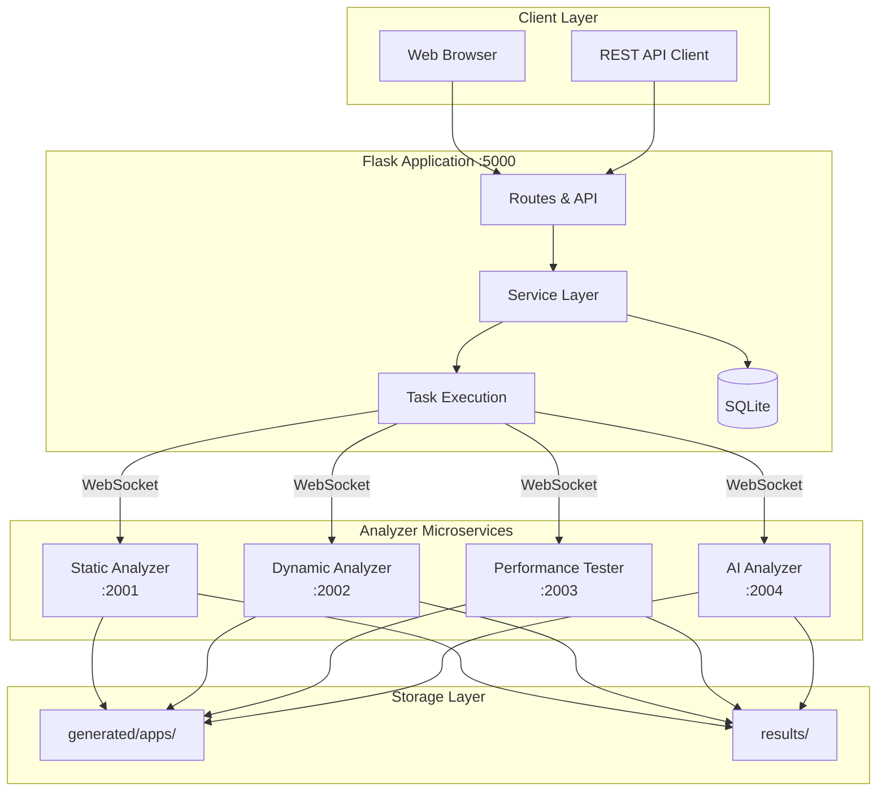
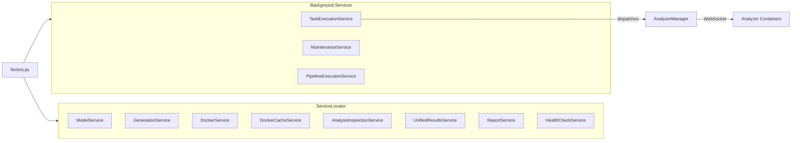
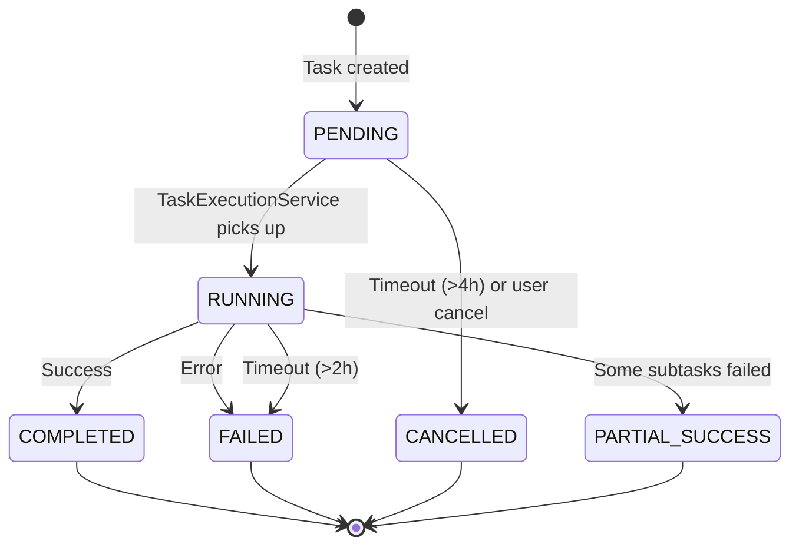
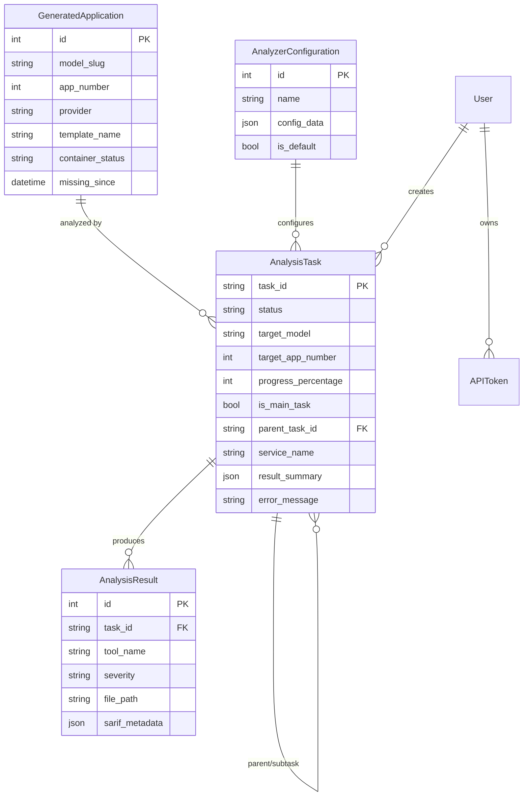
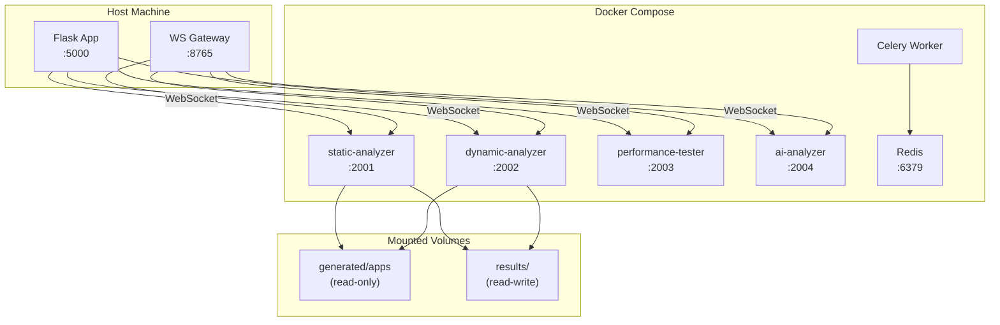

# Architecture Overview

ThesisAppRework is a Flask-based web application with containerized microservices for analyzing AI-generated applications. The system evaluates code quality, security, performance, and requirements compliance.

## System Architecture



## Component Details

### Flask Application

| Component | Location | Purpose |
|-----------|----------|---------|
| Entry Point | [src/main.py](../src/main.py) | Server startup, logging |
| App Factory | [src/app/factory.py](../src/app/factory.py) | Initialization, DI setup |
| Service Locator | [src/app/services/service_locator.py](../src/app/services/service_locator.py) | Dependency injection |
| Models | [src/app/models/](../src/app/models/) | SQLAlchemy ORM |
| Routes | [src/app/routes/](../src/app/routes/) | Web endpoints |
| API | [src/app/api/](../src/app/api/) | REST API endpoints |

### Analyzer Services

| Service | Port | Tools | Source |
|---------|------|-------|--------|
| Static | 2001 | Bandit, Semgrep, ESLint, Pylint, Ruff, MyPy | [analyzer/services/static-analyzer/](../analyzer/services/static-analyzer/) |
| Dynamic | 2002 | OWASP ZAP, nmap, curl probes | [analyzer/services/dynamic-analyzer/](../analyzer/services/dynamic-analyzer/) |
| Performance | 2003 | Locust, aiohttp, Apache ab | [analyzer/services/performance-tester/](../analyzer/services/performance-tester/) |
| AI | 2004 | OpenRouter LLM analysis | [analyzer/services/ai-analyzer/](../analyzer/services/ai-analyzer/) |

## Service Layer



### Background Services

| Service | Purpose | Polling |
|---------|---------|---------|
| TaskExecutionService | Executes PENDING analysis tasks | 2-10s |
| MaintenanceService | Cleanup orphans, stuck tasks | Manual/hourly |
| PipelineExecutionService | Automation pipelines | Event-driven |

## Data Flow

### Analysis Task Lifecycle


### Task Status Lifecycle



## Database Schema



## Communication Patterns

### WebSocket Protocol

Analyzer services communicate via WebSocket using a shared protocol defined in [analyzer/shared/protocol.py](../analyzer/shared/protocol.py).

| Message Type | Direction | Purpose |
|--------------|-----------|---------|
| `*_analysis_request` | Client→Service | Start analysis |
| `progress_update` | Service→Client | Progress % |
| `*_analysis_result` | Service→Client | Final result |
| `error` | Service→Client | Error details |

### REST API Authentication

Bearer token authentication via `Authorization: Bearer <token>` header. Tokens managed through User → API Access in the web UI.

## Deployment Architecture



### Container Resources

| Service | Memory | CPU |
|---------|--------|-----|
| static-analyzer | 1GB | 1.0 |
| dynamic-analyzer | 2GB | 1.0 |
| performance-tester | 1GB | 0.5 |
| ai-analyzer | 512MB | 0.5 |

## Results Storage

```
results/
└── {model_slug}/
    └── app{N}/
        └── task_{id}/
            ├── {model}_app{N}_task_{id}_{timestamp}.json  # Consolidated
            ├── manifest.json                              # Metadata
            ├── sarif/                                     # SARIF files
            │   ├── static_bandit.sarif.json
            │   └── static_semgrep.sarif.json
            └── services/                                  # Per-service
                ├── static.json
                ├── dynamic.json
                └── ai.json
```

See [analyzer/README.md](../analyzer/README.md) for detailed result format documentation.

## Environment Configuration

| Variable | Purpose | Default |
|----------|---------|---------|
| `OPENROUTER_API_KEY` | AI analyzer authentication | Required |
| `ANALYZER_ENABLED` | Enable analyzer integration | `true` |
| `ANALYZER_AUTO_START` | Auto-start containers | `false` |
| `MAINTENANCE_AUTO_START` | Auto-start cleanup | `false` |
| `LOG_LEVEL` | Logging verbosity | `INFO` |
| `STATIC_ANALYSIS_TIMEOUT` | Tool timeout (seconds) | `300` |

## Quick Reference

```bash
# Start everything
./start.ps1 -Mode Start

# Flask only (dev)
./start.ps1 -Mode Dev -NoAnalyzer

# Analyzer management
python analyzer/analyzer_manager.py start
python analyzer/analyzer_manager.py status
python analyzer/analyzer_manager.py health

# Run analysis
python analyzer/analyzer_manager.py analyze openai_gpt-4 1 comprehensive

# Tests
pytest -m "not integration and not slow and not analyzer"
```

## Related Documentation

- [API Reference](./api-reference.md)
- [Development Guide](./development-guide.md)
- [Deployment Guide](./deployment-guide.md)
- [Analyzer README](../analyzer/README.md)
