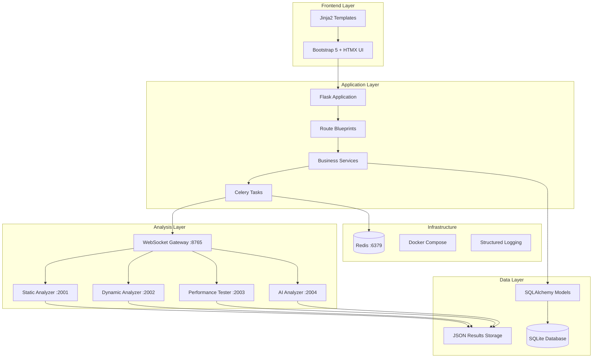
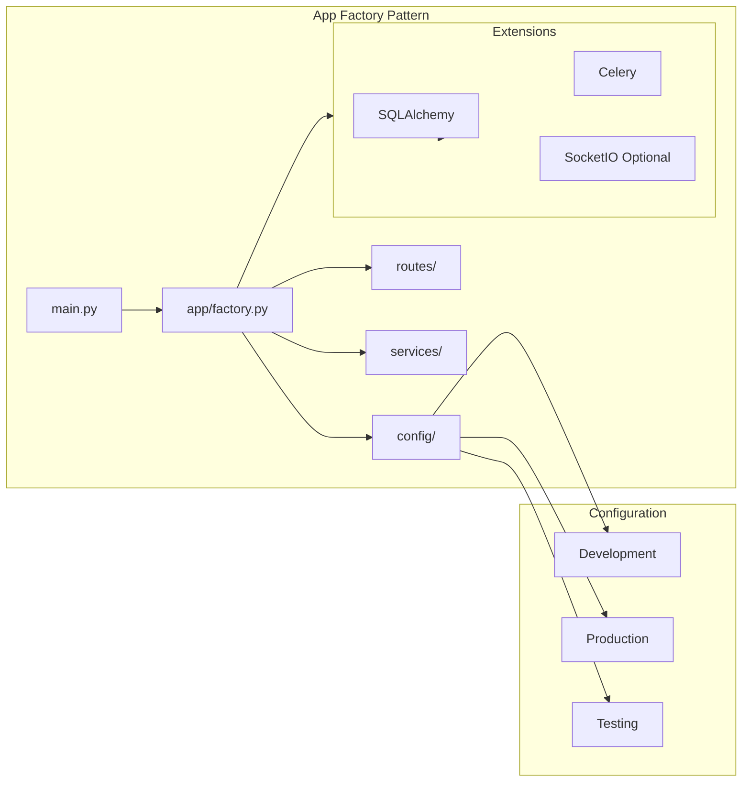
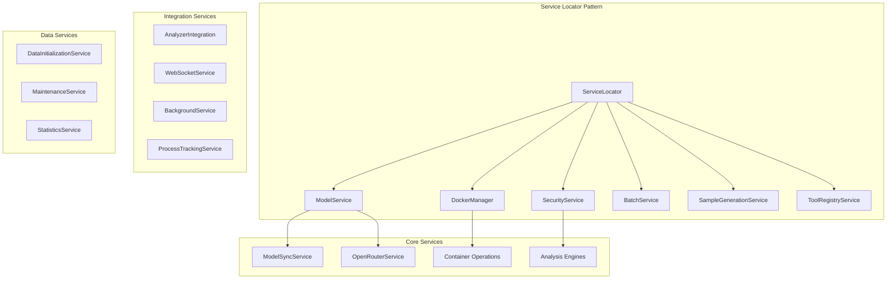
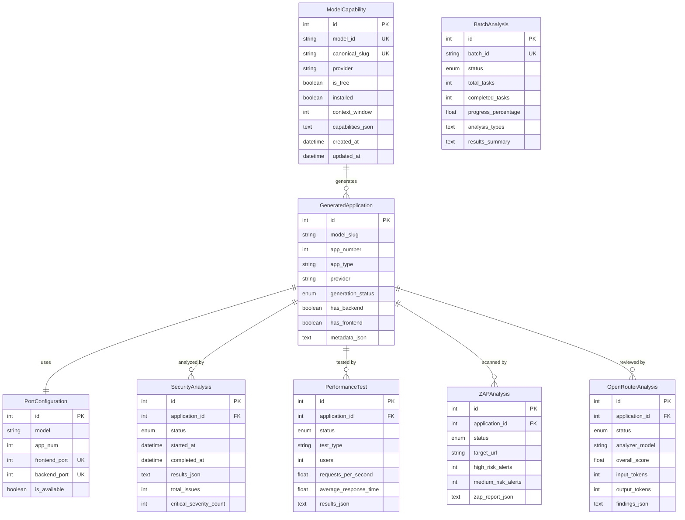
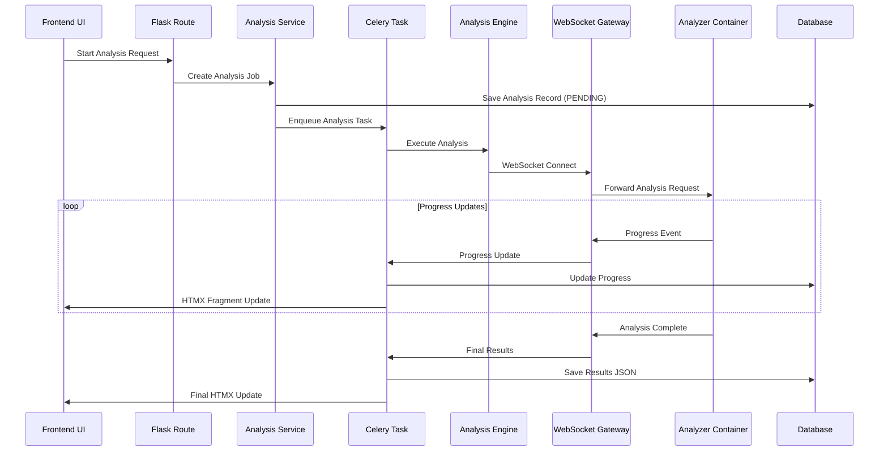
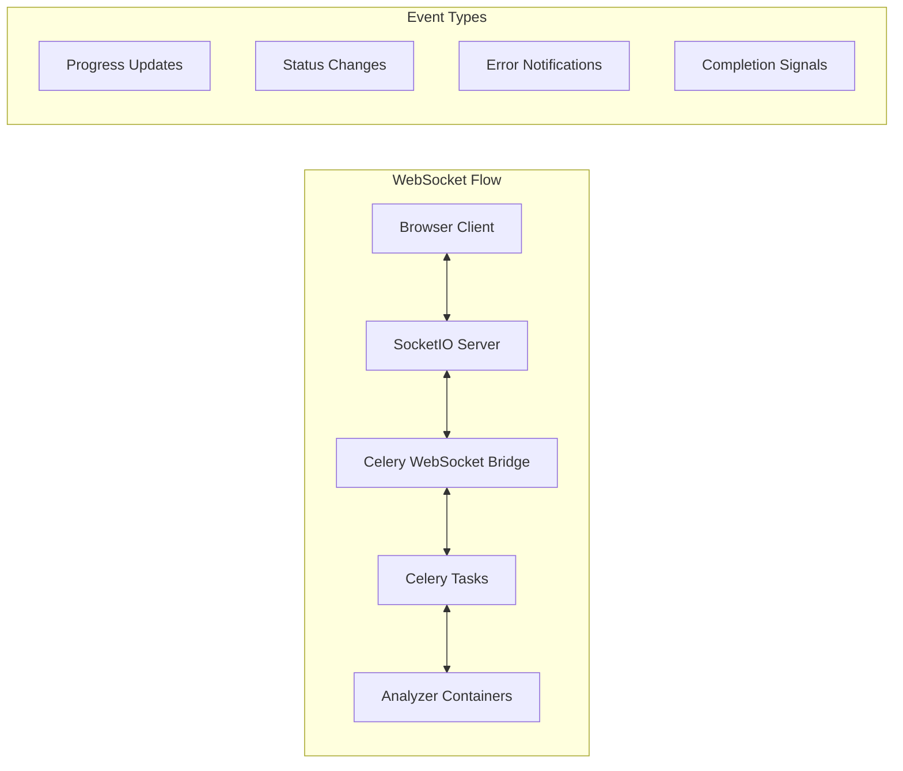
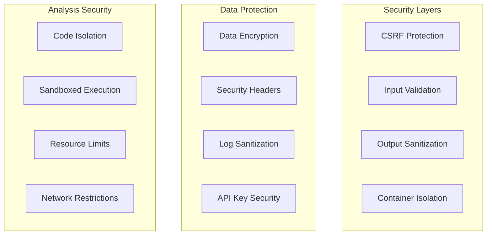
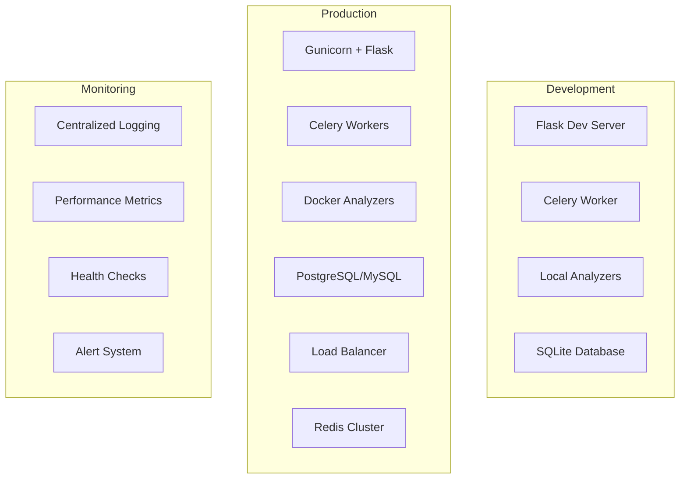

# ThesisApp Architecture

A comprehensive Flask-based platform for AI model analysis and research, featuring containerized analyzer services, real-time WebSocket communication, and Bootstrap 5 + HTMX frontend.

## System Overview

```mermaid
graph TB
    subgraph "Frontend Layer"
        UI[Bootstrap 5 + HTMX UI]
        Templates[Jinja2 Templates]
    end
    
    subgraph "Application Layer"
        Flask[Flask Application]
        Routes[Route Blueprints]
        Services[Business Services]
        Tasks[Celery Tasks]
    end
    
    subgraph "Data Layer"
        DB[(SQLite Database)]
        Models[SQLAlchemy Models]
        JSON[JSON Results Storage]
    end
    
    subgraph "Analysis Layer"
        Gateway[WebSocket Gateway :8765]
        Static[Static Analyzer :2001]
        Dynamic[Dynamic Analyzer :2002]
        Perf[Performance Tester :2003]
        AI[AI Analyzer :2004]
    end
    
    subgraph "Infrastructure"
        Redis[(Redis :6379)]
        Docker[Docker Compose]
        Logs[Structured Logging]
    end
    
    UI --> Flask
    Templates --> UI
    Flask --> Routes
    Routes --> Services
    Services --> Tasks
    Services --> Models
    Models --> DB
    Tasks --> Gateway
    Gateway --> Static
    Gateway --> Dynamic
    Gateway --> Perf
    Gateway --> AI
    Tasks --> Redis
    Static --> JSON
    Dynamic --> JSON
    Perf --> JSON
    AI --> JSON
```

## Core Components

### 1. Flask Application Core

```mermaid
graph LR
    subgraph "App Factory Pattern"
        Main[main.py] --> Factory[app/factory.py]
        Factory --> Config[config/]
        Factory --> Extensions[extensions.py]
        Factory --> Routes[routes/]
        Factory --> Services[services/]
    end
    
    subgraph "Configuration"
        Config --> DevConfig[Development]
        Config --> ProdConfig[Production]
        Config --> TestConfig[Testing]
    end
    
    subgraph "Extensions"
        Extensions --> SQLAlchemy
        Extensions --> Celery
        Extensions --> SocketIO[SocketIO Optional]
    end
```

**Key Files:**
- `src/main.py` - Application entry point
- `src/app/factory.py` - Flask app factory with extension initialization
- `src/worker.py` - Celery worker bootstrap
- `src/app/extensions.py` - Extension configuration and initialization

### 2. Route Architecture

```mermaid
graph TB
    subgraph "Route Organization"
        Jinja[Jinja Routes]
        API[API Routes]
        WS[WebSocket Routes]
    end
    
    subgraph "Jinja Blueprints"
        Main[main_bp - Dashboard]
        Models[models_bp - Model Management]
        Analysis[analysis_bp - Analysis Pages]
        Stats[stats_bp - Statistics]
        Reports[reports_bp - Reports]
        Docs[docs_bp - Documentation]
        SampleGen[sample_generator_bp]
    end
    
    subgraph "API Blueprints"
        CoreAPI[core_bp - Health/Status]
        ModelsAPI[models_bp - Model CRUD]
        AnalysisAPI[analysis_bp - Analysis API]
        SystemAPI[system_bp - System Info]
        DashboardAPI[dashboard_bp - Dashboard Data]
        AppsAPI[applications_bp - App Management]
        TasksAPI[tasks_rt_bp - Real-time Tasks]
        SampleAPI[sample_gen_bp - Sample Generation]
    end
    
    Jinja --> Main
    Jinja --> Models
    Jinja --> Analysis
    Jinja --> Stats
    Jinja --> Reports
    Jinja --> Docs
    Jinja --> SampleGen
    
    API --> CoreAPI
    API --> ModelsAPI
    API --> AnalysisAPI
    API --> SystemAPI
    API --> DashboardAPI
    API --> AppsAPI
    API --> TasksAPI
    API --> SampleAPI
```

**Route Patterns:**
- **Jinja Routes**: Server-rendered HTML pages with HTMX fragments
- **API Routes**: JSON endpoints for AJAX and external integrations
- **WebSocket Routes**: Real-time communication for analysis progress

### 3. Service Layer Architecture

```mermaid
graph TB
    subgraph "Service Locator Pattern"
        Locator[ServiceLocator] --> ModelSvc[ModelService]
        Locator --> DockerMgr[DockerManager]
        Locator --> SecuritySvc[SecurityService]
        Locator --> BatchSvc[BatchService]
        Locator --> SampleGenSvc[SampleGenerationService]
        Locator --> ToolRegistry[ToolRegistryService]
    end
    
    subgraph "Core Services"
        ModelSvc --> ModelSync[ModelSyncService]
        ModelSvc --> OpenRouter[OpenRouterService]
        DockerMgr --> ContainerOps[Container Operations]
        SecuritySvc --> AnalysisEngines[Analysis Engines]
    end
    
    subgraph "Integration Services"
        AnalyzerInteg[AnalyzerIntegration]
        WebSocketSvc[WebSocketService]
        BackgroundSvc[BackgroundService]
        ProcessTrack[ProcessTrackingService]
    end
    
    subgraph "Data Services"
        DataInit[DataInitializationService]
        MaintenanceSvc[MaintenanceService]
        StatsSvc[StatisticsService]
    end
```

**Service Responsibilities:**
- **ModelService**: AI model metadata and capability management
- **DockerManager**: Container lifecycle and health monitoring
- **SecurityService**: Security analysis orchestration
- **AnalyzerIntegration**: WebSocket communication with analyzer containers
- **SampleGenerationService**: AI-powered code generation

### 4. Data Architecture

```mermaid
erDiagram
    ModelCapability {
        int id PK
        string model_id UK
        string canonical_slug UK
        string provider
        boolean is_free
        boolean installed
        int context_window
        text capabilities_json
        datetime created_at
        datetime updated_at
    }
    
    GeneratedApplication {
        int id PK
        string model_slug
        int app_number
        string app_type
        string provider
        enum generation_status
        boolean has_backend
        boolean has_frontend
        text metadata_json
    }
    
    PortConfiguration {
        int id PK
        string model
        int app_num
        int frontend_port UK
        int backend_port UK
        boolean is_available
    }
    
    SecurityAnalysis {
        int id PK
        int application_id FK
        enum status
        datetime started_at
        datetime completed_at
        text results_json
        int total_issues
        int critical_severity_count
    }
    
    PerformanceTest {
        int id PK
        int application_id FK
        enum status
        string test_type
        int users
        float requests_per_second
        float average_response_time
        text results_json
    }
    
    ZAPAnalysis {
        int id PK
        int application_id FK
        enum status
        string target_url
        int high_risk_alerts
        int medium_risk_alerts
        text zap_report_json
    }
    
    OpenRouterAnalysis {
        int id PK
        int application_id FK
        enum status
        string analyzer_model
        float overall_score
        int input_tokens
        int output_tokens
        text findings_json
    }
    
    BatchAnalysis {
        int id PK
        string batch_id UK
        enum status
        int total_tasks
        int completed_tasks
        float progress_percentage
        text analysis_types
        text results_summary
    }
    
    ModelCapability ||--o{ GeneratedApplication : "generates"
    GeneratedApplication ||--|| PortConfiguration : "uses"
    GeneratedApplication ||--o{ SecurityAnalysis : "analyzed by"
    GeneratedApplication ||--o{ PerformanceTest : "tested by"
    GeneratedApplication ||--o{ ZAPAnalysis : "scanned by"
    GeneratedApplication ||--o{ OpenRouterAnalysis : "reviewed by"
```

**Key Data Patterns:**
- **JSON Columns**: Large analysis results stored as JSON for flexibility
- **Status Enums**: Consistent lifecycle management (PENDING → RUNNING → COMPLETED/FAILED)
- **Metadata Storage**: Extensible metadata in JSON columns
- **Temporal Tracking**: Created/updated timestamps for audit trails

### 5. Analysis Pipeline

```mermaid
sequenceDiagram
    participant UI as Frontend UI
    participant Route as Flask Route
    participant Service as Analysis Service
    participant Task as Celery Task
    participant Engine as Analysis Engine
    participant Gateway as WebSocket Gateway
    participant Analyzer as Analyzer Container
    participant DB as Database
    
    UI->>Route: Start Analysis Request
    Route->>Service: Create Analysis Job
    Service->>DB: Save Analysis Record (PENDING)
    Service->>Task: Enqueue Analysis Task
    Task->>Engine: Execute Analysis
    Engine->>Gateway: WebSocket Connect
    Gateway->>Analyzer: Forward Analysis Request
    
    loop Progress Updates
        Analyzer->>Gateway: Progress Event
        Gateway->>Task: Progress Update
        Task->>DB: Update Progress
        Task->>UI: HTMX Fragment Update
    end
    
    Analyzer->>Gateway: Analysis Complete
    Gateway->>Task: Final Results
    Task->>DB: Save Results JSON
    Task->>UI: Final HTMX Update
```

**Analysis Types:**
- **Security Analysis**: Static code analysis using Bandit, Safety, ESLint
- **Performance Testing**: Load testing using Locust
- **ZAP Security**: Dynamic security testing with OWASP ZAP
- **AI Analysis**: Code review using OpenRouter models
- **Code Quality**: Linting and complexity analysis

### 6. Analyzer Infrastructure

```mermaid
graph TB
    subgraph "Docker Compose Stack"
        Gateway[WebSocket Gateway<br/>:8765]
        Static[Static Analyzer<br/>:2001]
        Dynamic[Dynamic Analyzer<br/>:2002]
        Perf[Performance Tester<br/>:2003]
        AI[AI Analyzer<br/>:2004]
        Redis[Redis<br/>:6379]
    end
    
    subgraph "Gateway Features"
        Gateway --> Routing[Request Routing]
        Gateway --> Events[Event Broadcasting]
        Gateway --> Health[Health Monitoring]
    end
    
    subgraph "Static Analyzer Tools"
        Static --> Bandit[Bandit - Python Security]
        Static --> Safety[Safety - Vulnerability Check]
        Static --> ESLint[ESLint - JavaScript Linting]
        Static --> PyLint[PyLint - Python Quality]
    end
    
    subgraph "Dynamic Analyzer"
        Dynamic --> ZAP[OWASP ZAP]
        Dynamic --> Spider[Web Crawler]
        Dynamic --> ActiveScan[Active Security Scan]
    end
    
    subgraph "Performance Tester"
        Perf --> Locust[Locust Load Testing]
        Perf --> Metrics[Performance Metrics]
        Perf --> Reports[HTML Reports]
    end
    
    subgraph "AI Analyzer"
        AI --> OpenRouterAPI[OpenRouter API]
        AI --> CodeReview[Automated Code Review]
        AI --> Recommendations[Improvement Suggestions]
    end
```

**Container Management:**
- **Health Checks**: All containers have built-in health monitoring
- **Resource Limits**: Memory and CPU constraints for stability
- **Volume Mounts**: Persistent storage for results and configurations
- **Network Isolation**: Secure communication via dedicated network

### 7. Frontend Architecture

```mermaid
graph TB
    subgraph "Template Structure"
        Layouts[layouts/]
        Pages[pages/]
        Shared[shared/]
        Generation[generation/]
    end
    
    subgraph "Technology Stack"
        Bootstrap5[Bootstrap 5<br/>CSS Framework]
        HTMX[HTMX<br/>Dynamic Updates]
        FontAwesome[Font Awesome<br/>Icons]
        Jinja2[Jinja2<br/>Templating]
    end
    
    subgraph "Page Organization"
        Pages --> Dashboard[analysis/]
        Pages --> Models[models/]
        Pages --> Apps[applications/]
        Pages --> Reports[reports/]
        Pages --> Stats[statistics/]
        Pages --> Batch[batch/]
        Pages --> SampleGen[sample_generator/]
        Pages --> DocsPages[docs/]
        Pages --> Errors[errors/]
    end
    
    subgraph "Layout Types"
        Layouts --> Base[base.html]
        Layouts --> Dashboard[dashboard.html]
        Layouts --> SinglePage[single-page.html]
        Layouts --> Modal[modal.html]
    end
    
    subgraph "HTMX Patterns"
        HTMX --> Polling[Progress Polling]
        HTMX --> Fragments[Partial Updates]
        HTMX --> Forms[Form Submission]
        HTMX --> Tables[Dynamic Tables]
    end
```

**Frontend Features:**
- **Progressive Enhancement**: Works without JavaScript
- **Responsive Design**: Mobile-first Bootstrap 5 approach
- **Accessibility**: WCAG AA compliance with proper ARIA
- **Performance**: Minimal JavaScript, server-side rendering

### 8. Real-time Communication

```mermaid
graph LR
    subgraph "WebSocket Flow"
        Client[Browser Client]
        SocketIO[SocketIO Server]
        CeleryBridge[Celery WebSocket Bridge]
        Tasks[Celery Tasks]
        Analyzers[Analyzer Containers]
    end
    
    Client <--> SocketIO
    SocketIO <--> CeleryBridge
    CeleryBridge <--> Tasks
    Tasks <--> Analyzers
    
    subgraph "Event Types"
        ProgressEvents[Progress Updates]
        StatusEvents[Status Changes]
        ErrorEvents[Error Notifications]
        CompletionEvents[Completion Signals]
    end
```

**Communication Patterns:**
- **Analysis Progress**: Real-time updates during analysis execution
- **Task Status**: Live monitoring of Celery task queue
- **System Health**: Container and service health monitoring
- **Error Handling**: Graceful degradation with HTMX fallback

### 9. Security & Authentication

```mermaid
graph TB
    subgraph "Security Layers"
        CSRF[CSRF Protection]
        InputValidation[Input Validation]
        OutputSanitization[Output Sanitization]
        ContainerIsolation[Container Isolation]
    end
    
    subgraph "Data Protection"
        Encryption[Data Encryption]
        SecureHeaders[Security Headers]
        LogSanitization[Log Sanitization]
        APIKeySecurity[API Key Security]
    end
    
    subgraph "Analysis Security"
        CodeIsolation[Code Isolation]
        SandboxedExecution[Sandboxed Execution]
        ResourceLimits[Resource Limits]
        NetworkRestrictions[Network Restrictions]
    end
```

### 10. Deployment Architecture

```mermaid
graph TB
    subgraph "Development"
        DevFlask[Flask Dev Server]
        DevCelery[Celery Worker]
        DevAnalyzers[Local Analyzers]
        DevDB[SQLite Database]
    end
    
    subgraph "Production"
        ProdFlask[Gunicorn + Flask]
        ProdCelery[Celery Workers]
        ProdAnalyzers[Docker Analyzers]
        ProdDB[PostgreSQL/MySQL]
        LoadBalancer[Load Balancer]
        Redis[Redis Cluster]
    end
    
    subgraph "Monitoring"
        Logs[Centralized Logging]
        Metrics[Performance Metrics]
        Health[Health Checks]
        Alerts[Alert System]
    end
```

## Key Design Principles

### 1. **Microservices Architecture**
- Independent analyzer containers for scalability
- WebSocket gateway for unified communication
- Service-oriented backend design

### 2. **Progressive Enhancement**
- Server-first rendering with HTMX augmentation
- Graceful degradation without JavaScript
- Accessible design from the ground up

### 3. **Data-Driven Design**
- JSON storage for flexible analysis results
- Metadata-rich models for extensibility
- Audit trails for research reproducibility

### 4. **Real-time Capabilities**
- WebSocket integration for live updates
- Asynchronous task processing with Celery
- Event-driven architecture

### 5. **Developer Experience**
- Clear separation of concerns
- Comprehensive error handling
- Extensive logging and monitoring

## Technology Stack Summary

| Layer | Technologies |
|-------|-------------|
| **Frontend** | Bootstrap 5, HTMX, Font Awesome, Jinja2 |
| **Backend** | Flask, SQLAlchemy, Celery, Redis |
| **Analysis** | Docker, WebSockets, Python analyzers |
| **Database** | SQLite (dev), PostgreSQL (prod) |
| **Infrastructure** | Docker Compose, Gunicorn, Nginx |
| **Monitoring** | Structured logging, Health checks |

## Getting Started

1. **Start Services**: `python scripts/start_services.py`
2. **Run Flask**: `python src/main.py`
3. **Start Worker**: `celery -A app.tasks worker --loglevel=info`
4. **Access UI**: `http://localhost:5000`

## Performance Characteristics

- **Analysis Throughput**: 10-50 concurrent analyses depending on container resources
- **Response Time**: < 200ms for UI interactions, real-time analysis updates
- **Scalability**: Horizontal scaling via additional analyzer containers
- **Resource Usage**: ~2GB RAM for full stack, configurable container limits

This architecture supports the platform's core mission of providing comprehensive AI model analysis with real-time feedback, scalable processing, and an intuitive user experience.