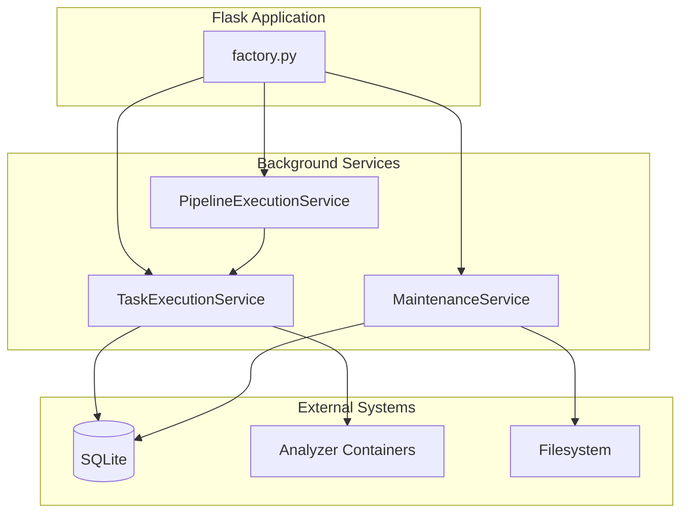
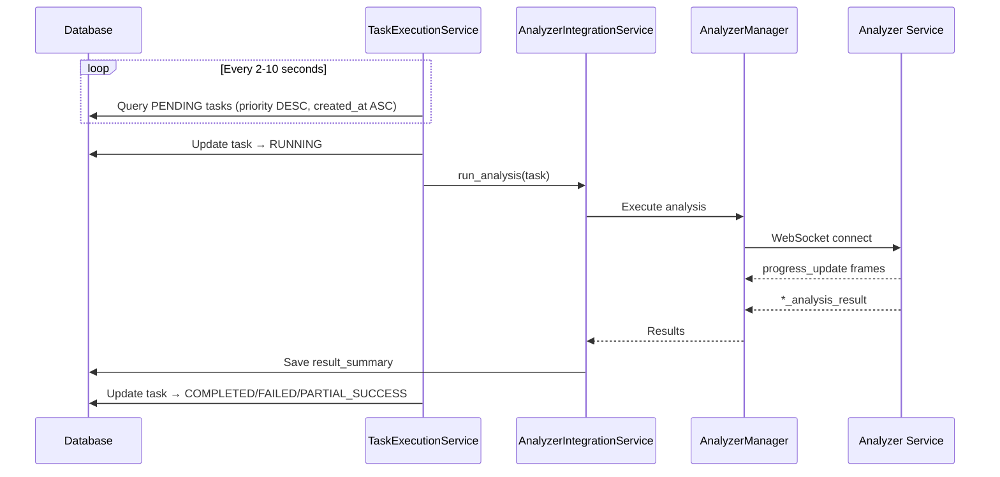
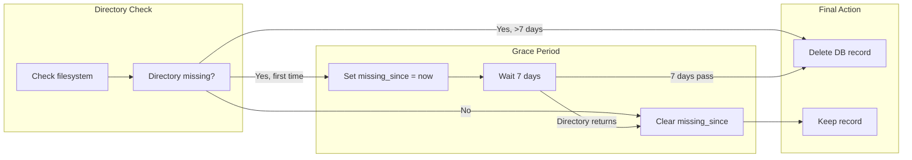
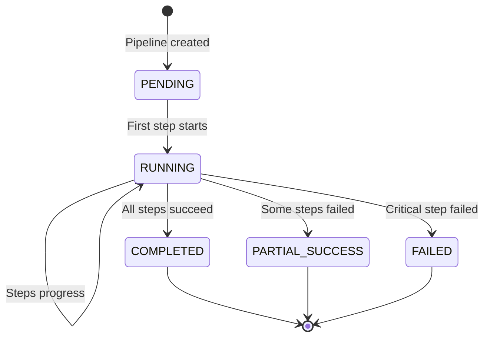
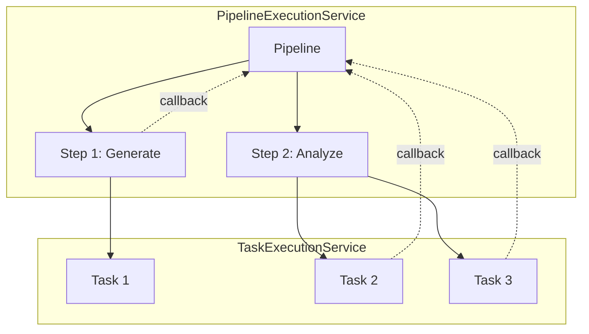
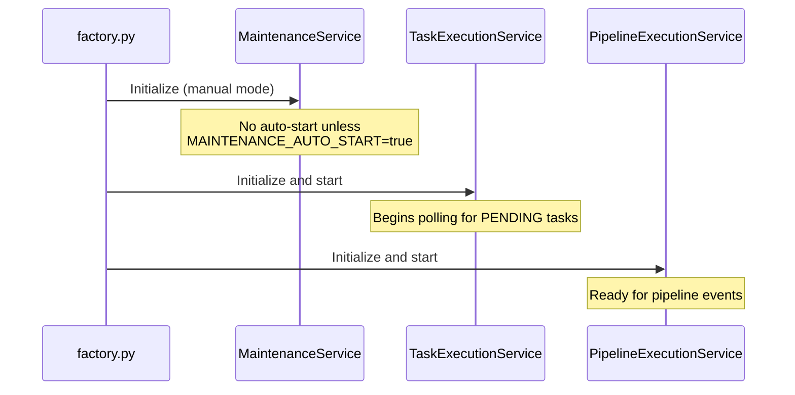

# Background Services

ThesisAppRework uses three background services for task execution, cleanup, and automation. This document details their configuration, behavior, and debugging.

## Overview



| Service | Purpose | Default State | Trigger |
|---------|---------|---------------|---------|
| TaskExecutionService | Execute PENDING analysis tasks | **Auto-start** | Polling (2-10s) |
| MaintenanceService | Cleanup orphans and stuck tasks | **Manual** | `./start.ps1 -Mode Maintenance` |
| PipelineExecutionService | Automation pipeline orchestration | **Auto-start** | Event-driven |

---

## TaskExecutionService

**Location**: [src/app/services/task_execution_service.py](../src/app/services/task_execution_service.py)

Asynchronous daemon that picks up PENDING analysis tasks and executes them via analyzer containers.

### Lifecycle

1. **Initialization**: Started automatically in `factory.py` during Flask app creation
2. **Polling**: Queries database every 2s (test) or 10s (production) for PENDING tasks
3. **Execution**: Dispatches to `AnalyzerIntegrationService.run_analysis()`
4. **Shutdown**: Gracefully waits for current task to complete on app shutdown

### Task Flow



### Configuration

| Variable | Purpose | Default |
|----------|---------|---------|
| `TASK_POLL_INTERVAL` | Polling interval (seconds) | 10 (prod), 2 (test) |
| `TASK_TIMEOUT` | Overall task timeout (seconds) | 1800 (30 min) |
| `PREFLIGHT_MAX_RETRIES` | Max retries for service unavailability | 3 |
| `TRANSIENT_FAILURE_MAX_RETRIES` | Max auto-recovery attempts for failed tasks | 3 |

### Automatic Retry Behavior (December 2025)

The TaskExecutionService implements robust retry mechanisms:

1. **Pre-flight Check Retries**: When analyzer services are unavailable, tasks are automatically rescheduled with exponential backoff (30s, 60s, 120s) up to `PREFLIGHT_MAX_RETRIES` times.

2. **Transient Failure Recovery**: Tasks that failed due to service unavailability are automatically recovered when services become available (checked every 5 minutes).

3. **Stuck Task Recovery**: Tasks stuck in RUNNING state for >15 minutes are reset to PENDING for retry (up to 3 retries).

### Debugging

```python
# Check if service is running
from app.services.service_locator import ServiceLocator
service = ServiceLocator.get_task_execution_service()
print(f"Running: {service._running}")  # Should be True
print(f"Current task: {service._current_task_id}")  # None if idle

# Find stuck tasks
from app.models import AnalysisTask, AnalysisStatus
stuck = AnalysisTask.query.filter_by(status=AnalysisStatus.RUNNING).all()
for task in stuck:
    print(f"{task.task_id}: running since {task.started_at}")

# Manual recovery
python scripts/fix_task_statuses.py
```

### Common Issues

| Symptom | Cause | Solution |
|---------|-------|----------|
| Tasks stuck in PENDING | Service not running | Restart Flask app |
| Tasks stuck in RUNNING | Service crashed mid-execution | Run `scripts/fix_task_statuses.py` |
| Slow task pickup | Long poll interval | Set `TASK_POLL_INTERVAL=2` |

---

## MaintenanceService

**Location**: [src/app/services/maintenance_service.py](../src/app/services/maintenance_service.py)

Handles cleanup of orphaned resources, stuck tasks, and old data. **Manual by default** since Nov 2025.

### Behavior (Nov 2025 Update)

The service was changed to manual operation to prevent aggressive auto-cleanup during development:

| Before Nov 2025 | After Nov 2025 |
|-----------------|----------------|
| Auto-start on Flask init | Manual via `./start.ps1 -Mode Maintenance` |
| Immediate orphan deletion | 7-day grace period before deletion |
| No recovery mechanism | `missing_since` tracking with auto-restore |

### 7-Day Grace Period



### Cleanup Operations

| Operation | Behavior | Threshold |
|-----------|----------|-----------|
| Orphan apps | Mark with `missing_since`, delete after 7 days | `orphan_app_retention_days: 7` |
| Orphan tasks | Cancel tasks targeting deleted apps | Immediate |
| Stuck RUNNING tasks | Mark as FAILED | `stuck_task_timeout_minutes: 120` |
| Stuck PENDING tasks | Mark as CANCELLED | `pending_task_timeout_minutes: 240` |
| Old completed tasks | Delete from database | `task_retention_days: 30` |

### Configuration

```python
# Default configuration in MaintenanceService.__init__
config = {
    'cleanup_orphan_apps': True,
    'cleanup_orphan_tasks': True,
    'cleanup_stuck_tasks': True,
    'cleanup_old_tasks': True,
    'task_retention_days': 30,
    'stuck_task_timeout_minutes': 120,  # 2 hours
    'pending_task_timeout_minutes': 240,  # 4 hours
    'grace_period_minutes': 5,  # Skip very recent tasks
    'orphan_app_retention_days': 7,  # 7-day grace period
}
```

| Variable | Purpose | Default |
|----------|---------|---------|
| `MAINTENANCE_AUTO_START` | Auto-start cleanup | `false` |
| `MAINTENANCE_INTERVAL_SECONDS` | Interval when auto-started | 3600 (1 hour) |

### Usage

```bash
# Recommended: Manual cleanup via orchestrator
./start.ps1 -Mode Maintenance

# Direct Python execution
python -c "
from app.factory import create_app
from app.services.maintenance_service import get_maintenance_service
app = create_app()
with app.app_context():
    get_maintenance_service()._run_maintenance()
"
```

### Database Migration

If upgrading from before Nov 2025, run the migration to add the `missing_since` column:

```bash
python scripts/add_missing_since_column.py
```

### Log Output

```
[MaintenanceService] Starting maintenance run...
[MaintenanceService] Marked 2 apps as missing (grace period: 7 days)
[MaintenanceService] Restored 1 apps (filesystem directories reappeared)
[MaintenanceService] Found 1 orphan apps ready for deletion (missing for >7 days)
[MaintenanceService] Cleaned up 1 orphan app records
[MaintenanceService] Marked 3 stuck tasks as FAILED
[MaintenanceService] Deleted 15 old tasks (>30 days)
[MaintenanceService] Maintenance complete
```

---

## PipelineExecutionService

**Location**: [src/app/services/pipeline_execution_service.py](../src/app/services/pipeline_execution_service.py)

Orchestrates automation pipelines that execute multi-step workflows (generation + analysis).

### Lifecycle

1. **Initialization**: Started in `factory.py` alongside TaskExecutionService
2. **Trigger**: Event-driven (pipeline creation, task completion callbacks)
3. **Execution**: Creates AnalysisTasks and monitors their completion
4. **Completion**: Updates pipeline status based on aggregate task results

### Pipeline Flow



### Integration with TaskExecutionService

Pipelines create child tasks that are executed by TaskExecutionService:



---

## Service Interaction

### Startup Order



### Debugging All Services

```bash
# Check service status via Flask
python -c "
from app.factory import create_app
from app.services.service_locator import ServiceLocator

app = create_app()
with app.app_context():
    tes = ServiceLocator.get_task_execution_service()
    print(f'TaskExecutionService: running={tes._running}')
    
    # Check pending/running tasks
    from app.models import AnalysisTask, AnalysisStatus
    pending = AnalysisTask.query.filter_by(status=AnalysisStatus.PENDING).count()
    running = AnalysisTask.query.filter_by(status=AnalysisStatus.RUNNING).count()
    print(f'Tasks: {pending} pending, {running} running')
"
```

---

## Related Documentation

- [Architecture Overview](./ARCHITECTURE.md) - System design and data flow
- [Troubleshooting](./TROUBLESHOOTING.md) - Common issues and recovery
- [API Reference](./api-reference.md) - Task API endpoints
