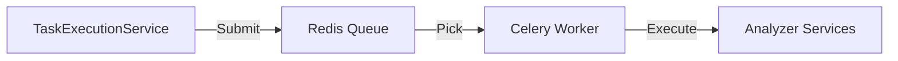
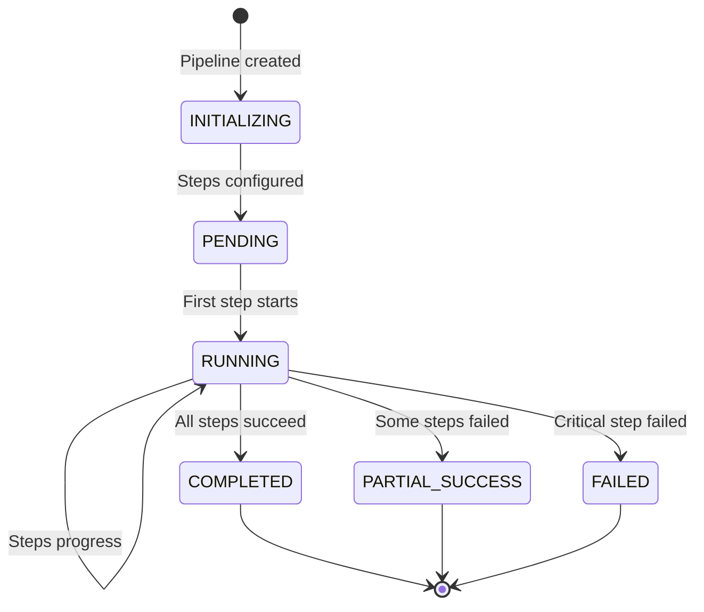
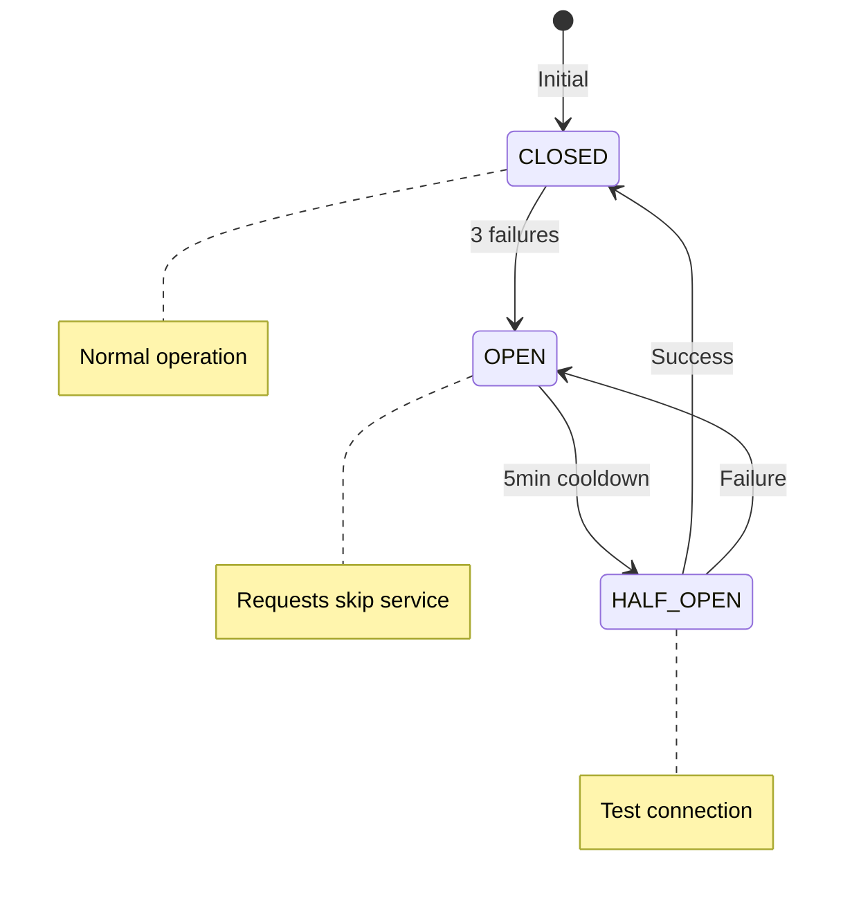
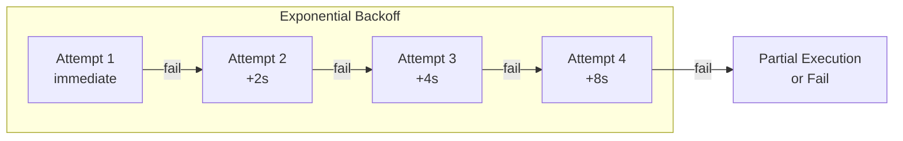

# Background Services

> **Summary**: Celery worker, pipeline execution polling, and maintenance service configuration, behavior, and debugging.
> **Key files**: `src/app/celery_worker.py`, `src/app/services/pipeline_execution_service.py`, `src/app/services/maintenance_service.py`
> **See also**: [Architecture Overview](ARCHITECTURE.md), [Deployment Guide](deployment-guide.md)

ThesisAppRework uses three background services for task execution, cleanup, and automation. This document details their configuration, behavior, and debugging.

## Overview


| Service | Purpose | Default State | Trigger |
|---------|---------|---------------|---------|
| TaskExecutionService | Execute PENDING analysis tasks | **Auto-start** | Polling (2s test / 5s prod) |
| MaintenanceService | Cleanup orphans and stuck tasks | **Manual** | `./start.ps1 -Mode Maintenance` |
| PipelineExecutionService | Automation pipeline orchestration | **Auto-start** | Polling (2s test / 3s prod) |

---

## TaskExecutionService

**Location**: [src/app/services/task_execution_service.py](../src/app/services/task_execution_service.py)

Asynchronous daemon that picks up PENDING analysis tasks and dispatches them for execution. In Docker environments (default), tasks are executed via **Celery workers**. In local development, tasks can optionally use ThreadPoolExecutor.

### Lifecycle

1. **Initialization**: Started automatically in `factory.py` during Flask app creation
2. **Polling**: Queries database every 2s (test) or 5s (production) for PENDING tasks
3. **Execution**: Dispatches to `AnalyzerIntegrationService.run_analysis()`
4. **Shutdown**: Gracefully waits for current task to complete on app shutdown

### Task Flow


### Configuration

| Variable | Purpose | Default |
|----------|---------|---------|
| **Task Execution** | | |
| `USE_CELERY_ANALYSIS` | Use Celery workers (recommended) | `true` (Docker) |
| `CELERY_BROKER_URL` | Redis broker for Celery | `redis://redis:6379/0` |
| `CELERY_RESULT_BACKEND` | Task result storage | `redis://redis:6379/0` |
| **Polling & Timeouts** | | |
| `TASK_POLL_INTERVAL` | Polling interval (seconds) | 5 (prod), 2 (test) |
| `TASK_TIMEOUT` | Overall task timeout (seconds) | 1800 (30 min) |
| **Retry Behavior** | | |
| `PREFLIGHT_MAX_RETRIES` | Max retries for service unavailability | 3 |
| `TRANSIENT_FAILURE_MAX_RETRIES` | Max auto-recovery attempts for failed tasks | 3 |

### Celery vs ThreadPoolExecutor

The TaskExecutionService supports two execution backends:

| Backend | Mode | Use Case |
|---------|------|----------|
| **Celery** | `USE_CELERY_ANALYSIS=true` | **Default** - Docker, production, scalable |
| ThreadPoolExecutor | `USE_CELERY_ANALYSIS=false` | Legacy local development only |

**Celery Mode (Docker):**


**Benefits:**
- Distributed execution across multiple workers
- Task persistence and automatic retry
- Built-in monitoring and inspection
- Production-ready scalability

**ThreadPoolExecutor Mode (Local):**
- In-process execution with 8 worker threads
- Faster for development (no Redis overhead)
- Limited scalability

### Automatic Retry Behavior (December 2025)

The TaskExecutionService implements robust retry mechanisms:

1. **Pre-flight Check Retries**: When analyzer services are unavailable, tasks are automatically rescheduled with exponential backoff (30s, 60s, 120s) up to `PREFLIGHT_MAX_RETRIES` times.

2. **Transient Failure Recovery**: Tasks that failed due to service unavailability are automatically recovered when services become available (checked every 5 minutes).

3. **Stuck Task Recovery**: Tasks stuck in RUNNING state for >15 minutes are reset to PENDING for retry (up to 3 retries).

### Debugging

#### Check TaskExecutionService

```python
# Check if service is running
from app.services.service_locator import ServiceLocator
service = ServiceLocator.get_task_execution_service()
print(f"Running: {service._running}")  # Should be True
print(f"Current task: {service._current_task_id}")  # None if idle

# Find stuck tasks
from app.models import AnalysisTask, AnalysisStatus
stuck = AnalysisTask.query.filter_by(status=AnalysisStatus.RUNNING).all()
for task in stuck:
    print(f"{task.task_id}: running since {task.started_at}")

# Manual recovery
python scripts/reset_stuck_tasks.py
```

#### Monitor Celery Workers (Docker)

```bash
# Check worker status
docker compose exec web celery -A app.celery_worker.celery inspect active

# View registered tasks
docker compose exec web celery -A app.celery_worker.celery inspect registered

# Monitor queue length
docker compose exec web celery -A app.celery_worker.celery inspect stats

# View worker logs
docker compose logs -f celery-worker

# Restart workers
docker compose restart celery-worker
```

#### Scale Celery Workers

```bash
# Scale to 3 workers
docker compose up -d --scale celery-worker=3

# Check worker count
docker compose ps celery-worker
```

### Common Issues

| Symptom | Cause | Solution |
|---------|-------|----------|
| Tasks stuck in PENDING | Service not running | Restart Flask app |
| Tasks stuck in RUNNING | Service crashed mid-execution | Run `scripts/reset_stuck_tasks.py` |
| Slow task pickup | Long poll interval | Set `TASK_POLL_INTERVAL=2` |

---

## MaintenanceService

**Location**: [src/app/services/maintenance_service.py](../src/app/services/maintenance_service.py)

Handles cleanup of orphaned resources, stuck tasks, and old data. **Manual by default** since Nov 2025.

### Behavior (Nov 2025 Update)

The service was changed to manual operation to prevent aggressive auto-cleanup during development:

| Before Nov 2025 | After Nov 2025 |
|-----------------|----------------|
| Auto-start on Flask init | Manual via `./start.ps1 -Mode Maintenance` |
| Immediate orphan deletion | 7-day grace period before deletion |
| No recovery mechanism | `missing_since` tracking with auto-restore |

### 7-Day Grace Period


### Cleanup Operations

| Operation | Behavior | Threshold |
|-----------|----------|-----------|
| Orphan apps | Mark with `missing_since`, delete after 7 days | `orphan_app_retention_days: 7` |
| Orphan tasks | Cancel tasks targeting deleted apps | Immediate |
| Stuck RUNNING tasks | Mark as FAILED | `stuck_task_timeout_minutes: 120` |
| Stuck PENDING tasks | Mark as CANCELLED | `pending_task_timeout_minutes: 240` |
| Old completed tasks | Delete from database | `task_retention_days: 30` |

### Configuration

```python
# Default configuration in MaintenanceService.__init__
config = {
    'cleanup_orphan_apps': True,
    'cleanup_orphan_tasks': True,
    'cleanup_stuck_tasks': True,
    'cleanup_old_tasks': True,
    'task_retention_days': 30,
    'stuck_task_timeout_minutes': 120,  # 2 hours
    'pending_task_timeout_minutes': 240,  # 4 hours
    'grace_period_minutes': 5,  # Skip very recent tasks
    'orphan_app_retention_days': 7,  # 7-day grace period
}
```

| Variable | Purpose | Default |
|----------|---------|---------|
| `MAINTENANCE_AUTO_START` | Auto-start cleanup | `false` |
| `MAINTENANCE_INTERVAL_SECONDS` | Interval when auto-started | 3600 (1 hour) |

### Usage

```bash
# Recommended: Manual cleanup via orchestrator
./start.ps1 -Mode Maintenance

# Direct Python execution
python -c "
from app.factory import create_app
from app.services.maintenance_service import get_maintenance_service
app = create_app()
with app.app_context():
    get_maintenance_service()._run_maintenance()
"
```

### Database Migration

If upgrading from before Nov 2025, the `missing_since` column should already exist. If not, add it manually via SQLite:

```bash
sqlite3 src/data/thesis_app.db "ALTER TABLE generated_application ADD COLUMN missing_since DATETIME;"
```

### Log Output

```
[MaintenanceService] Starting maintenance run...
[MaintenanceService] Marked 2 apps as missing (grace period: 7 days)
[MaintenanceService] Restored 1 apps (filesystem directories reappeared)
[MaintenanceService] Found 1 orphan apps ready for deletion (missing for >7 days)
[MaintenanceService] Cleaned up 1 orphan app records
[MaintenanceService] Marked 3 stuck tasks as FAILED
[MaintenanceService] Deleted 15 old tasks (>30 days)
[MaintenanceService] Maintenance complete
```

---

## PipelineExecutionService

**Location**: [src/app/services/pipeline_execution_service.py](../src/app/services/pipeline_execution_service.py)

Orchestrates automation pipelines that execute multi-step workflows (generation + analysis).

### Lifecycle

1. **Initialization**: Started in `factory.py` alongside TaskExecutionService
2. **Trigger**: Event-driven (pipeline creation, task completion callbacks)
3. **Execution**: Creates AnalysisTasks and monitors their completion
4. **Completion**: Updates pipeline status based on aggregate task results

### Pipeline Flow



### Graceful Degradation (January 2026)

Pipeline execution is designed to be resilient to partial failures:

| Failure Type | Behavior |
|-------------|----------|
| Analyzer containers unavailable | Warning logged, analysis continues (static-only may succeed) |
| App container build failure | Mark task as PARTIAL_SUCCESS, other services continue |
| Individual tool failure | Task continues with remaining tools |
| Single app analysis failure | Pipeline continues with other apps |

**Key principle**: Pipelines complete with `PARTIAL_SUCCESS` status when some tasks fail but others succeed. Only catastrophic failures (exceptions, all services down) result in `FAILED` status.

**Status values**:
| Status | Meaning |
|--------|---------|
| `COMPLETED` | All analysis tasks succeeded |
| `PARTIAL_SUCCESS` | Some tasks failed, but at least one succeeded |
| `FAILED` | All tasks failed OR critical exception |

### Circuit Breaker Pattern (January 2026)

PipelineExecutionService implements a circuit breaker pattern for analyzer service resilience:

#### Configuration

| Setting | Value | Description |
|---------|-------|-------------|
| `CIRCUIT_BREAKER_THRESHOLD` | 3 | Consecutive failures before circuit opens |
| `CIRCUIT_BREAKER_COOLDOWN` | 300s (5 min) | Time before circuit resets |
| `MAX_STARTUP_RETRIES` | 4 | Retry attempts with exponential backoff |
| `BASE_RETRY_DELAY` | 2s | Initial retry delay (doubles each attempt) |
| `HEALTH_CHECK_TTL` | 30s | Cache invalidation for per-service health |

#### Circuit States



#### Partial Execution Behavior

When some analyzer services are unavailable, the pipeline continues with available services:

| Scenario | Behavior |
|----------|----------|
| All services healthy | Full analysis proceeds normally |
| Some services unavailable | Partial execution with available services (≥50% required) |
| Circuit breaker open | Service skipped until cooldown expires |
| All services down | Pipeline fails with clear error message |

#### Retry Strategy



#### Adaptive Polling

During container startup, poll intervals adjust based on elapsed time:

| Elapsed Time | Poll Interval |
|--------------|---------------|
| 0-30s | 2s |
| 30-60s | 3s |
| >60s | 5s |

#### Debugging Circuit Breaker

```python
# Check circuit breaker state for a service
from app.services.pipeline_execution_service import get_pipeline_execution_service
service = get_pipeline_execution_service()

# View service failure counts
print(service._analyzer_failures)  # {'static-analyzer': 0, ...}

# View cooldown times (Unix timestamp when cooldown expires)
print(service._analyzer_cooldown_until)  # {'static-analyzer': 0, ...}

# View health cache
print(service._service_health_cache)  # {'static-analyzer': {'healthy': True, 'check_time': ...}}

# Force health cache invalidation
service._invalidate_health_cache()  # Clears all cached health status
```

### Integration with TaskExecutionService

Pipelines create child tasks that are executed by TaskExecutionService:


### Configuration

| Variable | Purpose | Default |
|----------|---------|--------|
| Poll interval | How often to check for pipeline work | 2s (test) / 3s (prod) |
| Max concurrent analysis | Parallel analysis tasks per pipeline | 3 |

---

## Service Interaction

### Startup Order


### Debugging All Services

```bash
# Check service status via Flask
python -c "
from app.factory import create_app
from app.services.service_locator import ServiceLocator

app = create_app()
with app.app_context():
    tes = ServiceLocator.get_task_execution_service()
    print(f'TaskExecutionService: running={tes._running}')
    
    # Check pending/running tasks
    from app.models import AnalysisTask, AnalysisStatus
    pending = AnalysisTask.query.filter_by(status=AnalysisStatus.PENDING).count()
    running = AnalysisTask.query.filter_by(status=AnalysisStatus.RUNNING).count()
    print(f'Tasks: {pending} pending, {running} running')
"
```

---

## Related Documentation

- [Architecture Overview](./ARCHITECTURE.md) - System design and data flow
- [Troubleshooting](./TROUBLESHOOTING.md) - Common issues and recovery
- [API Reference](./api-reference.md) - Task API endpoints
