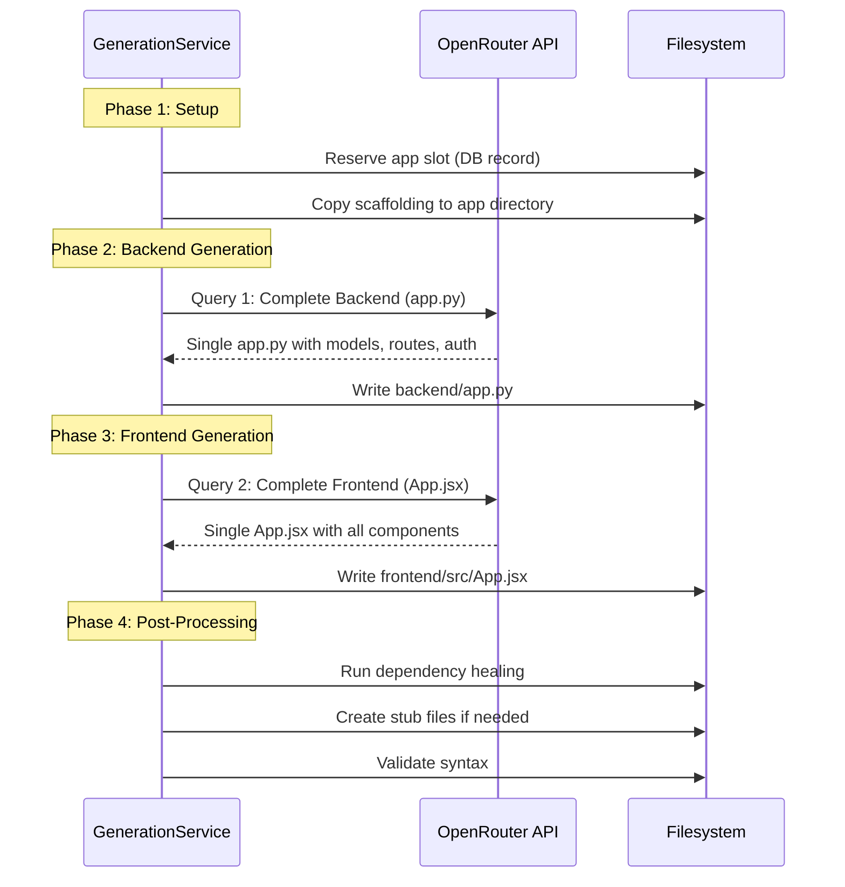

# Application Generation Process

> **Summary**: How LLM code generation works, from prompt construction through scaffolding injection to final app output.
> **Key files**: `src/app/services/generation_v2/service.py`, `misc/requirements/*.json`
> **See also**: [Template Specification](TEMPLATE_SPECIFICATION.md), [Models Reference](MODELS_REFERENCE.md)

This document describes the code generation architecture used in ThesisAppRework. The system generates full-stack web applications by combining immutable Docker scaffolding with AI-generated application code.

## Architecture Overview


## Core Design Principle: Scaffolding-First Architecture

The generation system follows a **"scaffolding-first"** approach where Docker infrastructure is treated as **immutable ("sacred")**:

| Component | Modifiable by AI? | Description |
|-----------|-------------------|-------------|
| `docker-compose.yml` | ❌ Never | Container orchestration |
| `Dockerfile` (backend/frontend) | ❌ Never | Build configuration |
| `nginx.conf` | ❌ Never | Reverse proxy config |
| `vite.config.js` | ❌ Never | Build tool config |
| `tailwind.config.js` | ❌ Never | CSS framework config |
| `main.jsx`, `index.html` | ❌ Never | React entry point |
| `backend/app.py` | ✅ Replace entirely | Flask app (models, routes, auth) |
| `frontend/src/App.jsx` | ✅ Replace entirely | React app (components, pages, hooks) |
| `requirements.txt` | ✅ Extend only | AI adds below marker comment |
| `package.json` | ✅ Extend only | AI adds from allowed libraries |

This ensures:
- **Reproducible builds** across all generated applications
- **Consistent deployment** via Docker Compose
- **Isolation of AI variability** to application-level code only

## Generation Modes

### GUARDED Mode (Primary - Used for Research)

The **GUARDED mode** is the primary generation strategy used for this research. It employs a structured **2-query system** that generates backend and frontend separately:



#### 2-Query File Output

Each query produces a single file:

| Query | Component | Output File |
|-------|-----------|-------------|
| 1 | Backend | `app.py` (complete backend with models, auth, user+admin routes) |
| 2 | Frontend | `App.jsx` (complete React app with all components, auth, pages) |

**Single-File Architecture:**
- Backend: ALL code in one `app.py` file (~500-800 lines)
- Frontend: ALL code in one `App.jsx` file (~600-900 lines)
- Simpler for LLMs to understand and generate
- No file splitting or imports between generated files
- Predictable structure for analysis

#### Public + Logged-in Conditional Rendering

The HomePage serves **both public and logged-in users** through conditional rendering:

**Public User Experience:**
- Fetches data from public read endpoints (no authentication required)
- Displays ALL content in read-only mode
- Shows "Sign in to [action]" call-to-action buttons instead of action buttons
- Same layout and data as logged-in users

**Logged-in User Experience:**
- Same public data fetch (same endpoints)
- Unlocks create/edit/delete buttons via conditional rendering
- Shows additional features/sections if specified in requirements
- Pattern: `{isAuthenticated ? <EditButton /> : <SignInCTA />}`

**Backend Support:**
- GET/list endpoints are public (no @token_required decorator)
- POST/PUT/DELETE endpoints require authentication
- Public endpoints return ALL data (no filtering by auth status)

### UNGUARDED Mode (Defined, Not Implemented)

An alternative **UNGUARDED mode** is defined in constants (`GenerationMode.UNGUARDED`) but has **no implementation** in the generation service. The service always uses GUARDED mode. This was planned as a mode giving the AI "full creative control" but was never completed due to expected high failure rates.

## Generation Workflow Detail

### Step 1: Atomic App Reservation

```python
# Prevents race conditions in concurrent generation
app_record = GeneratedApplication(
    model_slug=normalized_slug,
    app_number=next_available_number,
    status='generating'
)
db.session.add(app_record)
db.session.commit()
```

### Step 2: Scaffolding Copy

The scaffolding from `misc/scaffolding/react-flask/` is copied to the target directory with port substitution:

```
misc/scaffolding/react-flask/
├── .env.example          → .env (with allocated ports)
├── docker-compose.yml    → docker-compose.yml
├── backend/
│   ├── .dockerignore
│   ├── Dockerfile
│   ├── app.py           (placeholder - fully replaced by AI)
│   └── requirements.txt
└── frontend/
    ├── .dockerignore
    ├── Dockerfile
    ├── nginx.conf        (reverse proxy config - immutable)
    ├── vite.config.js    (build config - immutable)
    ├── tailwind.config.js (CSS config - immutable)
    ├── postcss.config.js
    ├── package.json
    ├── index.html
    └── src/
        └── App.jsx      (placeholder - fully replaced by AI)
```

### Step 3: Prompt Construction

Prompts are built using **Jinja2 templates** with requirement data:


#### Prompt Templates

Located in `misc/prompts/v2/`:

| Directory | Purpose |
|-----------|---------|
| `backend/system.md.jinja2` | Flask backend system prompt |
| `backend/user.md.jinja2` | Flask backend user prompt template |
| `frontend/system.md.jinja2` | React frontend system prompt |
| `frontend/user.md.jinja2` | React frontend user prompt template |

Each directory contains system and user prompt Jinja2 templates used for the 2-query generation approach (backend + frontend).

### Step 4: OpenRouter API Integration


#### Token Limits

All models use a unified token limit:

| Setting | Value |
|---------|-------|
| Default `max_tokens` | 32,000 |
| Dynamic calculation | `max(8000, min(32000, available_context))` |
| Hardcoded cap | 32,000 |

> **Note**: Token limits are not model-specific. The same cap applies to all providers via OpenRouter.

### Step 5: Code Merging

The AI response contains code in markdown fenced blocks. Each query produces a single file:

- **Backend query** → `app.py` (all models, routes, auth in one file, ~500-800 lines)
- **Frontend query** → `App.jsx` (all components, pages, hooks in one file, ~600-900 lines)

The merging process:
1. **Extract** code blocks by filename pattern
2. **Validate** Python syntax using `ast.parse()`
3. **Transform** localhost URLs to relative API paths
4. **Infer** missing dependencies and update `requirements.txt`
5. **Write** files to appropriate locations

### Step 6: Post-Generation Healing

The `DependencyHealer` performs automatic fixes:

| Issue | Fix Applied |
|-------|-------------|
| Missing `.jsx` extensions | Add extensions to imports |
| Undefined exports | Create stub exports |
| Missing npm packages | Add to `package.json` |
| Python import errors | Add to `requirements.txt` |
| Non-Lucide icon imports | Strip FA/Heroicons/react-icons imports |

> **Icon Library Normalization**: The healer automatically removes imports from non-standard icon libraries (Font Awesome, Heroicons, react-icons, MUI Icons, Ant Design Icons) to prevent build failures from hallucinated icon names. Applications should only use `lucide-react`.

## Technology Stack

### Backend (Flask)

| Package | Version | Purpose |
|---------|---------|---------|
| Flask | 3.0.0 | Web framework |
| Flask-SQLAlchemy | 3.1.1 | ORM integration |
| SQLAlchemy | 2.0.25 | Database ORM |
| Flask-CORS | 4.0.0 | Cross-origin support |
| Flask-JWT-Extended | 4.6.0 | JWT authentication |
| bcrypt | 4.1.2 | Password hashing |
| Werkzeug | 3.0.1 | WSGI utilities |

### Frontend (React + Vite)

| Package | Version | Purpose |
|---------|---------|---------|
| React | 18.2.0 | UI framework |
| React DOM | 18.2.0 | DOM rendering |
| React Router DOM | 6.21.0 | Client routing |
| Vite | 5.0.0 | Build tool |
| Tailwind CSS | 3.4.0 | Utility CSS |
| Axios | 1.6.0 | HTTP client |
| react-hot-toast | 2.4.1 | Notifications |
| lucide-react | 0.469.0 | Icons |

> **Note**: Lucide React is used instead of Font Awesome or Heroicons because its simple PascalCase naming convention (e.g., `Home`, `User`, `Search`) reduces LLM hallucination issues during code generation.

### Database

- **SQLite** - File-based database at `/app/data/app.db`
- Chosen for simplicity and reproducibility (no external database server)

### Deployment

- **Docker Compose** - Container orchestration
- **Nginx** - Static file serving for frontend
- **Gunicorn** - Production WSGI server (optional)

## Port Allocation

Ports are dynamically allocated starting from base values, checking for availability:

```
Backend Port  = 5001 + sequential offset (next free)
Frontend Port = 8001 + sequential offset (next free)
```

The port allocator (`PortAllocationService`) checks both OS port availability and database records to prevent conflicts. Pre-configured ports can be set in `misc/port_config.json`.

## Error Handling

### Generation Failures

| Failure Type | Handling |
|--------------|----------|
| API timeout | Retry up to 2 times with exponential backoff |
| Invalid response | Mark app as `generation_failed` with reason |
| Syntax errors | Attempt auto-fix, else mark failed |
| Missing files | Create stub files to improve build success |

### Success Metrics

A generation is considered **successful** if:
1. Both queries (backend + frontend) complete without API errors
2. Backend `app.py` passes Python syntax validation
3. Frontend `App.jsx` is syntactically valid
4. Docker build completes without errors

## Related Documentation

- [Template Specification](./TEMPLATE_SPECIFICATION.md) - Requirement template format
- [Analysis Pipeline](./ANALYSIS_PIPELINE.md) - How generated apps are analyzed
- [Architecture Overview](./ARCHITECTURE.md) - System architecture
