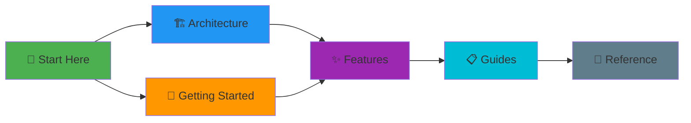
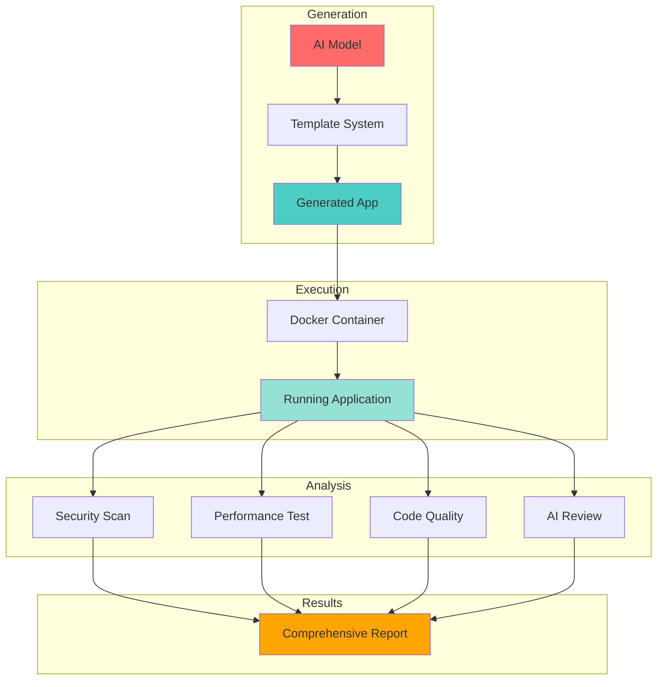
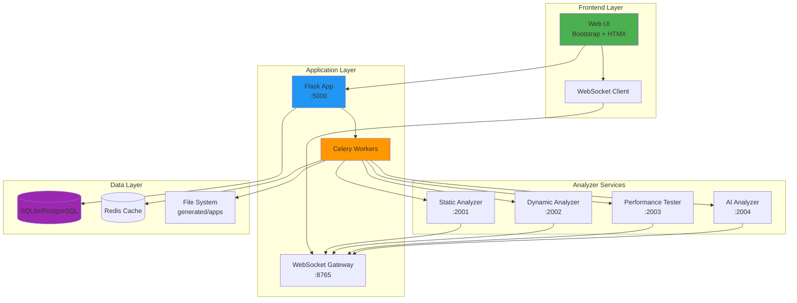
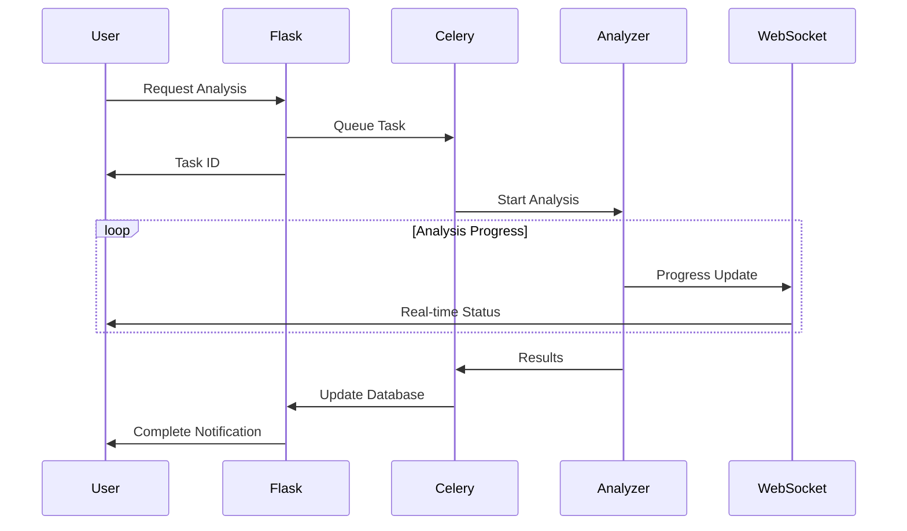

# ThesisApp Documentation

> **AI Model Analysis Platform** - Comprehensive testing and evaluation of AI-generated applications

[](LICENSE)
[](https://python.org)
[](https://docker.com)

---

## 📚 Documentation Map



---

## 🚀 Quick Navigation

### Getting Started
- **[Getting Started Guide](GETTING_STARTED.md)** - Installation, setup, and first steps
- **[Architecture Overview](ARCHITECTURE.md)** - System design and component interaction

### Core Features
- **[Application Generation](features/GENERATION.md)** - AI-powered app generation system
- **[Analysis Pipeline](features/ANALYSIS.md)** - Multi-dimensional analysis tools
- **[Port Management](features/PORT_ALLOCATION.md)** - Automatic port allocation system
- **[Container Orchestration](features/CONTAINERS.md)** - Docker-based app management

### How-To Guides
- **[Generate Applications](guides/GENERATING_APPS.md)** - Step-by-step generation guide
- **[Run Analysis](guides/RUNNING_ANALYSIS.md)** - Execute security, performance, and quality tests
- **[Manage Applications](guides/MANAGING_APPS.md)** - Start, stop, and monitor generated apps
- **[Batch Operations](guides/BATCH_OPERATIONS.md)** - Process multiple apps at once

### Technical Reference
- **[API Reference](reference/API.md)** - REST API endpoints and schemas
- **[Database Schema](reference/DATABASE.md)** - Data models and relationships
- **[Configuration](reference/CONFIGURATION.md)** - Environment variables and settings
- **[CLI Commands](reference/CLI.md)** - Analyzer manager command reference

---

## 🎯 What is ThesisApp?

ThesisApp is a comprehensive platform for **generating, executing, and analyzing AI-generated applications** across multiple dimensions:



### Key Capabilities

| Feature | Description |
|---------|-------------|
| 🤖 **Multi-Model Support** | OpenAI, Anthropic, Google, Meta, and more |
| 🛡️ **Security Analysis** | Bandit, Safety, OWASP ZAP, Semgrep |
| ⚡ **Performance Testing** | Locust, Apache Bench, custom load tests |
| 🔍 **Code Quality** | Pylint, Flake8, ESLint, complexity metrics |
| 🧠 **AI Reviews** | Automated code review using LLMs |
| 📦 **Container Management** | Docker orchestration with health monitoring |
| 🔄 **Batch Processing** | Parallel generation and analysis |
| 📊 **Rich Reporting** | Interactive dashboards and exports |

---

## 🏗️ System Architecture

<details>
<summary><b>Click to expand architecture diagram</b></summary>



</details>

---

## 📦 Project Structure

```
ThesisAppRework/
├── src/                    # Flask application
│   ├── app/               # Application package
│   │   ├── routes/        # Blueprint routes
│   │   ├── services/      # Business logic
│   │   ├── models/        # Database models
│   │   └── tasks/         # Celery tasks
│   ├── templates/         # Jinja2 templates
│   └── static/            # CSS, JS, assets
├── analyzer/              # Analysis orchestration
│   ├── services/          # Analyzer microservices
│   │   ├── static-analyzer/
│   │   ├── dynamic-analyzer/
│   │   ├── performance-tester/
│   │   └── ai-analyzer/
│   └── shared/            # Shared utilities
├── generated/             # Generated applications
│   └── apps/              # Model apps organized by slug
├── misc/                  # Templates and configs
│   ├── app_templates/     # Generation templates
│   └── code_templates/    # Scaffolding templates
├── results/               # Analysis results
└── docs/                  # Documentation (you are here)
```

---

## 🚦 Quick Start

### Prerequisites

```bash
# Required
✓ Python 3.9+
✓ Docker & Docker Compose
✓ Redis

# Optional
✓ PostgreSQL (production)
```

### Installation

```bash
# 1. Clone and setup
git clone https://github.com/YourOrg/ThesisAppRework.git
cd ThesisAppRework
python -m venv .venv
source .venv/bin/activate  # Windows: .venv\Scripts\activate
pip install -r requirements.txt

# 2. Configure environment
cp .env.example .env
# Edit .env with your API keys

# 3. Initialize database
cd src && python init_db.py

# 4. Start analyzer services
cd ../analyzer
docker-compose up -d

# 5. Start Flask app
cd ../src
python main.py

# 6. Start Celery worker (separate terminal)
celery -A app.tasks worker --loglevel=info
```

### First Analysis

```bash
# Generate and analyze an app
python analyzer/analyzer_manager.py analyze anthropic_claude-3.5-sonnet 1

# Or use the web interface
# Navigate to http://localhost:5000
```

---

## 📊 Analysis Workflow



---

## 🔧 Configuration

### Environment Variables

```bash
# Required
OPENROUTER_API_KEY=sk-...        # AI model access
FLASK_SECRET_KEY=random-string   # Session security

# Optional
DATABASE_URL=sqlite:///app.db    # Database connection
REDIS_URL=redis://localhost:6379 # Cache/queue
ANALYZER_TIMEOUT=300             # Analysis timeout (seconds)
DISABLED_ANALYSIS_MODELS=model1,model2  # Skip specific models
```

See [Configuration Reference](reference/CONFIGURATION.md) for complete details.

---

## 📈 Key Metrics

| Metric | Value |
|--------|-------|
| **Supported Models** | 50+ (OpenAI, Anthropic, Google, Meta, etc.) |
| **Analysis Tools** | 15 (Security, Performance, Quality, AI) |
| **Template Library** | 60+ app templates (30 backend, 30 frontend) |
| **Analyzer Services** | 4 containerized microservices |
| **Test Coverage** | >90% |

---

## 🤝 Contributing

See our [Development Guide](DEVELOPMENT_GUIDE.md) for:
- Development setup
- Code style guidelines
- Testing requirements
- Pull request process

---

## 📝 Recent Updates

<details>
<summary><b>October 2025 - Major Enhancements</b></summary>

- ✅ Multi-tier template system for weak model support
- ✅ Automatic port allocation system
- ✅ Application status caching with Docker sync
- ✅ Enhanced frontend with Tabler components
- ✅ Unified analysis pipeline with 15 tools
- ✅ Real-time WebSocket progress updates

See [CHANGELOG.md](CHANGELOG.md) for complete history.

</details>

---

## 📞 Support & Resources

- **Issues**: [GitHub Issues](https://github.com/YourOrg/ThesisAppRework/issues)
- **Discussions**: [GitHub Discussions](https://github.com/YourOrg/ThesisAppRework/discussions)
- **Documentation**: You're reading it! 📖

---

## 📄 License

MIT License - see [LICENSE](../LICENSE) for details.

---

**Last Updated**: October 2025  
**Documentation Version**: 2.0
