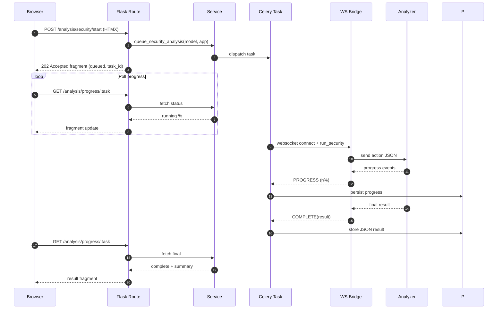

# Request & Task Flow

> Navigation: [Overview](OVERVIEW.md) · [Architecture](ARCHITECTURE.md) · [Analysis Pipeline](ANALYSIS_PIPELINE.md) · [Data Model](DATA_MODEL.md) · [Routes](ROUTES_REFERENCE.md) · [Services](SERVICES_REFERENCE.md) · [Dev Guide](DEVELOPMENT_GUIDE.md) · [Observability](OBSERVABILITY.md)

This document traces typical interactions from browser to analyzer microservice and back, highlighting synchronous vs asynchronous paths and HTMX fragment updates.

## High-Level Branching

```
					+------------------+              +-----------------------+
Browser --| HTTP Request     |--> Fast Path | Render Template/JSON  |--> Response
					+------------------+              +-----------------------+
										|
										| Long-running (analysis, build, batch)
										v
							+-------------+        +--------------+        +-----------------+
							| Route Layer |  --->  | Celery Task  |  --->  | Analyzer Bridge |
							+-------------+        +--------------+        +-----------------+
																													 (WebSocket fan-out)
```

### Mermaid Sequence (Security Analysis Example)



## 1. Simple Read-Only Request (Fast Path)
Example: list models, show recent analyses.
1. Browser issues GET `/models` (maybe HTMX fragment).
2. Route inspects `HX-Request`; chooses full page or partial.
3. Service layer retrieves DB rows + parses JSON fields.
4. Template returned (full page) or fragment → browser swaps DOM region (`hx-target`).

Latency target: < 150ms local.

## 2. Starting an Analysis
1. User clicks "Run Security Analysis" button with `hx-post` to `/analysis/security/start`.
2. Route validates inputs, enqueues Celery task via `TaskManager` (or analysis-specific service).
3. Immediate HTMX fragment response returns queued state + task id.
4. Client triggers polling (current) or future push subscription using task id.

## 3. Progress & Completion Feedback

Current implementation: periodic HTMX polling endpoint (e.g., `/analysis/progress/<task_id>`). Future: Server-Sent Events or WebSocket to browser (analyzer side already streams to bridge).

Polling fragment flow:
```
Browser interval (JS/HTMX) --> GET /analysis/progress/:id --> status fragment --> DOM update
```

## 4. Celery Task Execution Lifecycle (Summary)
1. Worker receives job (model, app, analysis_type)
2. Resolves ports + container names via services.
3. Opens WebSocket to analyzer gateway (port 200x).
4. Streams progress events; persists partial artifacts.
5. On completion, marks task record terminal & stores final JSON.

See: [Analysis Pipeline](ANALYSIS_PIPELINE.md) for deep steps.

## 5. WebSocket Bridge Contract
Analysis message: `{action, model, app, options}`.
Bridge normalizes inbound container events into: PROGRESS, COMPLETE, ERROR. Celery consumes; UI polls derived task status.

## 6. HTMX Fragment Strategy

| Pattern | Reason |
|---------|--------|
| Replace panel body | Incremental status without full reload |
| Append log lines | Live-tail progressive feedback |
| Swap summary on COMPLETE | Avoid second fetch for final view |

Routes render uniform partial templates; HTMX target IDs keep DOM churn minimal.

## 7. Error Handling Path
1. Analyzer network/container error → Celery exception.
2. Task status set FAILED; error JSON stored.
3. Polling endpoint returns FAILED + message.
4. HTMX swaps UI area to error alert w/ retry action.

## 8. Batch Analysis Flow
1. User submits batch definition (list of [model, app]).
2. Route enqueues parent batch task referencing N sub-tasks.
3. Fragment enumerates pending items.
4. Polling updates counts: queued/running/completed/failed.
5. Completion triggers aggregate summary fragment.

## 9. Idempotency & Duplicate Clicks
Client: disable button after click (attribute) to reduce rapid duplicates.
Server (future): check for RUNNING task with same (model, app, type) and reuse or reject.

## 10. Caching (Planned)
Prospective: ETag on static catalog fragments; memoization of parsed large JSON results per-request.

## 11. Sequence Example (Security Analysis)

```
User
	POST /analysis/security/start (HTMX) -----> Flask Route
	<fragment: status=queued, task_id=T123>
	GET  /analysis/progress/T123 (interval) --> Progress Route
	<fragment: status=running, percent=40>
	GET  /analysis/progress/T123 -----------> Progress Route
	<fragment: status=complete, summary_html>
```

Background stream:
```
Celery Task -> AnalyzerBridge WS -> Analyzer Container
						 <- progress events ----<
Celery writes events -> DB
```

## 12. Concurrency & Scaling Notes
- Multiple Celery workers parallelize tasks; container resource limits define true throughput.
- Polling intervals must be tuned (stagger start, exponential backoff on long phases) to avoid thundering herd.

## 13. Extending Flow for New Analysis Type
1. Implement Celery task.
2. Add service method invoked by route (through ServiceLocator).
3. Add route endpoint; returns queued fragment with task id.
4. Register analyzer container (port + gateway handler).
5. Implement progress/result fragment templates.

## 14. UX Improvements Roadmap
- WebSocket push to browser (subscribe progress) eliminating polling.
- Inline streaming partial results for very long tasks.
- Animated progress smoothing between server updates.

---
_Last updated: 2025-08-24._ 
