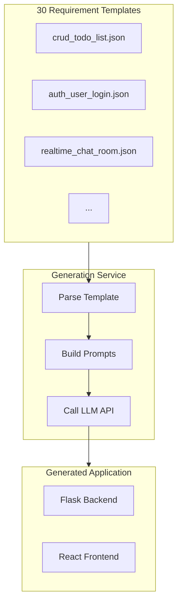
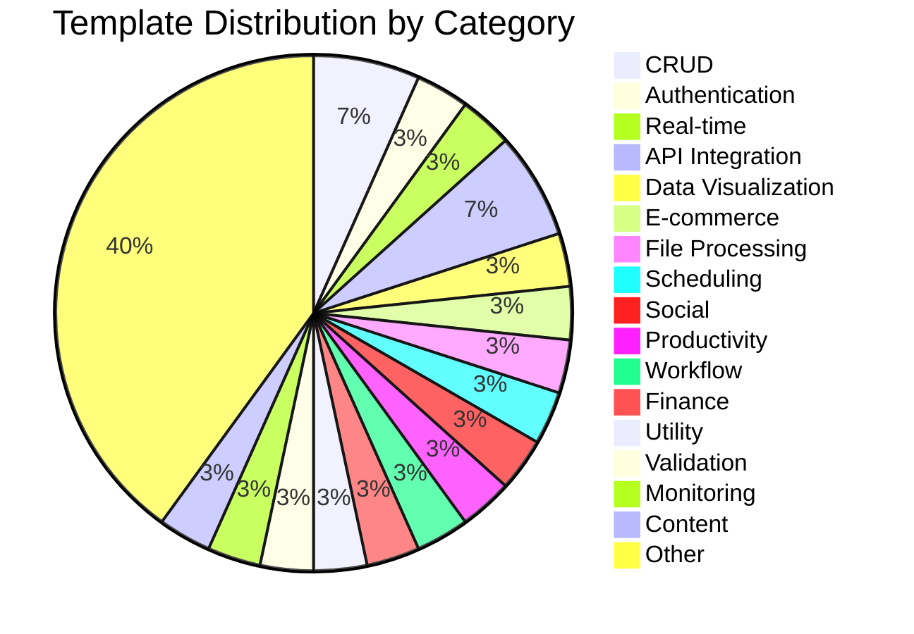
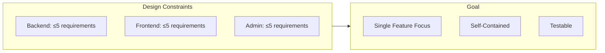
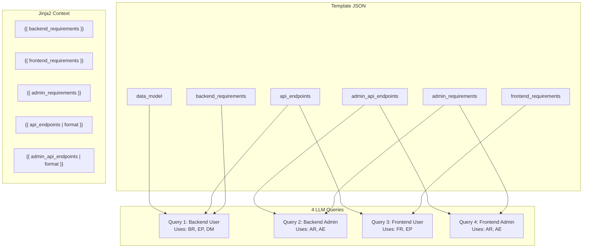

# Template Specification

This document describes the requirement template system used to define web applications for LLM code generation.

## Overview

Templates are JSON files that specify:
- Application requirements (backend + frontend)
- API endpoint definitions
- Data model schemas
- Admin functionality requirements



## Template Categories

The study uses **30 requirement templates** across 20+ categories:



### Complete Template List

| Category | Template Slug | Description |
|----------|---------------|-------------|
| **CRUD** | `crud_todo_list` | Task management with soft delete |
| **CRUD** | `crud_book_library` | Book collection management |
| **Authentication** | `auth_user_login` | User registration and login |
| **Real-time** | `realtime_chat_room` | WebSocket-based messaging |
| **API Integration** | `api_weather_display` | External weather API integration |
| **API Integration** | `api_url_shortener` | URL shortening service |
| **Data Visualization** | `dataviz_sales_table` | Tabular data display |
| **E-commerce** | `ecommerce_cart` | Shopping cart functionality |
| **File Processing** | `fileproc_image_upload` | Image upload and preview |
| **Scheduling** | `scheduling_event_list` | Event calendar management |
| **Social** | `social_blog_posts` | Blog post creation |
| **Productivity** | `productivity_notes` | Note-taking application |
| **Workflow** | `workflow_task_board` | Kanban-style task board |
| **Finance** | `finance_expense_list` | Expense tracking |
| **Utility** | `utility_base64_tool` | Base64 encoding/decoding |
| **Validation** | `validation_xml_checker` | XML syntax validation |
| **Monitoring** | `monitoring_server_stats` | Server metrics display |
| **Content** | `content_recipe_list` | Recipe management |
| **Collaboration** | `collaboration_simple_poll` | Voting/polling system |
| **Media** | `media_audio_player` | Audio playback interface |
| **Geolocation** | `geolocation_store_list` | Store locator with maps |
| **Inventory** | `inventory_stock_list` | Stock management |
| **Healthcare** | `healthcare_appointments` | Appointment scheduling |
| **Gaming** | `gaming_leaderboard` | Score leaderboard |
| **Messaging** | `messaging_notifications` | Notification system |
| **IoT** | `iot_sensor_display` | Sensor data visualization |
| **CRM** | `crm_customer_list` | Customer management |
| **Learning** | `learning_flashcards` | Flashcard study tool |
| **Booking** | `booking_reservations` | Reservation system |
| **Education** | `education_quiz_app` | Quiz/assessment tool |

## JSON Schema

### Required Fields

```json
{
  "slug": "category_feature_name",
  "name": "Human Readable Name",
  "category": "Category",
  "description": "One-line description",
  "backend_requirements": ["..."],
  "frontend_requirements": ["..."],
  "api_endpoints": [{...}],
  "control_endpoints": [{...}]
}
```

### Optional Fields

```json
{
  "admin_requirements": ["..."],
  "admin_api_endpoints": [{...}],
  "data_model": {...}
}
```

### Field Descriptions

| Field | Type | Required | Description |
|-------|------|----------|-------------|
| `slug` | string | ✅ | Unique identifier matching filename |
| `name` | string | ✅ | Display name for UI |
| `category` | string | ✅ | Grouping category |
| `description` | string | ✅ | Brief description |
| `backend_requirements` | array | ✅ | Backend feature specifications |
| `frontend_requirements` | array | ✅ | Frontend feature specifications |
| `api_endpoints` | array | ✅ | REST API definitions |
| `control_endpoints` | array | ✅ | Health/status endpoints |
| `admin_requirements` | array | ❌ | Admin panel features |
| `admin_api_endpoints` | array | ❌ | Admin-only API endpoints |
| `data_model` | object | ❌ | Database schema definition |

## Template Example

### crud_todo_list.json

```json
{
  "slug": "crud_todo_list",
  "name": "Todo List",
  "category": "CRUD",
  "description": "Simple task management - add, complete, and delete todos",
  
  "backend_requirements": [
    "1. Todo model with SQLAlchemy: id, title (string, required), completed (boolean, default False), created_at, is_active (boolean, default True)",
    "2. REST API endpoints: GET /api/todos (list active only), POST /api/todos (create), PUT /api/todos/:id (update), DELETE /api/todos/:id (soft delete)",
    "3. Filter support: ?completed=true/false query parameter",
    "4. JSON responses with proper status codes (200, 201, 404)",
    "5. Input validation: title is required and cannot be empty"
  ],
  
  "frontend_requirements": [
    "1. Display todo list with title and checkbox for completion status",
    "2. Input field with 'Add' button to create new todos",
    "3. Click checkbox to toggle completed state",
    "4. Delete button per todo with confirmation",
    "5. Show empty state when no todos exist"
  ],
  
  "admin_requirements": [
    "1. Admin dashboard showing total todos, completed count, and deleted count statistics",
    "2. Table listing ALL todos including deleted/inactive ones with status badges",
    "3. Toggle button to activate/deactivate todos (soft delete restore)",
    "4. Checkbox selection for multiple todos with bulk delete action",
    "5. Search/filter by title and status"
  ],
  
  "api_endpoints": [
    {
      "method": "GET",
      "path": "/api/todos",
      "description": "List all active todos (supports ?completed=true/false filter)",
      "request": null,
      "response": {
        "items": [{"id": 1, "title": "string", "completed": false, "created_at": "ISO8601"}],
        "total": 1
      }
    },
    {
      "method": "POST",
      "path": "/api/todos",
      "description": "Create new todo",
      "request": {"title": "string"},
      "response": {"id": 1, "title": "string", "completed": false, "created_at": "ISO8601"}
    },
    {
      "method": "PUT",
      "path": "/api/todos/:id",
      "description": "Update todo",
      "request": {"title": "string (optional)", "completed": "boolean (optional)"},
      "response": {"id": 1, "title": "string", "completed": false, "created_at": "ISO8601"}
    },
    {
      "method": "DELETE",
      "path": "/api/todos/:id",
      "description": "Soft delete todo (set is_active=false)",
      "request": null,
      "response": {}
    }
  ],
  
  "admin_api_endpoints": [
    {
      "method": "GET",
      "path": "/api/admin/todos",
      "description": "List ALL todos including inactive",
      "request": null,
      "response": {
        "items": [{"id": 1, "title": "string", "completed": false, "is_active": true, "created_at": "ISO8601"}],
        "total": 1
      }
    },
    {
      "method": "POST",
      "path": "/api/admin/todos/:id/toggle",
      "description": "Toggle todo active status",
      "request": null,
      "response": {"id": 1, "title": "string", "is_active": true}
    },
    {
      "method": "POST",
      "path": "/api/admin/todos/bulk-delete",
      "description": "Permanently delete multiple todos",
      "request": {"ids": [1, 2, 3]},
      "response": {"deleted": 3}
    },
    {
      "method": "GET",
      "path": "/api/admin/stats",
      "description": "Get dashboard statistics",
      "request": null,
      "response": {"total": 10, "completed": 5, "active": 8, "inactive": 2}
    }
  ],
  
  "data_model": {
    "name": "Todo",
    "fields": {
      "id": "integer (primary key, auto-increment)",
      "title": "string (required, max 255 chars)",
      "completed": "boolean (default: false)",
      "is_active": "boolean (default: true, for soft delete)",
      "created_at": "datetime (auto, ISO 8601 format in JSON)"
    }
  }
}
```

## Design Philosophy

Templates follow a **"minimal complexity"** design:



### Why Minimal?

1. **Reproducibility**: Simpler requirements reduce ambiguity in LLM interpretation
2. **Comparability**: Consistent complexity across templates enables fair model comparison
3. **Analysis Speed**: Smaller codebases enable faster security/quality analysis
4. **Build Success**: Less code means fewer potential build failures

## Validation Rules

The generation service validates templates on load:

| Rule | Description |
|------|-------------|
| Slug matches filename | `crud_todo_list.json` must have `"slug": "crud_todo_list"` |
| Required fields present | All required fields must exist |
| No duplicate slugs | Each template must have unique slug |
| Valid JSON format | Must parse without errors |
| Endpoint paths formatted | Paths must start with `/api/` |

## How Templates Map to Prompts



## Creating New Templates

### Guidelines

1. **One core feature only** - No multi-feature systems
2. **≤5 requirements per section** - Keep complexity bounded
3. **Clear API contracts** - Define request/response schemas
4. **Self-contained** - Should work without external services (except where testing API integration)

### Checklist

- [ ] Unique slug matching filename
- [ ] All required fields populated
- [ ] Backend requirements include data model
- [ ] Frontend requirements include user interactions
- [ ] API endpoints have request/response schemas
- [ ] Health endpoint included in control_endpoints

## Related Documentation

- [Generation Process](./GENERATION_PROCESS.md) - How templates become apps
- [Analysis Pipeline](./ANALYSIS_PIPELINE.md) - How apps are analyzed
- [Architecture Overview](./ARCHITECTURE.md) - System architecture
