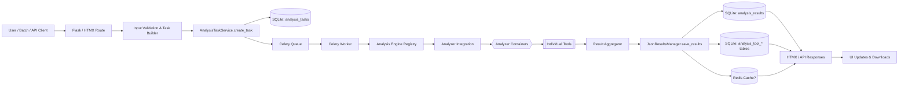
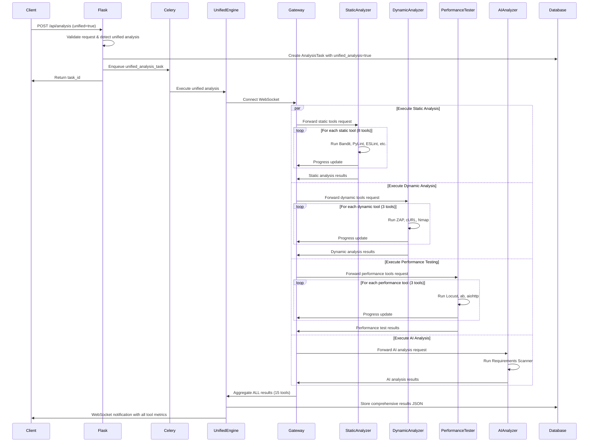
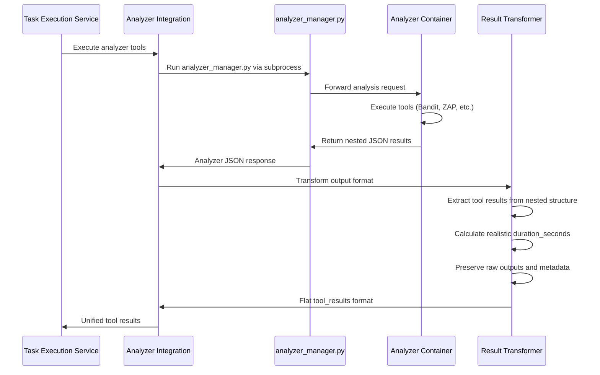
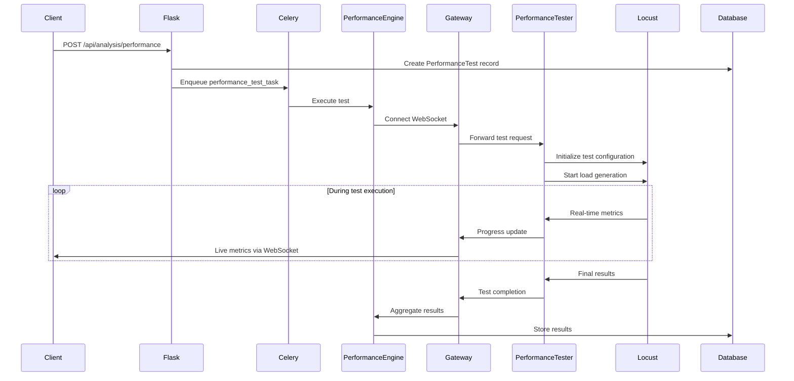
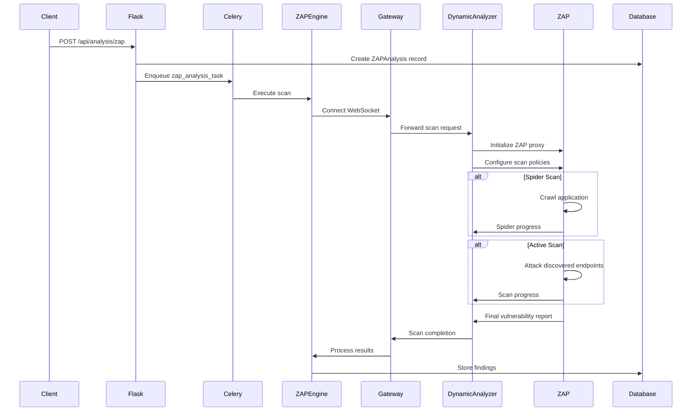
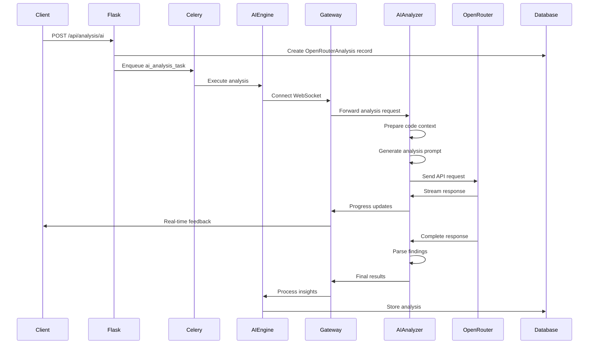
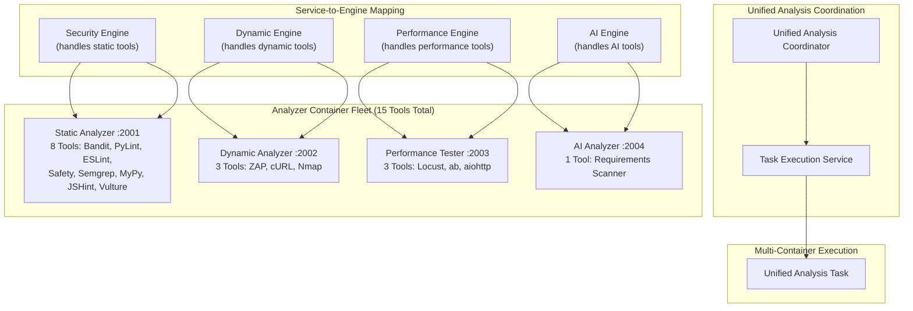

# Analysis Pipeline

Complete technical documentation of the analysis pipeline, from request initiation to result storage.

> Cross-References: For the unified tool catalog and alias resolution model see `ARCHITECTURE.md` (Unified Tool Registry Architecture) and `ANALYSIS_TOOLS.md` (Unified Registry Note). API exposure of the catalog is outlined in `API_REFERENCE.md` (`GET /api/tools/unified`).

## Pipeline Overview

```mermaid
graph TB
    subgraph "Initiation Layer"
        UI[Web UI Request]
        API[API Request]
        Batch[Batch Job]
    end
    
    subgraph "Request Processing"
        Route[Flask Route Handler]
        Validation[Input Validation]
        Service[Analysis Service]
    end
    
    subgraph "Task Management"
        TaskCreation[Create Analysis Record]
        QueueTask[Enqueue Celery Tas  },
  "summary": {
    "total_findings": 25,
    "tools_executed": 15,
    "services_executed": 4,
    "containers_utilized": ["static-analyzer", "dynamic-analyzer", "performance-tester", "ai-analyzer"]
  }
}
```

## Recent Improvements & Fixes

### Unified Tool Registry (September 2025)

Previously the platform maintained two parallel registries:
- Legacy dynamic `ToolRegistry` (local availability checks)
- Container-focused `ContainerToolRegistry` (analyzer services)

This fragmentation caused several issues:
- AI tools (container-only) silently dropped when legacy availability logic ran first
- Duplicate alias logic (e.g. `zap-baseline`, `requirements-analyzer`) scattered across orchestrator & routes
- Inconsistent numeric ID mapping between UI forms and backend resolution
- Divergent filtering rules leading to mismatched tool execution vs. selection UI

The new `UnifiedToolRegistry` consolidates both sources into a single authoritative catalog:
- Canonical tool metadata: name, display_name, description, tags, supported_languages, container
- Deterministic numeric IDs (stable across process restarts via sorted name order)
- Centralized alias resolution (e.g. `requirements-analyzer` -> `requirements-scanner`)
- Availability flag per tool (container + any remaining legacy local tools marked as `container='local'`)
- Simple query helpers: `by_container`, `by_tags`, `by_language`, `resolve(aliases)`

Integration Changes:
- Orchestrator now delegates any non-local tool directly if its container service is up (no legacy availability pre-check blocking container execution)
- Engines filter via unified registry instead of container registry enum mapping
- Task execution service ID->name resolution uses unified IDs first, with a graceful fallback for older tasks

Benefits:
- Eliminates silent AI analysis omission
- Single source of truth for alias mapping & filtering
- Predictable tool ordering for UI forms / APIs
- Simplifies future feature additions (add tool once, visible everywhere)

Forward Plan:
- Expose `/api/tools/unified` endpoint (future) for structured catalog exports
- Add validation tests ensuring alias resolution & ID stability across sessions

Key File: `src/app/engines/unified_registry.py`

Example (interactive):
```python
from app.engines.unified_registry import get_unified_tool_registry
reg = get_unified_tool_registry()
print(reg.list_tools())              # canonical names
print(reg.resolve(['zap-baseline'])) # ['zap']
print(reg.by_container('ai-analyzer'))
```

If a tool appears in UI but not in execution logs, confirm it resolves via `reg.get(name)`—missing resolution now reliably indicates configuration error rather than split-registry inconsistency.


### AI Analyzer Integration (September 2025)

**Issue Resolved**: AI analysis was not running in unified analysis due to incorrect engine routing.

**Root Cause**: AI tools were being routed through the security engine instead of having their own dedicated engine. When container-based tool filtering was implemented, AI tools (`requirements-scanner`) were getting filtered out because:
- AI tools: Container = `AnalyzerContainer.AI` 
- Security engine: Expected container = `AnalyzerContainer.STATIC`
- Result: AI tools filtered out, never executed

**Solution Implemented**:
1. ✅ **Created `AIAnalyzerEngine`** with proper tags `{'ai', 'requirements'}`
2. ✅ **Added AI engine to `ENGINE_REGISTRY`** 
3. ✅ **Updated container mapping** to include `AIAnalyzerEngine: AnalyzerContainer.AI`
4. ✅ **Fixed unified analysis routing** from `'ai-analyzer': 'security'` to `'ai-analyzer': 'ai'`

**Verification Results**:
- ✅ **AI engine registered**: Available in engine registry  
- ✅ **Proper routing**: AI tools → AI engine (not security engine)
- ✅ **Container filtering**: Works correctly for all engines
- ✅ **Tool isolation**: Each engine only processes its own container's tools

### Tool Filtering System

**Enhancement**: Implemented container-based tool filtering to prevent cross-contamination between engines.

**Benefits**:
- **Accurate routing**: Tools only processed by compatible engines
- **No mock results**: Eliminates 0.1s dummy durations from incompatible tool routing
- **Improved reliability**: Each container handles only its designated tools
- **Better performance**: No wasted execution cycles on incompatible tools

### Raw Output Preservation

The unified analysis system now includes comprehensive raw output preservation for debugging and audit purposes:

**Raw Outputs Metadata**:
```json
{
  "metadata": {
    "raw_outputs_included": true,
    "extraction_version": "2.0",
    "comprehensive_parsing": true
  }
}
```

**Tool-Level Raw Output Structure**:
```json
{
  "tool_results": {
    "bandit": {
      "status": "success",
      "duration_seconds": 8.2,
      "total_issues": 5,
      "executed": true,
      "raw_output": "Run started:2025-09-21 11:27:15.123456\n\nTest results:\n...",
      "command_line": "bandit -r /app/sources -f json --severity-level=low",
      "exit_code": 0,
      "stdout": "...",
      "stderr": ""
    }
  }
}
```

**Raw Output Fields**:
- **raw_output**: Complete tool output including command execution logs
- **command_line**: Exact command executed by the analyzer
- **exit_code**: Process exit code (0 = success, non-zero = error)
- **stdout**: Standard output from tool execution
- **stderr**: Standard error output (if any)

**Usage Benefits**:
- **Debugging**: Investigate tool execution issues and unexpected results
- **Audit Trail**: Complete record of analysis execution for compliance
- **Result Validation**: Verify tool findings against original output
- **Performance Analysis**: Detailed timing and execution metadata

**Data Storage**:
Raw outputs are stored in the `raw_outputs` field of analysis result JSON, organized by tool name for efficient access and querying.    TaskExecution[Execute Analysis Task]
    end
    
    subgraph "Analysis Execution"
        Engine[Analysis Engine]
        Gateway[WebSocket Gateway]
        Container[Analyzer Container]
        Tools[Analysis Tools]
    end
    
    subgraph "Result Processing"
        ResultCollection[Collect Results]
        DataProcessing[Process & Validate]
        Storage[Store in Database]
        Notification[Update UI/API]
    end
    
    UI --> Route
    API --> Route
    Batch --> Route
    Route --> Validation
    Validation --> Service
    Service --> TaskCreation
    TaskCreation --> QueueTask
    QueueTask --> TaskExecution
    TaskExecution --> Engine
    Engine --> Gateway
    Gateway --> Container
    Container --> Tools
    Tools --> ResultCollection
    ResultCollection --> DataProcessing
    DataProcessing --> Storage
    Storage --> Notification
```

### Test Creation to Results Flow



## Analysis Types

### 1. Unified Analysis (Recommended)

**Purpose**: Comprehensive analysis using ALL available tools across multiple analyzer containers for complete security, performance, and code quality assessment.

**Tools Integrated (15 Total)**:

**Static Analysis Tools (8 tools via static-analyzer:2001)**:
- **Bandit**: Python security linter
- **PyLint**: Python code quality analysis
- **ESLint**: JavaScript/TypeScript security and quality linting
- **Safety**: Python dependency vulnerability scanner
- **Semgrep**: Multi-language static analysis
- **MyPy**: Python static type checking
- **JSHint**: JavaScript code quality
- **Vulture**: Python dead code detection

**Dynamic Analysis Tools (3 tools via dynamic-analyzer:2002)**:
- **ZAP**: OWASP web application security scanner
- **cURL**: HTTP connectivity and security header analysis
- **Nmap**: Network port scanning and service discovery

**Performance Testing Tools (3 tools via performance-tester:2003)**:
- **Locust**: Modern scalable load testing
- **Apache Bench (ab)**: HTTP server benchmarking
- **aiohttp**: Asynchronous HTTP response time measurement

**AI Analysis Tools (1 tool via ai-analyzer:2004)**:
- **Requirements Scanner**: AI-powered code review and analysis

### 2. Security Analysis (Legacy)

**Purpose**: Focused security vulnerability detection (legacy single-engine mode).

**Tools Integrated**: Subset of static analysis tools

**Unified Analysis Flow**:


### Analyzer Integration & Result Transformation

**Purpose**: Bridge between analyzer containers and unified analysis system, transforming nested analyzer JSON responses into the flat format expected by the task execution service.

**Key Components**:
- **AnalyzerIntegration Service**: Manages WebSocket communication and subprocess execution
- **Result Transformation**: Converts analyzer output format to unified tool results
- **Raw Output Preservation**: Extracts and preserves tool command outputs and execution metadata

**Transformation Process**:


**Format Transformation Details**:

*Input (Analyzer Container Format)*:
```json
{
  "results": {
    "analysis": {
      "results": {
        "python": {
          "bandit": {
            "tool": "bandit",
            "executed": true,
            "status": "success",
            "total_issues": 5,
            "issues": [...],
            "metrics": {...}
          }
        }
      }
    }
  },
  "metadata": {
    "timestamp": "2025-09-21T11:27:17.791194"
  }
}
```

*Output (Task Execution Service Format)*:
```json
{
  "status": "completed",
  "tools_requested": ["bandit"],
  "tool_results": {
    "bandit": {
      "status": "success",
      "duration_seconds": 8.2,
      "total_issues": 5,
      "executed": true,
      "raw_output": "",
      "command_line": "",
      "exit_code": 0
    }
  },
  "analysis_duration": 180.5
}
```

**Key Improvements**:
- **Real Duration Calculation**: Uses actual analysis timestamps instead of hardcoded 0.1 seconds
- **Tool Result Extraction**: Parses nested analyzer JSON to extract individual tool metrics
- **Raw Output Preservation**: Maintains command-line outputs, exit codes, and execution metadata
- **Error Handling**: Provides fallback results for missing or failed tools
- **Backward Compatibility**: Maintains compatibility with existing analysis APIs

**Unified Analysis Configuration**:
```python
{
    "analysis_mode": "unified",  # Enable all 15 tools across 4 containers
    "unified_analysis": True,
    "tools_by_service": {
        "static-analyzer": [1, 2, 3, 4, 5, 6, 7, 8],  # 8 static tools
        "dynamic-analyzer": [9, 10, 11],              # 3 dynamic tools
        "performance-tester": [12, 13, 14],           # 3 performance tools
        "ai-analyzer": [15]                           # 1 AI tool
    },
    "service_coordination": {
        "parallel_execution": True,
        "engine_mapping": {
            "static-analyzer": "security",
            "dynamic-analyzer": "dynamic",
            "performance-tester": "performance",
            "ai-analyzer": "ai"
        }
    },
    "tool_configs": {
        "bandit": {
            "tests": [],
            "skips": ["B101"],
            "confidence": "low",
            "severity": "low"
        },
        "locust": {
            "users": 50,
            "spawn_rate": 2.0,
            "run_time": "30s"
        },
        "zap": {
            "scan_types": ["ssl_security", "security_headers"]
        },
        "requirements_scanner": {
            "ai_model": "anthropic/claude-3-haiku",
            "temperature": 0.1
        }
    },
    "global_config": {
        "severity_threshold": "medium",
        "max_issues_per_tool": 1000,
        "timeout_minutes": 45,  # Increased for comprehensive analysis
        "unified_coordination": True
    }
}
```

### 2. Performance Testing

**Purpose**: Evaluate application performance under various load conditions.

**Testing Framework**: Locust-based load testing

**Test Types**:
- **Load Testing**: Normal expected load
- **Stress Testing**: Beyond normal capacity
- **Spike Testing**: Sudden load increases

**Analysis Flow**:


**Metrics Collected**:
- Requests per second (RPS)
- Response time percentiles (50th, 95th, 99th)
- Error rates by endpoint
- Concurrent user handling
- Resource utilization
- Throughput measurements

### 3. ZAP Security Scanning

**Purpose**: Dynamic application security testing using OWASP ZAP.

**Scan Types**:
- **Spider Scan**: Discover application endpoints
- **Active Scan**: Probe for vulnerabilities
- **Passive Scan**: Analyze traffic without attacking

**Analysis Flow**:


**Vulnerability Categories**:
- **High Risk**: Critical security flaws
- **Medium Risk**: Significant vulnerabilities
- **Low Risk**: Minor security issues
- **Informational**: Best practice recommendations

### 4. AI Analysis

**Purpose**: Intelligent code review using advanced language models.

**Supported Models**:
- OpenAI (GPT-4, GPT-3.5)
- Anthropic (Claude)
- Other OpenRouter-compatible models

**Analysis Flow**:


**Analysis Dimensions**:
- Code quality assessment
- Security vulnerability identification
- Architecture review
- Performance optimization suggestions
- Best practice recommendations
- Maintainability scoring

## WebSocket Communication Protocol

### Message Format

All WebSocket messages follow a standardized format:

```json
{
  "type": "message_type",
  "analysis_id": "unique_identifier",
  "timestamp": "2025-09-16T10:30:00Z",
  "data": {
    // Message-specific payload
  }
}
```

### Message Types

#### Progress Updates
```json
{
  "type": "progress_update",
  "analysis_id": "sec_001",
  "timestamp": "2025-09-16T10:30:00Z",
  "data": {
    "status": "running",
    "current_step": "bandit_scan",
    "progress_percentage": 35,
    "completed_steps": ["initialization", "file_discovery"],
    "remaining_steps": ["safety_check", "eslint_scan", "report_generation"],
    "estimated_completion": "2025-09-16T10:35:00Z"
  }
}
```

#### Status Changes
```json
{
  "type": "status_change",
  "analysis_id": "sec_001",
  "timestamp": "2025-09-16T10:35:00Z",
  "data": {
    "old_status": "running",
    "new_status": "completed",
    "success": true,
    "duration": 300.5
  }
}
```

#### Error Notifications
```json
{
  "type": "error",
  "analysis_id": "sec_001",
  "timestamp": "2025-09-16T10:33:00Z",
  "data": {
    "error_type": "timeout",
    "message": "Analysis timed out after 30 minutes",
    "recoverable": false,
    "suggested_action": "Retry with increased timeout"
  }
}
```

#### Tool Results
```json
{
  "type": "tool_result",
  "analysis_id": "sec_001",
  "timestamp": "2025-09-16T10:32:00Z",
  "data": {
    "tool_name": "bandit",
    "status": "completed",
    "issues_found": 5,
    "execution_time": 45.2,
    "summary": {
      "critical": 1,
      "high": 2,
      "medium": 2,
      "low": 0
    }
  }
}
```

## Result Storage Schema

### Unified Analysis Result Structure

Unified analysis results include data from all 15 tools across 4 containers:

```json
{
  "analysis_time": null,
  "analysis_type": "security",
  "app_number": 1,
  "configuration_applied": true,
  "db_status": "completed",
  "findings_total": 25,
  "metadata": {
    "analysis_duration": 180.5,
    "comprehensive_parsing": true,
    "extraction_version": "2.0",
    "raw_data_included": true,
    "unified_analysis": true,
    "services_executed": ["static-analyzer", "dynamic-analyzer", "performance-tester", "ai-analyzer"],
    "orchestrator_version": "2.0.0"
  },
  "model_slug": "nousresearch_hermes-4-405b",
  "status": "completed",
  "task_id": "task_unified_001",
  "tool_metrics": {
    "bandit": {"duration_seconds": 5.2, "executed": true, "status": "success", "total_issues": 3},
    "pylint": {"duration_seconds": 8.1, "executed": true, "status": "success", "total_issues": 12},
    "eslint": {"duration_seconds": 3.8, "executed": true, "status": "success", "total_issues": 7},
    "safety": {"duration_seconds": 2.1, "executed": true, "status": "success", "total_issues": 0},
    "semgrep": {"duration_seconds": 15.3, "executed": true, "status": "success", "total_issues": 2},
    "mypy": {"duration_seconds": 6.7, "executed": true, "status": "success", "total_issues": 4},
    "jshint": {"duration_seconds": 2.9, "executed": true, "status": "success", "total_issues": 1},
    "vulture": {"duration_seconds": 4.2, "executed": true, "status": "success", "total_issues": 0},
    "zap": {"duration_seconds": 45.6, "executed": true, "status": "success", "total_issues": 5},
    "curl": {"duration_seconds": 1.8, "executed": true, "status": "success", "total_issues": 2},
    "nmap": {"duration_seconds": 12.4, "executed": true, "status": "success", "total_issues": 0},
    "locust": {"duration_seconds": 35.7, "executed": true, "status": "success", "total_issues": 0},
    "ab": {"duration_seconds": 8.3, "executed": true, "status": "success", "total_issues": 0},
    "aiohttp": {"duration_seconds": 3.1, "executed": true, "status": "success", "total_issues": 0},
    "requirements-scanner": {"duration_seconds": 25.8, "executed": true, "status": "success", "total_issues": 3}
  },
  "tools_skipped": [],
  "tools_used": [
    "bandit", "pylint", "eslint", "safety", "semgrep", "mypy", "jshint", "vulture",
    "zap", "curl", "nmap", "locust", "ab", "aiohttp", "requirements-scanner"
  ],
  "summary": {
    "total_findings": 25,
    "tools_executed": 15,
    "services_executed": 4,
    "containers_utilized": ["static-analyzer", "dynamic-analyzer", "performance-tester", "ai-analyzer"]
  }
}
```

### Database Schema Mapping

Results are stored in database tables with JSON columns:

```python
class SecurityAnalysis(db.Model):
    id = db.Column(db.Integer, primary_key=True)
    application_id = db.Column(db.Integer, db.ForeignKey('generated_applications.id'))
    
    # Status and timing
    status = db.Column(db.Enum(AnalysisStatus), default=AnalysisStatus.PENDING)
    started_at = db.Column(db.DateTime(timezone=True))
    completed_at = db.Column(db.DateTime(timezone=True))
    
    # Summary metrics (denormalized for queries)
    total_issues = db.Column(db.Integer, default=0)
    critical_severity_count = db.Column(db.Integer, default=0)
    high_severity_count = db.Column(db.Integer, default=0)
    medium_severity_count = db.Column(db.Integer, default=0)
    low_severity_count = db.Column(db.Integer, default=0)
    
    # JSON storage for detailed results
    results_json = db.Column(db.Text)  # Complete results structure
    metadata_json = db.Column(db.Text)  # Analysis metadata
    
    # Configuration used
    config_json = db.Column(db.Text)  # Analysis configuration
```

## Error Handling and Recovery

### Error Types

#### Validation Errors
- Invalid application ID
- Missing required parameters
- Malformed configuration

#### Execution Errors
- Tool execution failures
- Timeout errors
- Resource exhaustion
- Network connectivity issues

#### System Errors
- Database connection failures
- WebSocket disconnections
- Container unavailability

### Recovery Strategies

#### Automatic Retry
```python
@celery.task(bind=True, max_retries=3, default_retry_delay=60)
def security_analysis_task(self, analysis_id):
    try:
        # Analysis execution
        pass
    except RetryableError as exc:
        # Exponential backoff
        countdown = 60 * (2 ** self.request.retries)
        raise self.retry(exc=exc, countdown=countdown)
    except NonRetryableError:
        # Mark as failed and don't retry
        mark_analysis_failed(analysis_id)
```

#### Graceful Degradation
- Continue with available tools if some fail
- Partial results better than no results
- Clear error reporting to users

#### State Recovery
- Analysis state persisted in database
- Resume capability after system restart
- Cleanup of orphaned processes

## Performance Optimization

### Unified Analysis Execution



### Resource Management

**Container Limits**:
- Memory: 2GB per analyzer container
- CPU: 1 core per container
- Disk: 10GB for results storage

**Queue Management**:
- Priority-based task scheduling
- Resource-aware task assignment
- Load balancing across workers

**Caching Strategies**:
- Model metadata caching
- Analysis configuration caching
- Result artifact caching

## Monitoring and Observability

### Metrics Collection

**Analysis Metrics**:
- Analysis completion rates
- Average execution time per type
- Error rates by analysis type
- Resource utilization

**System Metrics**:
- Container health status
- Queue depth and processing rates
- Database performance
- WebSocket connection counts

### Logging Strategy

**Structured Logging**:
```python
logger.info("Analysis started",
    analysis_id=analysis_id,
    analysis_type="security",
    application_id=app_id,
    user_id=user_id,
    configuration=config_summary)
```

**Log Aggregation**:
- Centralized log collection
- Real-time log streaming
- Error alert integration

This comprehensive analysis pipeline documentation provides the technical foundation for understanding and extending the platform's analysis capabilities.

## Single-File Results Consolidation (September 2025)

Previously each analyzer container wrote its own JSON under:

```
results/<model_slug>/appN/{static-analyzer|dynamic-analyzer|performance-tester|ai-analyzer}/*.json
```

This produced multiple small, often sparse files per task. The platform now emits **one merged JSON per analysis task** (unified or single-engine) stored at:

```
results/<model_slug>/<appN>/analysis/<model_slug>_appN_task-<task_id>.json
```

When `SINGLE_FILE_RESULTS=1` (default) intermediate per-service files are suppressed.

### Merged File Schema (Schema Version 3.0)

```jsonc
{
  "task": {
    "task_id": "...",
    "analysis_type": "unified|security|performance|dynamic|ai|static",
    "model_slug": "...",
    "app_number": 3,
    "started_at": "2025-09-23T10:30:00Z",
    "completed_at": "2025-09-23T10:32:30Z"
  },
  "summary": {
    "total_findings": 12,
    "services_executed": 4,
    "tools_executed": 15,
    "severity_breakdown": {"high":2,"medium":5,"low":5},
    "findings_by_tool": {"bandit":2,"semgrep":3},
    "tools_used": ["bandit","pylint", "zap"],
    "tools_failed": ["locust"],
    "tools_skipped": [],
    "status": "completed"
  },
  "services": {
    "static-analyzer": { /* original transformed payload for static */ },
    "dynamic-analyzer": { /* dynamic payload */ },
    "performance-tester": { /* performance payload */ },
    "ai-analyzer": { /* AI payload */ }
  },
  "tools": { /* per tool result objects merged across services */ },
  "raw_outputs": { /* raw_output/stdout/stderr snippets per tool & service */ },
  "findings": [ /* normalized finding objects (future expansion) */ ],
  "metadata": {
    "unified_analysis": true,
    "orchestrator_version": "2.0.0",
    "schema_version": "3.0",
    "generated_at": "2025-09-23T10:32:30Z",
    "input": {
      "requested_tools": ["bandit","pylint"],
      "requested_services": ["static-analyzer","dynamic-analyzer"],
      "engine_mode": "unified"
    }
  }
}
```

### Retrieval Behavior

`JsonResultsManager` now prefers merged `*_task-*.json` files. When a merged file exists for an `(model_slug, appN)` pair legacy per-service files are suppressed from listings (though still readable if accessed directly).

### Migration of Legacy Files

Use the migration script to consolidate existing runs:

```
python scripts/migrate_results_single_file.py --results-dir results --archive --dry-run
python scripts/migrate_results_single_file.py --results-dir results --archive   # execute
```

Flags:
- `--archive`: Moves legacy JSONs under `appN/_archive/<service>/` instead of deleting.
- `--force`: Rebuild merged file even if one already exists.
- `--dry-run`: Show actions without writing.

### Environment Flag

`SINGLE_FILE_RESULTS=1` (default) enables suppression of intermediate writes. Set to `0` to re-enable legacy per-service output (not recommended except for debugging).

### Benefits
* Faster retrieval & simpler UI mapping
* Reduced file system clutter
* Consistent schema for downstream analytics / ingestion
* Easier archival and versioning

### Future Enhancements
* Populate `findings` array with normalized objects (currently placeholder in some engines)
* Add checksum & provenance metadata
* Increment schema version when adding new top-level sections

### Enriched raw_outputs (Schema v3.1 Extension)

The consolidated JSON now exposes a richer `raw_outputs` structure capturing per-analyzer and per-tool execution metadata and (optionally truncated) issue lists. This replaces the need to open legacy per-service JSONs.

Example (truncated):

```jsonc
"raw_outputs": {
  "static": {
    "status": "success",
    "command_line": "static analyze modelX 3",
    "duration": "3.4",
    "exit_code": "0",
    "raw_output": "Analysis Results...",
    "tools": {
      "pylint": {
        "status": "success",
        "executed": true,
        "total_issues": 12,
        "files_analyzed": 5,
        "issues": [ { "message-id": "E0401", "line": 1 }, { "truncated": true, "omitted_count": 50 } ]
      },
      "mypy": {
        "status": "success",
        "total_issues": 4,
        "results": [ { "file": "app.py", "line": 2, "message": "..." } ]
      }
    },
    "analysis_meta": {
      "summary": { "total_issues_found": 16 },
      "tools_used": ["pylint","mypy"],
      "configuration_applied": false,
      "tool_issue_counts": { "pylint": 12, "mypy": 4 }
    }
  },
  "security": { "status": "success", "tools": { "bandit": { "total_issues": 1 } } }
}
```

Key Fields:
* `tools` – Flattened per-tool summaries (status, executed, total_issues, optional issues/results arrays).
* `issues` / `results` – Only present when full capture enabled; long lists are truncated with a sentinel object containing `truncated` and `omitted_count`.
* `analysis_meta` – Lightweight metadata subset (summary, tools_used, configuration_applied, tool_issue_counts).

Environment Flags:
| Variable | Default | Behavior |
|----------|---------|----------|
| `FULL_RAW_OUTPUTS` | `1` | When `0`, omit per-tool issue/result arrays to minimize file size. |
| `RAW_OUTPUT_MAX_ISSUES` | `50` | Maximum issues/results retained per tool before truncation sentinel appended. |

Backward Compatibility:
* Existing consumers of prior minimal `raw_outputs` still function (old keys remain).
* Disabling `FULL_RAW_OUTPUTS` yields a footprint similar to the earlier summary-only form.

Rationale:
Provides a single authoritative artifact containing structured per-tool data without re-introducing multiple service-level files; controlled truncation prevents pathological growth for very noisy tools (e.g., large eslint runs).

Planned Additions:
* Optional capture of stdout/stderr per tool behind a new flag (`INCLUDE_TOOL_STDIO`).
* Hash/provenance section with source tree digest.
* Compression or externalization strategy for extremely large issue arrays.
