# ThesisApp Architecture

A comprehensive Flask-based platform for AI model analys**Primary Consumers After Migration:**
- Orchestrator (`orchestrator.py`) – delegates all non-`local` tools straight to analyzer services if they are reachable
- Engines (`analysis_engines.py`) – filter tools by expected container via unified registry instead of the old enum
- Task Execution (`task_execution_service.py`) – resolves numeric IDs to names using registry's deterministic orderingd research, featuring **unified analysis across 15 tools in 4 containerized analyzer services**, real-time WebSocket communication, and Bootstrap 5 + HTMX frontend.

## System Overview

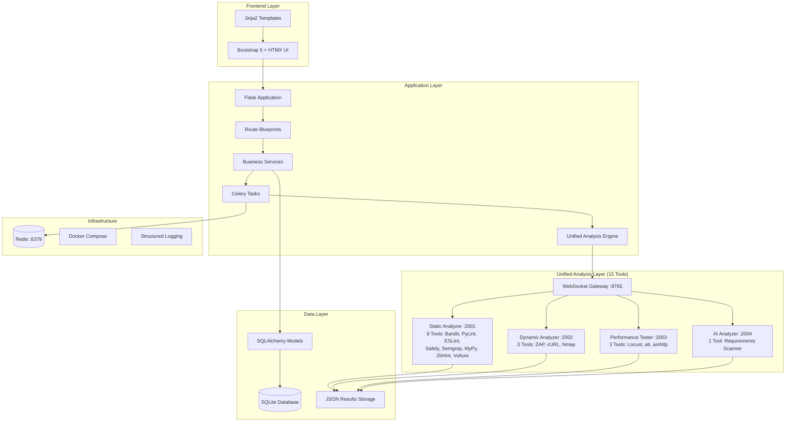

## Core Components

### Unified Tool Registry Architecture (September 2025)

The previous dual-registry model (legacy dynamic vs. container registry) has been collapsed into a single authoritative **UnifiedToolRegistry** providing a consistent contract for:

| Concern | Old Approach | Unified Registry |
|---------|--------------|------------------|
| Availability | Local PATH probing + container presence | Single `available` flag per tool |
| Aliases | Scattered hard-coded maps (routes, orchestrator) | Central alias map (`resolve([...])`) |
| Tool IDs | Implicit enumeration order (fragile) | Deterministic, name-sorted IDs `tool_id(name)` |
| Filtering | Repeated ad‑hoc tag/container checks | `by_container`, `by_tags`, `by_language` helpers |
| AI Tool Visibility | Often dropped (legacy availability failed) | Always resolved; container delegation unconditional |

**Location:** `src/app/engines/unified_registry.py`

**Key Data Fields per Tool:**
- `name`, `display_name`, `description`
- `container`: one of `static-analyzer`, `dynamic-analyzer`, `performance-tester`, `ai-analyzer`, or `local`
- `tags`, `supported_languages`
- `available` (boolean), `version`
- `origin`: `container` or `legacy`

**Primary Consumers After Migration:**
- Orchestrator (`orchestrator.py`) – delegates all non-`local` tools straight to analyzer services if they are reachable
- Engines (`analysis_engines.py`) – filter tools by expected container via unified registry instead of the old enum
- Task Execution (`task_execution_service.py`) – resolves numeric IDs to names using registry’s deterministic ordering
- Legacy Shim (`tool_registry_service_shim.py`) – now purely a thin adapter around unified registry for backward compatibility

**Delegation Logic Simplification:**
Previous logic: "If any selected tool unavailable locally but service up, delegate."  
New logic: "If tool.container != 'local' and service up, delegate group."  
Result: Removes false negatives that previously blocked AI or container-only tools.

**Alias Handling Examples:**
```
reg.resolve(['zap-baseline', 'owasp_zap']) -> ['zap']
reg.get('requirements-analyzer').name == 'requirements-scanner'
```

**Deterministic IDs:**
```
tid = reg.tool_id('bandit')  # stable across restarts (sorted name list)
assert reg.id_to_name(tid) == 'bandit'
```

**Extension Path:** A future `/api/tools/unified` endpoint can expose full registry metadata (including alias map) for UI introspection and external automation. Cross-reference: see Unified Tool Registry section in `ANALYSIS_PIPELINE.md` for operational rationale.


### 1. Flask Application Core

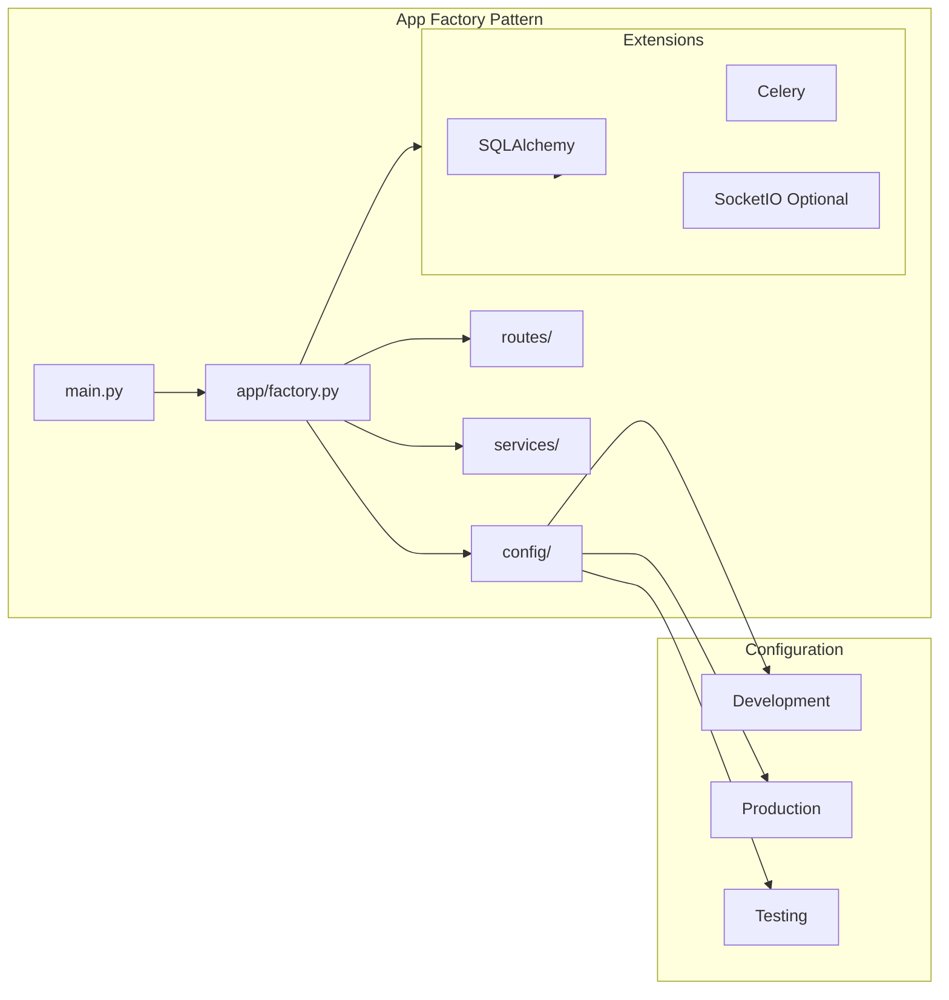

**Key Files:**
- `src/main.py` - Application entry point
- `src/app/factory.py` - Flask app factory with extension initialization
- `src/worker.py` - Celery worker bootstrap
- `src/app/extensions.py` - Extension configuration and initialization

### 2. Route Architecture

```mermaid
graph TB
    subgraph "Route Organization"
        Jinja[Jinja Routes]
        API[API Routes]
        WS[WebSocket Routes]
    end
    
    subgraph "Jinja Blueprints"
        Main[main_bp - Dashboard]
        Models[models_bp - Model Management]
        Analysis[analysis_bp - Analysis Pages]
        Stats[stats_bp - Statistics]
        Reports[reports_bp - Reports]
        Docs[docs_bp - Documentation]
        SampleGen[sample_generator_bp]
    end
    
    subgraph "API Blueprints"
        CoreAPI[core_bp - Health/Status]
        ModelsAPI[models_bp - Model CRUD]
        AnalysisAPI[analysis_bp - Analysis API]
        SystemAPI[system_bp - System Info]
        DashboardAPI[dashboard_bp - Dashboard Data]
        AppsAPI[applications_bp - App Management]
        TasksAPI[tasks_rt_bp - Real-time Tasks]
        SampleAPI[sample_gen_bp - Sample Generation]
    end
    
    Jinja --> Main
    Jinja --> Models
    Jinja --> Analysis
    Jinja --> Stats
    Jinja --> Reports
    Jinja --> Docs
    Jinja --> SampleGen
    
    API --> CoreAPI
    API --> ModelsAPI
    API --> AnalysisAPI
    API --> SystemAPI
    API --> DashboardAPI
    API --> AppsAPI
    API --> TasksAPI
    API --> SampleAPI
```

**Route Patterns:**
- **Jinja Routes**: Server-rendered HTML pages with HTMX fragments
- **API Routes**: JSON endpoints for AJAX and external integrations
- **WebSocket Routes**: Real-time communication for analysis progress

### 3. Service Layer Architecture

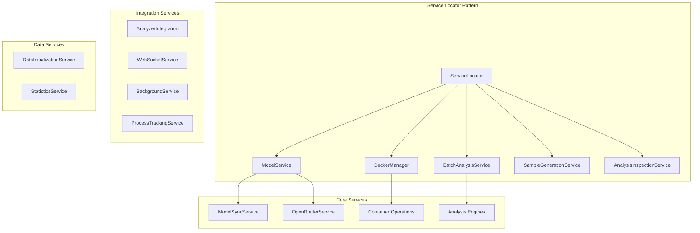

**Service Responsibilities:**
- **ModelService**: AI model metadata and capability management
- **DockerManager**: Container lifecycle and health monitoring
- **BatchAnalysisService**: Batch orchestration and task queuing for analyses
- **AnalysisInspectionService**: Read-only inspection and aggregation for analysis tasks
- **AnalyzerIntegration**: WebSocket communication, subprocess execution, and result transformation for analyzer containers
- **SampleGenerationService**: AI-powered code generation
- **ApplicationService**: Application lifecycle management with intelligent status caching and bulk refresh capabilities
- **PortAllocationService**: Centralized port management ensuring unique backend/frontend port pairs for all generated applications (see [PORT_ALLOCATION.md](PORT_ALLOCATION.md))

### 4. Data Architecture

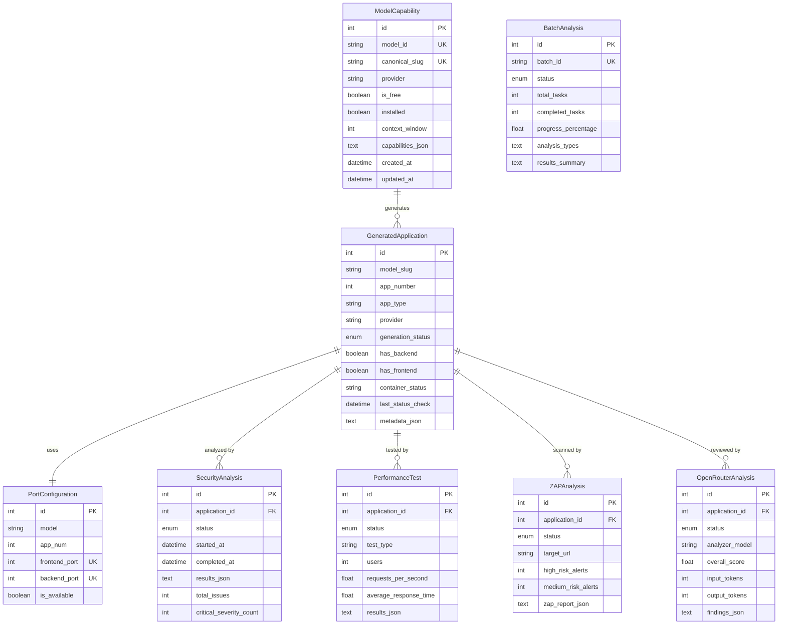

**Key Data Patterns:**
- **JSON Columns**: Large analysis results stored as JSON for flexibility
- **Status Enums**: Consistent lifecycle management (PENDING → RUNNING → COMPLETED/FAILED)
- **Metadata Storage**: Extensible metadata in JSON columns
- **Temporal Tracking**: Created/updated timestamps for audit trails

### 5. Unified Analysis Pipeline

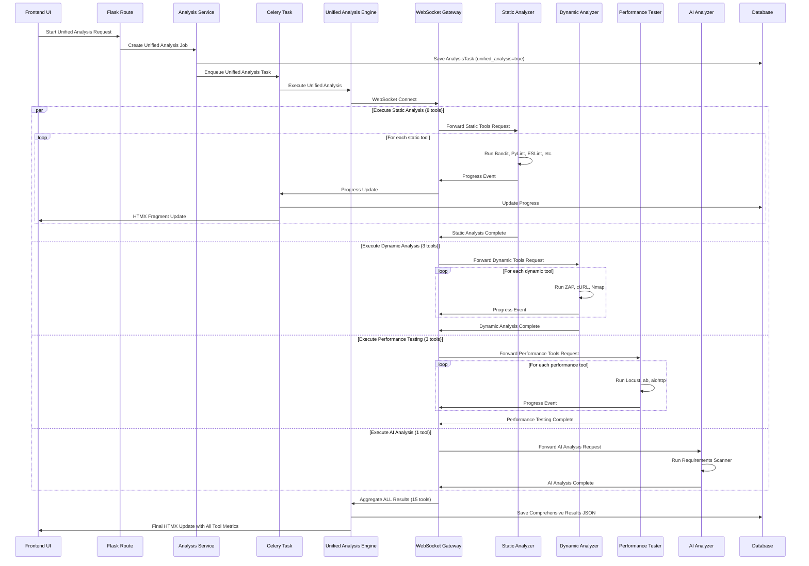

**Analysis Types:**
- **Unified Analysis (Recommended)**: All 15 tools across 4 containers for comprehensive coverage
- **Security Analysis (Legacy)**: Static code analysis subset (legacy single-engine mode)
- **Performance Testing**: Load testing using performance container tools
- **ZAP Security**: Dynamic security testing with OWASP ZAP
- **AI Analysis**: Code review using AI-powered analysis with dedicated AI engine

### 6. Unified Analyzer Infrastructure

```mermaid
graph TB
    subgraph "Docker Compose Stack - Unified Analysis"
        Gateway["WebSocket Gateway<br/>:8765<br/>Request Routing & Coordination"]
        Static["Static Analyzer<br/>:2001<br/>8 Tools"]
        Dynamic["Dynamic Analyzer<br/>:2002<br/>3 Tools"]
        Perf["Performance Tester<br/>:2003<br/>3 Tools"]
        AI["AI Analyzer<br/>:2004<br/>1 Tool"]
        Redis["Redis<br/>:6379<br/>Task Queue"]
    end
    
    subgraph "Gateway Features"
        Gateway --> Routing[Request Routing]
        Gateway --> Events[Event Broadcasting]
        Gateway --> Health[Health Monitoring]
        Gateway --> Coordination[Multi-Container Coordination]
    end
    
    subgraph "Static Analyzer Tools (8)"
        Static --> Bandit["Bandit - Python Security"]
        Static --> PyLint["PyLint - Python Quality"]
        Static --> ESLint["ESLint - JavaScript/TypeScript"]
        Static --> Safety["Safety - Dependency Vulnerabilities"]
        Static --> Semgrep["Semgrep - Multi-language Security"]
        Static --> MyPy["MyPy - Python Type Checking"]
        Static --> JSHint["JSHint - JavaScript Quality"]
        Static --> Vulture["Vulture - Dead Code Detection"]
    end
    
    subgraph "Dynamic Analyzer Tools (3)"
        Dynamic --> ZAP["OWASP ZAP - Web Security"]
        Dynamic --> cURL["cURL - Connectivity Testing"]
        Dynamic --> Nmap["Nmap - Port Scanning"]
    end
    
    subgraph "Performance Tester Tools (3)"
        Perf --> Locust["Locust - Load Testing"]
        Perf --> AB["Apache Bench - HTTP Benchmarking"]
        Perf --> AioHTTP["aiohttp - Async HTTP Testing"]
    end
    
    subgraph "AI Analyzer Tools (1)"
        AI --> RequirementsScanner["Requirements Scanner - AI Code Review"]
    end
```

**Container Management:**
- **Health Checks**: All 4 containers have built-in health monitoring
- **Resource Limits**: Memory and CPU constraints for stability
- **Volume Mounts**: Persistent storage for results and configurations
- **Network Isolation**: Secure communication via dedicated network
- **Unified Coordination**: Gateway orchestrates execution across all containers

**Tool Distribution:**
- **Total Tools**: 15 tools across 4 specialized containers
- **Static Analysis**: 8 tools for code quality, security, and type checking
- **Dynamic Analysis**: 3 tools for runtime security and network analysis
- **Performance Testing**: 3 tools for load testing and benchmarking
- **AI Analysis**: 1 tool for intelligent code review and recommendations

### 7. Frontend Architecture

```mermaid
graph TB
    subgraph "Template Structure"
        Layouts[layouts/]
        Pages[pages/]
        Shared[shared/]
        Generation[generation/]
    end
    
    subgraph "Technology Stack"
        Bootstrap5[Bootstrap 5<br/>CSS Framework]
        HTMX[HTMX<br/>Dynamic Updates]
        FontAwesome[Font Awesome<br/>Icons]
        Jinja2[Jinja2<br/>Templating]
    end
    
    subgraph "Page Organization"
        Pages --> Dashboard[analysis/]
        Pages --> Models[models/]
        Pages --> Apps[applications/]
        Pages --> Reports[reports/]
        Pages --> Stats[statistics/]
        Pages --> Batch[batch/]
        Pages --> SampleGen[sample_generator/]
        Pages --> DocsPages[docs/]
        Pages --> Errors[errors/]
    end
    
    subgraph "Layout Types"
        Layouts --> Base[base.html]
        Layouts --> Dashboard[dashboard.html]
        Layouts --> SinglePage[single-page.html]
        Layouts --> Modal[modal.html]
    end
    
    subgraph "HTMX Patterns"
        HTMX --> Polling[Progress Polling]
        HTMX --> Fragments[Partial Updates]
        HTMX --> Forms[Form Submission]
        HTMX --> Tables[Dynamic Tables]
    end
```

**Frontend Features:**
- **Progressive Enhancement**: Works without JavaScript
- **Responsive Design**: Mobile-first Bootstrap 5 approach
- **Accessibility**: WCAG AA compliance with proper ARIA
- **Performance**: Minimal JavaScript, server-side rendering

### 8. Real-time Communication

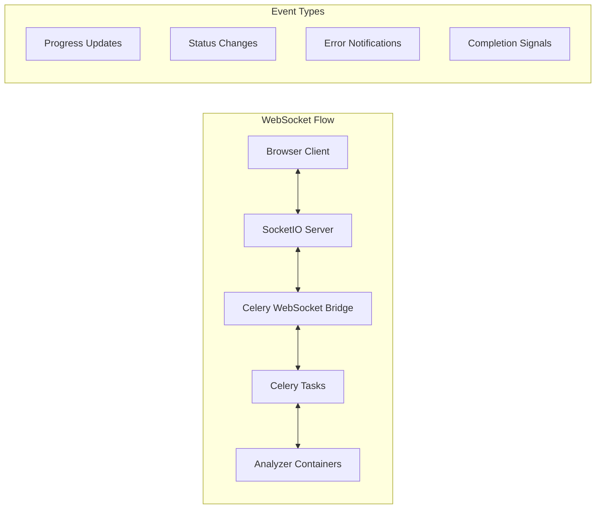

**Communication Patterns:**
- **Analysis Progress**: Real-time updates during analysis execution
- **Task Status**: Live monitoring of Celery task queue
- **System Health**: Container and service health monitoring
- **Error Handling**: Graceful degradation with HTMX fallback

### 9. Security & Authentication

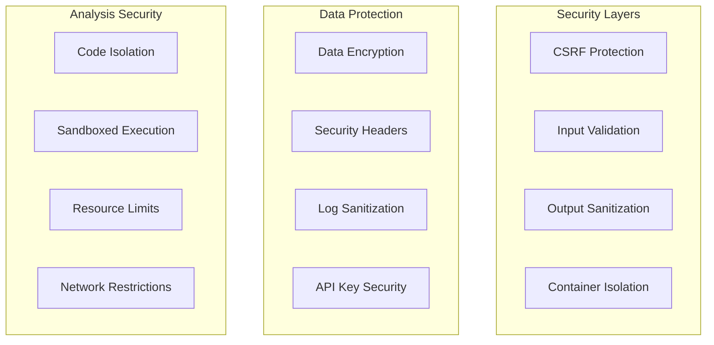

### 10. Deployment Architecture

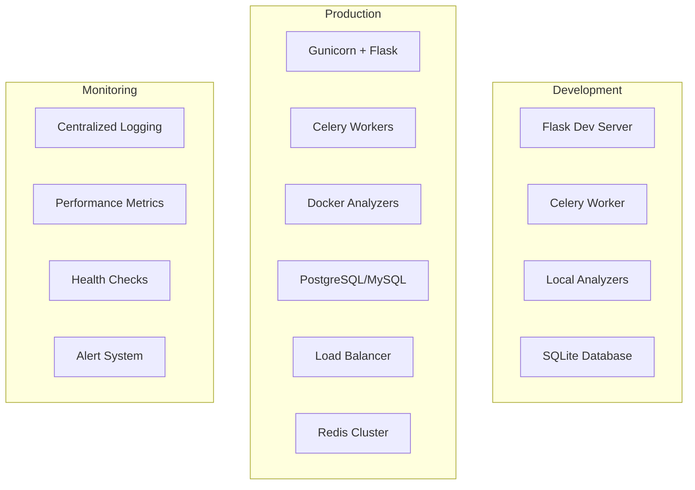

## Key Design Principles

### 1. **Microservices Architecture**
- Independent analyzer containers for scalability
- WebSocket gateway for unified communication
- Service-oriented backend design

### 2. **Progressive Enhancement**
- Server-first rendering with HTMX augmentation
- Graceful degradation without JavaScript
- Accessible design from the ground up

### 3. **Data-Driven Design**
- JSON storage for flexible analysis results
- Metadata-rich models for extensibility
- Audit trails for research reproducibility

### 4. **Real-time Capabilities**
- WebSocket integration for live updates
- Asynchronous task processing with Celery
- Event-driven architecture

### 5. **Developer Experience**
- Clear separation of concerns
- Comprehensive error handling
- Extensive logging and monitoring

### 6. **Intelligent Status Management**
- Database-cached container status with Docker sync
- Bulk refresh capabilities for manual consistency checks
- Smart polling that minimizes unnecessary Docker API calls
- Status age tracking for debugging and optimization

## Technology Stack Summary

| Layer | Technologies |
|-------|-------------|
| **Frontend** | Bootstrap 5, HTMX, Font Awesome, Jinja2 |
| **Backend** | Flask, SQLAlchemy, Celery, Redis |
| **Analysis** | Docker, WebSockets, Python analyzers |
| **Database** | SQLite (dev), PostgreSQL (prod) |
| **Infrastructure** | Docker Compose, Gunicorn, Nginx |
| **Monitoring** | Structured logging, Health checks |

## Getting Started

1. **Start Services**: `python scripts/start_services.py`
2. **Run Flask**: `python src/main.py`
3. **Start Worker**: `celery -A app.tasks worker --loglevel=info`
4. **Access UI**: `http://localhost:5000`

## Performance Characteristics

- **Analysis Throughput**: 10-50 concurrent analyses depending on container resources
- **Response Time**: < 200ms for UI interactions, real-time analysis updates
- **Scalability**: Horizontal scaling via additional analyzer containers
- **Resource Usage**: ~2GB RAM for full stack, configurable container limits

This architecture supports the platform's core mission of providing comprehensive AI model analysis with real-time feedback, scalable processing, and an intuitive user experience.