# System Architecture

> Comprehensive architectural overview of the ThesisApp AI Model Analysis Platform

---

## 📋 Table of Contents

- [System Overview](#system-overview)
- [Architecture Layers](#architecture-layers)
- [Component Details](#component-details)
- [Data Flow](#data-flow)
- [Technology Stack](#technology-stack)
- [Design Patterns](#design-patterns)
- [Deployment Architecture](#deployment-architecture)

---

## System Overview

ThesisApp is a **microservices-based platform** for generating, executing, and analyzing AI-generated applications with real-time monitoring and comprehensive multi-dimensional analysis.

### High-Level Architecture

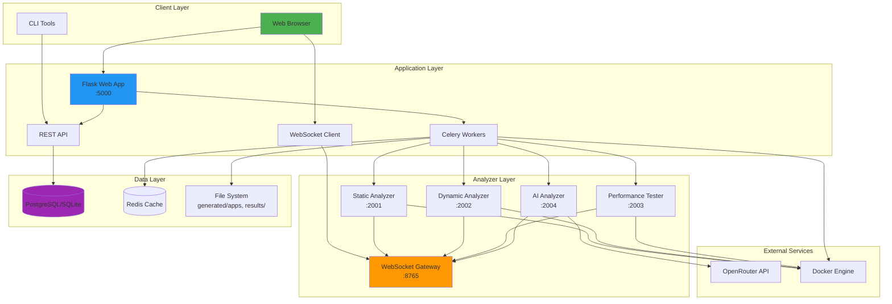

### Core Capabilities

| Capability | Description | Components |
|------------|-------------|------------|
| **Generation** | AI-powered app creation from templates | Flask, Celery, OpenRouter |
| **Execution** | Docker orchestration of generated apps | Docker Engine, Compose |
| **Analysis** | Multi-dimensional testing and review | 4 analyzer services, 15 tools |
| **Monitoring** | Real-time progress and status tracking | WebSocket Gateway, Redis |
| **Management** | App lifecycle and result management | Flask, Database, File System |

---

## Architecture Layers

### 1. Presentation Layer

**Purpose**: User interaction and visualization

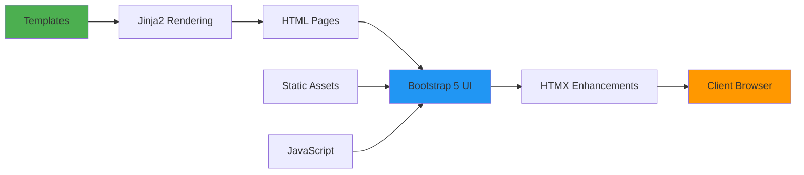

**Components**:
- **Templates**: Jinja2 templates in `src/templates/`
  - Pages: Full page templates
  - Partials: HTMX fragments for dynamic loading
  - Components: Reusable UI elements
- **Static Assets**: CSS, JavaScript, images in `src/static/`
- **UI Framework**: Bootstrap 5 (no jQuery dependency)
- **Progressive Enhancement**: HTMX for dynamic updates
- **Icons**: Font Awesome (solid style)

### 2. Application Layer

**Purpose**: Business logic and request handling

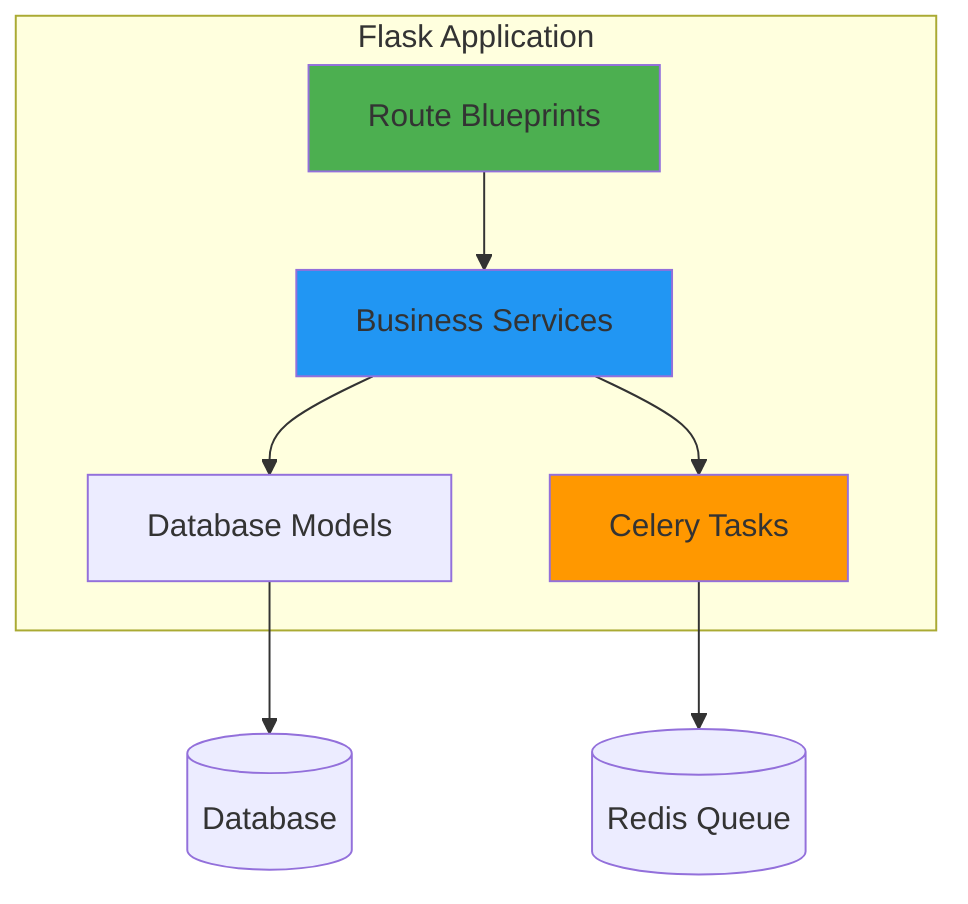

**Components**:
- **Flask App**: Main application server
  - Routes: Domain-separated blueprints
  - Middleware: Request logging, error handling
  - Extensions: SQLAlchemy, Celery, CORS
- **Services**: Business logic layer
  - `GenerationService`: App creation
  - `AnalysisService`: Test orchestration
  - `PortAllocationService`: Port management
  - `ContainerService`: Docker operations
  - `ResultsService`: Result management
- **Models**: Database entities via SQLAlchemy
  - `GeneratedApplication`
  - `AnalysisTask`
  - `ModelCapability`
  - `PortAllocation`
- **Celery Tasks**: Async job processing
  - `generate_application`: App generation
  - `analyze_application`: Analysis execution
  - Background workers for long-running operations

### 3. Analyzer Layer

**Purpose**: Specialized analysis microservices

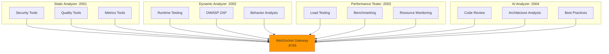

**Services**:

| Service | Port | Purpose | Tools |
|---------|------|---------|-------|
| **static-analyzer** | 2001 | Code analysis without execution | Bandit, Safety, Pylint, Flake8, ESLint, Radon, Semgrep |
| **dynamic-analyzer** | 2002 | Runtime behavior testing | OWASP ZAP, runtime monitors |
| **performance-tester** | 2003 | Load and performance testing | Locust, Apache Bench, custom load |
| **ai-analyzer** | 2004 | AI-powered code review | OpenRouter models, custom prompts |

**WebSocket Gateway** (Port 8765):
- Central hub for real-time communication
- Broadcasts progress updates from all analyzers
- Handles client subscriptions and unsubscriptions

### 4. Data Layer

**Purpose**: Persistent and transient data storage

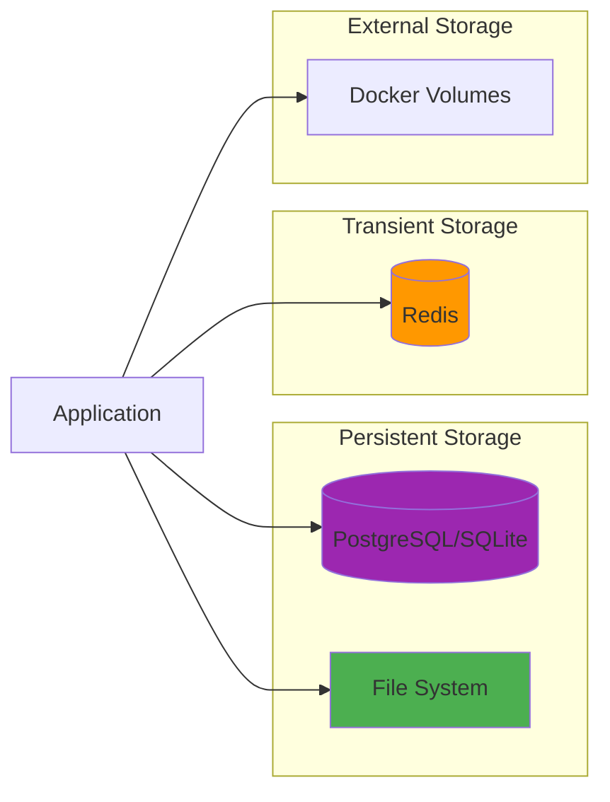

**Storage Types**:

| Storage | Type | Purpose | Example |
|---------|------|---------|---------|
| **Database** | PostgreSQL/SQLite | Structured data | Apps, tasks, results metadata |
| **File System** | Local disk | Generated apps, results | `generated/apps/`, `results/` |
| **Redis** | In-memory cache | Task queue, caching | Celery broker, status cache |
| **Docker Volumes** | Container storage | Persistent container data | Database files, logs |

---

## Component Details

### Flask Application

**Location**: `src/app/`

**Structure**:
```
app/
├── __init__.py           # App factory
├── factory.py            # Application initialization
├── extensions.py         # Flask extensions
├── routes/              # Blueprint routes
│   ├── dashboard.py
│   ├── models.py
│   ├── analysis.py
│   ├── tasks.py
│   └── api/            # API endpoints
├── services/           # Business logic
│   ├── sample_generation_service.py
│   ├── analysis_orchestrator.py
│   ├── port_allocation_service.py
│   ├── container_service.py
│   └── results_service.py
├── models/             # Database models
│   ├── application.py
│   ├── task.py
│   └── capability.py
└── tasks/              # Celery tasks
    ├── generation_tasks.py
    └── analysis_tasks.py
```

**Key Features**:
- **Factory Pattern**: App creation via `create_app()`
- **Blueprint Architecture**: Domain-separated routes
- **Service Locator**: Dependency injection for services
- **Extension Management**: Centralized extension initialization

### Analyzer Microservices

**Location**: `analyzer/services/`

**Structure**:
```
services/
├── static-analyzer/
│   ├── Dockerfile
│   ├── analyzer.py      # Main analyzer logic
│   ├── requirements.txt
│   └── tools/          # Individual tool integrations
├── dynamic-analyzer/
│   ├── Dockerfile
│   ├── analyzer.py
│   └── tools/
├── performance-tester/
│   ├── Dockerfile
│   ├── tester.py
│   └── tools/
└── ai-analyzer/
    ├── Dockerfile
    ├── analyzer.py
    └── prompts/        # AI review prompts
```

**Communication Protocol**:
```python
# WebSocket message format
{
    "type": "progress",
    "task_id": "task_20251014_143022",
    "analyzer": "static-analyzer",
    "tool": "bandit",
    "status": "running",
    "progress": 45,
    "message": "Scanning file 3 of 12"
}
```

### Tool Registry

**Location**: `src/app/services/analysis_engines.py`

**Registry Structure**:
```python
@dataclass
class ToolDefinition:
    name: str                    # Tool identifier
    container: str               # Container hosting tool
    category: str                # security, performance, quality, ai
    description: str             # Human-readable description
    requires_running_app: bool   # Needs app container running
    default_enabled: bool        # Enabled by default
    timeout_seconds: int         # Execution timeout

TOOL_REGISTRY: Dict[str, ToolDefinition] = {
    "bandit": ToolDefinition(
        name="bandit",
        container="static-analyzer",
        category="security",
        description="Python security linter",
        requires_running_app=False,
        default_enabled=True,
        timeout_seconds=60
    ),
    # ... 14 more tools
}
```

**Tool Resolution**:
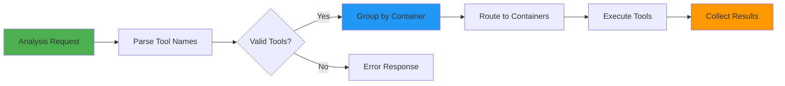

---

## Data Flow

### Application Generation Flow

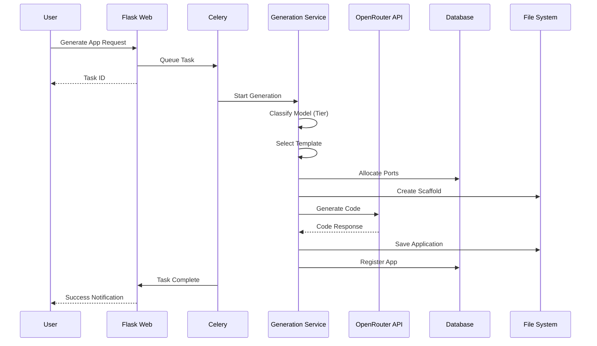

### Analysis Execution Flow

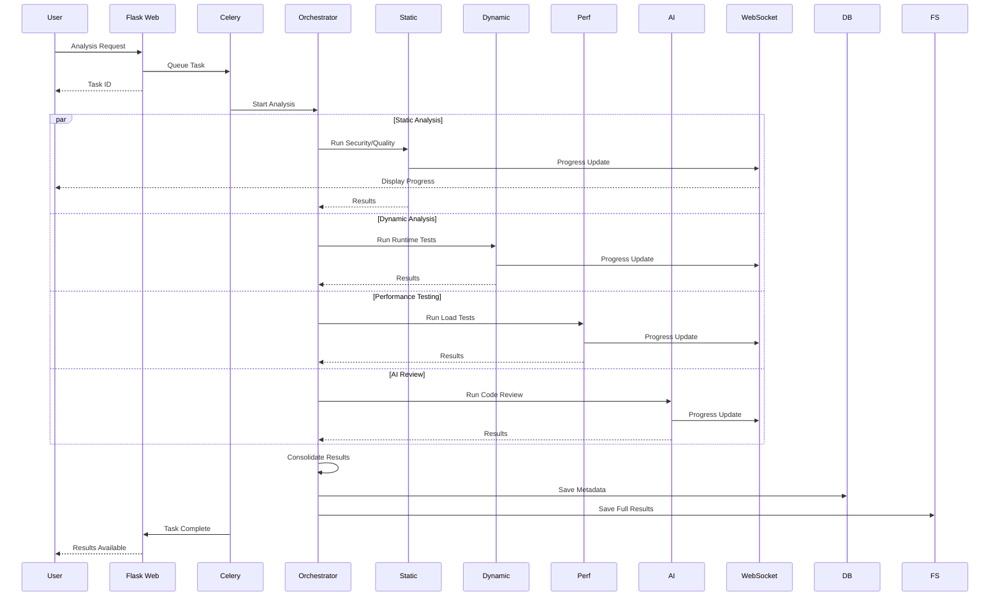

### Real-Time Progress Flow

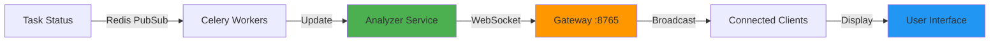

---

## Technology Stack

### Backend

| Technology | Version | Purpose |
|------------|---------|---------|
| **Python** | 3.9+ | Core language |
| **Flask** | 3.0+ | Web framework |
| **SQLAlchemy** | 2.0+ | ORM |
| **Celery** | 5.3+ | Task queue |
| **Redis** | Latest | Cache/broker |
| **PostgreSQL** | 12+ | Production database |
| **SQLite** | 3+ | Development database |

### Frontend

| Technology | Version | Purpose |
|------------|---------|---------|
| **Bootstrap** | 5.3+ | UI framework |
| **HTMX** | 1.9+ | Dynamic updates |
| **Font Awesome** | 6.0+ | Icons |
| **Jinja2** | 3.1+ | Templating |

### Infrastructure

| Technology | Version | Purpose |
|------------|---------|---------|
| **Docker** | Latest | Containerization |
| **Docker Compose** | Latest | Multi-container orchestration |
| **WebSockets** | - | Real-time communication |

### Analysis Tools

| Tool | Language | Purpose |
|------|----------|---------|
| **Bandit** | Python | Security scanning |
| **Safety** | Python | Dependency checking |
| **Pylint** | Python | Code quality |
| **Flake8** | Python | Style checking |
| **ESLint** | JavaScript | JS linting |
| **Radon** | Python | Complexity analysis |
| **Semgrep** | Multi | Pattern matching |
| **OWASP ZAP** | Java | Dynamic security |
| **Locust** | Python | Load testing |
| **Apache Bench** | C | HTTP benchmarking |

---

## Design Patterns

### 1. Factory Pattern

**Used For**: Application creation

```python
def create_app(config_name='default'):
    """Factory function for creating Flask app"""
    app = Flask(__name__)
    app.config.from_object(config[config_name])
    
    # Initialize extensions
    db.init_app(app)
    celery.config_from_object(app.config)
    
    # Register blueprints
    from app.routes import dashboard, models, analysis
    app.register_blueprint(dashboard.bp)
    app.register_blueprint(models.bp)
    app.register_blueprint(analysis.bp)
    
    return app
```

### 2. Service Locator

**Used For**: Dependency injection

```python
class ServiceLocator:
    _services = {}
    
    @classmethod
    def register(cls, name, service):
        cls._services[name] = service
    
    @classmethod
    def get(cls, name):
        return cls._services.get(name)

# Usage
ServiceLocator.register('generation', GenerationService())
gen_service = ServiceLocator.get('generation')
```

### 3. Repository Pattern

**Used For**: Data access abstraction

```python
class ApplicationRepository:
    def get_by_id(self, app_id):
        return GeneratedApplication.query.get(app_id)
    
    def get_by_model_and_number(self, model_slug, app_number):
        return GeneratedApplication.query.filter_by(
            model_slug=model_slug,
            app_number=app_number
        ).first()
    
    def list_all(self, filters=None):
        query = GeneratedApplication.query
        if filters:
            query = self._apply_filters(query, filters)
        return query.all()
```

### 4. Strategy Pattern

**Used For**: Model tier selection

```python
def get_model_capability_tier(model_slug: str) -> str:
    """Determine appropriate template tier for model"""
    
    # Strategy 1: Explicit lite list
    if model_slug in KNOWN_LITE_MODELS:
        return 'lite'
    
    # Strategy 2: Parameter count
    model = ModelCapability.query.filter_by(
        canonical_slug=model_slug
    ).first()
    
    if model and model.parameters_billions:
        if model.parameters_billions >= 30:
            return 'standard'
        else:
            return 'lite'
    
    # Strategy 3: Default
    return 'standard'
```

### 5. Observer Pattern

**Used For**: Real-time progress updates

```python
class ProgressObserver:
    def __init__(self, task_id):
        self.task_id = task_id
        self.subscribers = []
    
    def subscribe(self, callback):
        self.subscribers.append(callback)
    
    def notify(self, progress_data):
        for callback in self.subscribers:
            callback(progress_data)

# Usage
observer = ProgressObserver(task_id)
observer.subscribe(websocket_client.send)
observer.notify({"progress": 50, "message": "Halfway done"})
```

---

## Deployment Architecture

### Development Environment

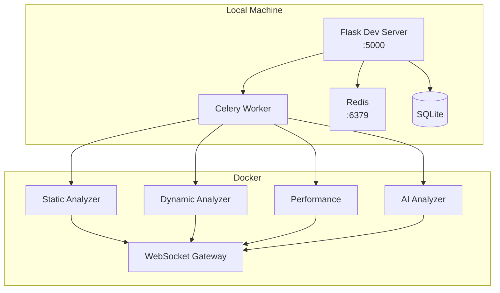

### Production Environment

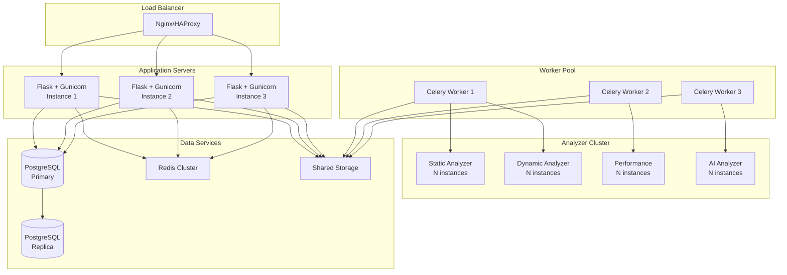

---

## Next Steps

- **[Getting Started](GETTING_STARTED.md)** - Setup and installation
- **[Features](features/)** - Detailed feature documentation
- **[Guides](guides/)** - How-to guides
- **[Reference](reference/)** - Technical reference

---

**Last Updated**: October 2025  
**Architecture Version**: 2.0
