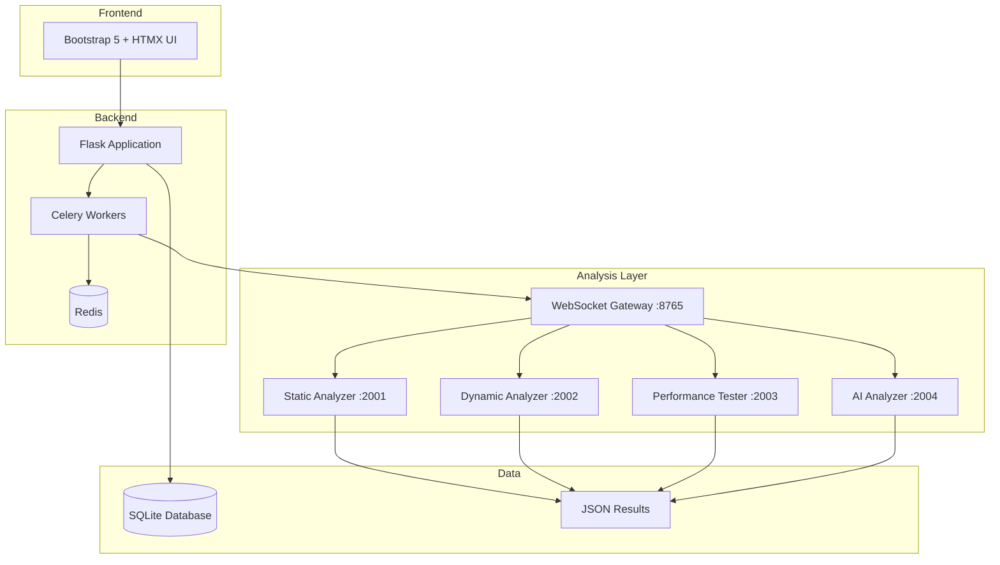

# README

ThesisApp - AI Model Analysis Platform

A comprehensive platform for analyzing AI-generated applications across multiple dimensions including security, performance, code quality, and AI-powered reviews.

## Features

- **Multi-Model Support**: Analyze applications from OpenAI, Anthropic, and other providers
- **Comprehensive Analysis**: Security scanning, performance testing, code quality checks, AI reviews
- **Real-time Monitoring**: Live progress updates and WebSocket communication
- **Intelligent Status Management**: Database-cached container status with Docker sync and bulk refresh capabilities
- **Batch Processing**: Run multiple analyses simultaneously with job management
- **Modern UI**: Bootstrap 5 + HTMX interface with progressive enhancement
- **Containerized Analyzers**: Docker-based analyzer microservices for scalability
- **REST API**: Complete API for programmatic access and integration

## Quick Start

### Prerequisites

- Python 3.9+
- Docker & Docker Compose
- Redis
- Git

### Installation

```bash
# Clone repository
git clone https://github.com/YourOrg/ThesisAppRework.git
cd ThesisAppRework

# Set up Python environment
python -m venv .venv
source .venv/bin/activate  # On Windows: .venv\Scripts\activate
pip install -r requirements.txt

# Configure environment
cp .env.example .env
# Edit .env with your configuration

# Initialize database
cd src
python init_db.py

# Start analyzer services
cd ../analyzer
docker-compose up -d

# Start the application
cd ../src
python main.py

# In another terminal, start Celery worker
cd src
celery -A app.tasks worker --loglevel=info
```

### Access

- **Web Interface**: http://localhost:5000
- **API Documentation**: http://localhost:5000/api/docs
- **Health Check**: http://localhost:5000/health

## Architecture



## Analysis Types

### Security Analysis
- **Bandit**: Python security linting
- **Safety**: Dependency vulnerability scanning  
- **ESLint**: JavaScript security rules
- **PyLint**: Python code quality

### Performance Testing
- **Locust**: Load testing framework
- Metrics: RPS, response times, error rates
- Test types: Load, stress, spike testing

### ZAP Security
- **OWASP ZAP**: Dynamic application security testing
- Spider crawling and active scanning
- Vulnerability classification and reporting

### AI Analysis
- **OpenRouter Integration**: GPT-4, Claude, and other models
- Intelligent code review and recommendations
- Security assessment and architecture feedback

## Technology Stack

| Component | Technology |
|-----------|------------|
| **Backend** | Flask, SQLAlchemy, Celery |
| **Frontend** | Bootstrap 5, HTMX, Font Awesome |
| **Database** | SQLite (dev), PostgreSQL (prod) |
| **Queue** | Redis + Celery |
| **Analyzers** | Docker containers with WebSocket |
| **Testing** | Pytest, coverage |

## Project Structure

```
ThesisAppRework/
├── src/                     # Main application
│   ├── app/                 # Flask package
│   │   ├── routes/          # Route blueprints
│   │   ├── services/        # Business logic
│   │   ├── models/          # Database models
│   │   └── tasks/           # Celery tasks
│   ├── templates/           # Jinja2 templates
│   ├── static/              # CSS, JS, images
│   └── main.py              # Application entry
├── analyzer/                # Analyzer services
│   ├── services/            # Individual analyzers
│   ├── docker-compose.yml   # Container orchestration
│   └── analyzer_manager.py  # Management CLI
├── tests/                   # Test suite
├── scripts/                 # Utility scripts
└── docs/                    # Documentation
```

## Development

### Running Tests

```bash
# Run all tests
pytest

# Run with coverage
pytest --cov=src/app tests/

# Run specific test file
pytest tests/test_analysis.py
```

### Code Quality

```bash
# Linting
flake8 src/
pylint src/app/

# Formatting
black src/
isort src/
```

### Database Management

```bash
# Create migration
cd src
flask db migrate -m "Description"

# Apply migrations  
flask db upgrade

# Reset database (dev only)
python init_db.py --reset
```

## API Usage

### Start Security Analysis

```python
import requests

response = requests.post('http://localhost:5000/api/analysis/security', json={
    'application_id': 1,
    'analysis_name': 'Security Audit',
    'tools': {
        'bandit_enabled': True,
        'safety_enabled': True,
        'eslint_enabled': True
    }
})

analysis = response.json()
print(f"Analysis ID: {analysis['analysis_id']}")
```

### Monitor Progress

```python
import websocket

def on_message(ws, message):
    data = json.loads(message)
    if data['type'] == 'progress_update':
        print(f"Progress: {data['data']['progress_percentage']}%")

ws = websocket.WebSocketApp("ws://localhost:5000/ws",
                            on_message=on_message)
ws.run_forever()
```

### Get Results

```python
analysis_id = 123
response = requests.get(f'http://localhost:5000/api/analysis/{analysis_id}/results')
results = response.json()

print(f"Total issues: {results['summary']['total_issues']}")
print(f"Critical: {results['summary']['critical_severity_count']}")
```

## Configuration

### Environment Variables

```bash
# Application
FLASK_ENV=development
DEBUG=true
HOST=127.0.0.1
PORT=5000

# Database
DATABASE_URL=sqlite:///src/data/thesis_app.db

# Celery
CELERY_BROKER_URL=redis://localhost:6379/0
CELERY_RESULT_BACKEND=redis://localhost:6379/0

# Analysis
OPENROUTER_API_KEY=your_api_key_here
DISABLED_ANALYSIS_MODELS=model1,model2
ANALYZER_AUTO_START=true

# Logging
LOG_LEVEL=INFO
```

### Analyzer Configuration

```yaml
# analyzer/docker-compose.yml
services:
  static-analyzer:
    build: ./services/static-analyzer
    ports: ["2001:2001"]
    environment:
      - LOG_LEVEL=INFO
    volumes:
      - ../generated:/app/sources:ro
      - static-results:/app/results
```

## Deployment

### Development

```bash
# Start all services
python scripts/start_services.py

# Access application
open http://localhost:5000
```

### Production

```bash
# Build containers
docker-compose build

# Start production stack
docker-compose -f docker-compose.prod.yml up -d

# Scale workers
docker-compose -f docker-compose.prod.yml up -d --scale worker=4
```

### Docker Deployment

```dockerfile
# Dockerfile
FROM python:3.9-slim

WORKDIR /app
COPY requirements.txt .
RUN pip install -r requirements.txt

COPY src/ ./src/
COPY analyzer/ ./analyzer/

EXPOSE 5000
CMD ["gunicorn", "--bind", "0.0.0.0:5000", "src.main:app"]
```

## Contributing

### Getting Started

1. Fork the repository
2. Create feature branch (`git checkout -b feature/amazing-feature`)
3. Make changes and add tests
4. Ensure tests pass (`pytest`)
5. Commit changes (`git commit -m 'Add amazing feature'`)
6. Push to branch (`git push origin feature/amazing-feature`)
7. Open Pull Request

### Code Standards

- Follow PEP 8 for Python code
- Use type hints where possible
- Write comprehensive tests
- Update documentation for new features
- Use meaningful commit messages

### Testing Requirements

- Unit tests for all new functionality
- Integration tests for API endpoints
- Maintain >90% code coverage
- All tests must pass before merging

## Documentation

- **[Architecture](docs/ARCHITECTURE.md)**: System design and components
- **[Development Guide](docs/DEVELOPMENT_GUIDE.md)**: Setup and development workflow
- **[API Reference](docs/API_REFERENCE.md)**: Complete API documentation
- **[User Guide](docs/USER_GUIDE.md)**: End-user documentation
- **[Analysis Pipeline](docs/ANALYSIS_PIPELINE.md)**: Technical analysis details
 - **[Raw Outputs Schema](docs/RAW_OUTPUTS.md)**: Structure & instrumentation of captured tool stdout/stderr

## Support

### Getting Help

- **Documentation**: Comprehensive docs in `/docs` directory
- **Issues**: GitHub Issues for bug reports and feature requests
- **Discussions**: GitHub Discussions for questions and ideas

### Common Issues

**Services not starting**: Check Docker is running and ports are available
**Analysis failing**: Verify analyzer containers are healthy
**Database errors**: Ensure proper permissions and disk space
**Performance issues**: Monitor resource usage and scale accordingly

### Troubleshooting

```bash
# Check service health
curl http://localhost:5000/health

# View logs
docker-compose logs analyzer

# Check Celery workers
celery -A app.tasks inspect active

# Database status
cd src && python -c "from app.factory import create_app; app = create_app(); print('DB OK')"
```

## License

This project is licensed under the MIT License - see the [LICENSE](LICENSE) file for details.

## Acknowledgments

- **Flask**: Web framework
- **Celery**: Distributed task queue
- **Bootstrap**: CSS framework
- **HTMX**: Dynamic HTML
- **OWASP ZAP**: Security testing
- **OpenRouter**: AI model access

---

**Version**: 1.0.0  
**Status**: Production Ready  
**Last Updated**: September 16, 2025