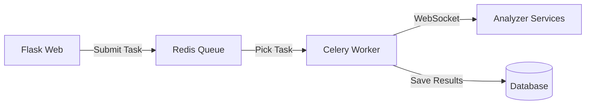

# Deployment Guide

Production deployment for ThesisAppRework.

## Deployment Options

ThesisAppRework is designed as a **Docker-first application** with Celery for distributed task processing.

| Option | Complexity | Best For |
|--------|------------|----------|
| Docker Compose | Low | **Recommended** - Production, single host |
| Kubernetes | High | Multi-server, high availability, scale |
| Single Server (Legacy) | Medium | Development only, not recommended |

## Docker Compose Deployment (Recommended)

### Requirements

- Ubuntu 22.04+ / Windows Server 2022+ / macOS
- Docker Engine 24+ with Docker Compose v2
- 4GB RAM minimum, 8GB recommended
- 50GB disk space

### Setup

```bash
# Clone repository
git clone https://github.com/GrabowMar/ThesisAppRework.git
cd ThesisAppRework

# Configure environment
cp .env.example .env
# Edit .env with production values (see below)

# Start complete stack
docker compose up -d
```

### Production Configuration

`.env` settings for production:

```bash
# Flask
FLASK_ENV=production
FLASK_DEBUG=0
SECRET_KEY=<generate-secure-random-key>

# Database
DATABASE_URL=sqlite:////app/src/data/thesis_app.db

# Celery (required for Docker deployment)
USE_CELERY_ANALYSIS=true
CELERY_BROKER_URL=redis://redis:6379/0
CELERY_RESULT_BACKEND=redis://redis:6379/0

# Logging
LOG_LEVEL=INFO

# Analyzers
ANALYZER_ENABLED=true
ANALYZER_AUTO_START=true

# Timeouts
STATIC_ANALYSIS_TIMEOUT=1800
SECURITY_ANALYSIS_TIMEOUT=1800
PERFORMANCE_TIMEOUT=1800
AI_ANALYSIS_TIMEOUT=2400

# API
OPENROUTER_API_KEY=sk-or-v1-your-key-here

# Security
REGISTRATION_ENABLED=false
SESSION_COOKIE_SECURE=true
SESSION_LIFETIME=86400
```

### Container Architecture

The Docker Compose stack includes:

| Service | Port | Purpose |
|---------|------|---------|
| **web** | 5000 | Flask web application (Gunicorn) |
| **redis** | 6379 | Celery task queue broker |
| **celery-worker** | - | Background task processor |
| **analyzer-gateway** | 8765 | WebSocket routing gateway |
| **static-analyzer** | 2001 | Static code analysis |
| **dynamic-analyzer** | 2002 | Runtime security testing |
| **performance-tester** | 2003 | Load testing |
| **ai-analyzer** | 2004 | AI-powered analysis |

### Managing Services

```bash
# View service status
docker compose ps

# View logs
docker compose logs -f web
docker compose logs -f celery-worker

# Restart specific service
docker compose restart web

# Stop all services
docker compose down

# Rebuild and restart
docker compose up -d --build

# View resource usage
docker stats
```

## Celery Task Processing

The application uses Celery with Redis for distributed task execution.

### How It Works



### Scaling Workers

```bash
# Scale to 3 Celery workers
docker compose up -d --scale celery-worker=3

# View worker status
docker compose exec web celery -A app.celery_worker.celery inspect active

# Monitor queue
docker compose exec web celery -A app.celery_worker.celery inspect stats
```

### Task Configuration

Environment variables for task control:

```bash
# Task execution
USE_CELERY_ANALYSIS=true  # Enable Celery (required in Docker)
CELERY_BROKER_URL=redis://redis:6379/0
CELERY_RESULT_BACKEND=redis://redis:6379/0

# Task timeouts
TASK_TIMEOUT=1800
TASK_POLL_INTERVAL=5
PREFLIGHT_MAX_RETRIES=3
TRANSIENT_FAILURE_MAX_RETRIES=3
```

## Nginx Reverse Proxy

`/etc/nginx/sites-available/thesisapp`:

```nginx
upstream flask {
    server 127.0.0.1:5000;
}

server {
    listen 80;
    server_name your-domain.com;

    location / {
        proxy_pass http://flask;
        proxy_set_header Host $host;
        proxy_set_header X-Real-IP $remote_addr;
        proxy_set_header X-Forwarded-For $proxy_add_x_forwarded_for;
        proxy_set_header X-Forwarded-Proto $scheme;
    }

    location /socket.io {
        proxy_pass http://flask;
        proxy_http_version 1.1;
        proxy_set_header Upgrade $http_upgrade;
        proxy_set_header Connection "upgrade";
    }

    client_max_body_size 100M;
}
```

### SSL with Certbot

```bash
sudo apt install certbot python3-certbot-nginx
sudo certbot --nginx -d your-domain.com
```

## Monitoring

### Health Checks

```bash
# Application health
curl http://localhost:5000/api/health

# Analyzer health
curl http://localhost:5000/api/health/analyzers

# CLI health check
python analyzer/analyzer_manager.py health
```

### Logging

Logs location:
- Flask: `logs/app.log`
- Analyzers: `docker compose logs <service>`

Log rotation with logrotate:

```
/opt/ThesisAppRework/logs/*.log {
    daily
    rotate 14
    compress
    missingok
    notifempty
}
```

### Metrics

Consider integrating:
- Prometheus + Grafana for metrics
- Sentry for error tracking
- ELK stack for log aggregation

## Backup

### Database

```bash
# SQLite backup
cp src/data/thesis_app.db backups/thesis_app_$(date +%Y%m%d).db
```

### Results

```bash
# Backup results directory
tar -czf backups/results_$(date +%Y%m%d).tar.gz results/
```

### Automated Backup Script

```bash
#!/bin/bash
BACKUP_DIR=/opt/backups
DATE=$(date +%Y%m%d)

# Database
cp /opt/ThesisAppRework/src/data/thesis_app.db $BACKUP_DIR/db_$DATE.db

# Results
tar -czf $BACKUP_DIR/results_$DATE.tar.gz /opt/ThesisAppRework/results/

# Cleanup old backups (keep 30 days)
find $BACKUP_DIR -mtime +30 -delete
```

## Security Checklist

- [ ] Change default `SECRET_KEY` to secure random value
- [ ] Enable HTTPS (SSL/TLS) with reverse proxy
- [ ] Configure firewall (ufw/iptables) to restrict ports
- [ ] Restrict database file permissions (chmod 600)
- [ ] Secure Docker socket access (correct GID in containers)
- [ ] Set `REGISTRATION_ENABLED=false` in production
- [ ] Set `SESSION_COOKIE_SECURE=true` with HTTPS
- [ ] Set up API rate limiting
- [ ] Enable log monitoring and rotation
- [ ] Regular security updates for base images
- [ ] Backup strategy in place (database + results)
- [ ] Secure Redis (network isolation, no public access)

## Troubleshooting

| Issue | Solution |
|-------|----------|
| Container fails to start | Check `docker compose logs <service>` |
| Database locked | Stop all processes, restart Flask |
| Out of memory | Increase container limits, add swap |
| Port conflict | Check `netstat -tlnp`, stop conflicting service |
| Analyzer timeout | Increase `*_TIMEOUT` env variables |

### Recovery Commands

```bash
# Restart all services
docker compose restart

# Rebuild specific container
docker compose up -d --build static-analyzer

# Fast incremental rebuild (30-90s, uses cache)
./start.ps1 -Mode Rebuild

# Clean rebuild (12-18min, no cache)
./start.ps1 -Mode CleanRebuild

# Fix stuck tasks
python scripts/fix_task_statuses.py

# Maintenance cleanup (7-day grace period for orphan apps)
./start.ps1 -Mode Maintenance

# Full wipeout (WARNING: removes all data)
./start.ps1 -Mode Wipeout

# Reset admin password
./start.ps1 -Mode Password
```

## Orchestrator Commands Reference

| Mode | Description |
|------|-------------|
| `Start` | Full stack: Flask + Analyzer containers |
| `Stop` | Stop all services |
| `Dev` | Development mode (Flask only) |
| `Status` | Show status dashboard |
| `Logs` | Tail Flask and analyzer logs |
| `Rebuild` | Fast incremental container rebuild |
| `CleanRebuild` | Full rebuild without cache |
| `Maintenance` | Run manual cleanup (7-day orphan grace period) |
| `Reload` | Hot reload for code changes |
| `Wipeout` | Full reset (WARNING: data loss) |
| `Password` | Reset admin password |
| `Health` | Check service health |

## Related

- [Architecture](./ARCHITECTURE.md)
- [Background Services](./BACKGROUND_SERVICES.md)
- [API Reference](./api-reference.md)
- [Development Guide](./development-guide.md)
- [Troubleshooting](./TROUBLESHOOTING.md)
