# Analysis Pipeline

> Comprehensive multi-dimensional analysis of AI-generated applications

---

## 📋 Table of Contents

- [Overview](#overview)
- [Analysis Architecture](#analysis-architecture)
- [Analysis Types](#analysis-types)
- [Tool Registry](#tool-registry)
- [Running Analysis](#running-analysis)
- [Results Format](#results-format)

---

## Overview

The ThesisApp analysis system performs comprehensive evaluation of generated applications across four dimensions:

```mermaid
graph TB
    App[Generated Application] --> Security[🛡️ Security Analysis]
    App --> Performance[⚡ Performance Testing]
    App --> Quality[🔍 Code Quality]
    App --> AI[🧠 AI Review]
    
    Security --> Results[📊 Consolidated Results]
    Performance --> Results
    Quality --> Results
    AI --> Results
    
    style App fill:#4CAF50
    style Security fill:#F44336
    style Performance fill:#FF9800
    style Quality fill:#2196F3
    style AI fill:#9C27B0
    style Results fill:#4CAF50
```



### Key Metrics

| Dimension | Tools | Metrics | Duration |
|-----------|-------|---------|----------|
| **Security** | 4 tools | Vulnerabilities, CVEs, OWASP issues | 30-60s |
| **Performance** | 3 tools | Response time, throughput, resource usage | 60-120s |
| **Code Quality** | 6 tools | Complexity, style, maintainability | 20-40s |
| **AI Review** | 2 tools | Architecture, best practices, suggestions | 40-80s |

---

## Analysis Architecture

### Microservice Design


### Execution Flow


---

## Analysis Types

### 1. Security Analysis 🛡️

**Purpose**: Identify vulnerabilities, security issues, and dependency risks

**Tools**:
- **Bandit**: Python security linter
- **Safety**: Dependency vulnerability scanner
- **Semgrep**: Pattern-based security checker
- **OWASP ZAP**: Dynamic security scanner (if running)

**Metrics**:
```json
{
  "severity": {
    "high": 2,
    "medium": 5,
    "low": 12
  },
  "categories": {
    "sql_injection": 1,
    "xss": 3,
    "insecure_crypto": 1
  },
  "vulnerable_dependencies": 2,
  "total_issues": 19
}
```

**Example Output**:
```
┌────────────────────────────────────────────────────┐
│ Security Analysis Results                           │
├────────────────────────────────────────────────────┤
│ ⚠️  High Severity:     2 issues                    │
│ ⚠️  Medium Severity:   5 issues                    │
│ ℹ️  Low Severity:      12 issues                   │
│                                                     │
│ Top Issues:                                         │
│ 1. SQL Injection risk in login endpoint            │
│ 2. Hardcoded secret key detected                   │
│ 3. Insecure password hashing (MD5)                 │
└────────────────────────────────────────────────────┘
```

### 2. Performance Testing ⚡

**Purpose**: Measure application performance under load

**Tools**:
- **Locust**: Load testing framework
- **Apache Bench (ab)**: HTTP benchmarking
- **Custom Load Tester**: Async HTTP testing

**Metrics**:
```json
{
  "response_time": {
    "p50": 45.2,
    "p95": 123.7,
    "p99": 234.1
  },
  "throughput": {
    "requests_per_second": 542.3,
    "total_requests": 10000,
    "failed_requests": 12
  },
  "resource_usage": {
    "cpu_percent": 45.2,
    "memory_mb": 234.5
  }
}
```

**Example Output**:
```
┌────────────────────────────────────────────────────┐
│ Performance Test Results                            │
├────────────────────────────────────────────────────┤
│ 📊 Requests/sec:    542.3                          │
│ ⏱️  Avg Response:    45.2ms                        │
│ 🎯 P95 Response:    123.7ms                        │
│ ❌ Failed:          12/10000 (0.12%)               │
│                                                     │
│ Resource Usage:                                     │
│ 🔧 CPU:             45.2%                          │
│ 💾 Memory:          234.5 MB                       │
└────────────────────────────────────────────────────┘
```

### 3. Code Quality 🔍

**Purpose**: Assess code maintainability, style, and complexity

**Tools**:
- **Pylint**: Python linter
- **Flake8**: Style checker
- **ESLint**: JavaScript linter
- **Radon**: Complexity analyzer
- **Bandit**: Security linter (quality aspects)
- **Custom Metrics**: LOC, file count, etc.

**Metrics**:
```json
{
  "quality_score": 7.8,
  "complexity": {
    "cyclomatic": 12.3,
    "cognitive": 15.7,
    "maintainability_index": 68.4
  },
  "style": {
    "pylint_score": 8.2,
    "issues": 23
  },
  "statistics": {
    "total_lines": 1247,
    "code_lines": 892,
    "comment_lines": 134,
    "files": 12
  }
}
```

**Example Output**:
```
┌────────────────────────────────────────────────────┐
│ Code Quality Report                                 │
├────────────────────────────────────────────────────┤
│ 🎯 Overall Score:     7.8/10                       │
│ 📊 Pylint Score:      8.2/10                       │
│ 🔄 Complexity:        Medium (12.3)                │
│ 📝 Maintainability:   68.4/100                     │
│                                                     │
│ Statistics:                                         │
│ 📄 Files:            12                            │
│ 📏 Total Lines:      1,247                         │
│ 💻 Code Lines:       892                           │
│ 💬 Comments:         134 (15%)                     │
└────────────────────────────────────────────────────┘
```

### 4. AI Review 🧠

**Purpose**: Leverage AI models to review code architecture and practices

**Tools**:
- **OpenRouter API**: Multiple model reviews
- **Custom Prompts**: Domain-specific analysis

**Metrics**:
```json
{
  "overall_rating": 8.5,
  "categories": {
    "architecture": 9.0,
    "security": 7.5,
    "performance": 8.0,
    "maintainability": 9.0
  },
  "strengths": [
    "Well-structured API design",
    "Good separation of concerns",
    "Comprehensive error handling"
  ],
  "weaknesses": [
    "Missing input validation",
    "No rate limiting",
    "Hardcoded configuration"
  ],
  "suggestions": [
    "Implement request validation middleware",
    "Add rate limiting decorator",
    "Use environment variables for config"
  ]
}
```

**Example Output**:
```
┌────────────────────────────────────────────────────┐
│ AI Review Summary                                   │
├────────────────────────────────────────────────────┤
│ ⭐ Overall Rating:    8.5/10                       │
│                                                     │
│ Strengths:                                          │
│ ✅ Well-structured API design                      │
│ ✅ Good separation of concerns                     │
│ ✅ Comprehensive error handling                    │
│                                                     │
│ Improvements:                                       │
│ 🔧 Implement request validation middleware         │
│ 🔧 Add rate limiting decorator                     │
│ 🔧 Use environment variables for config            │
└────────────────────────────────────────────────────┘
```

---

## Tool Registry

### Unified Tool System

All 15 analysis tools are managed through a unified registry:


### Tool Definitions

<details>
<summary><b>Security Tools</b></summary>

| Tool | Container | Purpose | Output |
|------|-----------|---------|--------|
| **bandit** | static-analyzer | Python security linter | JSON with issues |
| **safety** | static-analyzer | Dependency scanner | JSON with CVEs |
| **semgrep** | static-analyzer | Pattern matcher | JSON with findings |
| **owasp-zap** | dynamic-analyzer | Dynamic scanner | XML report |

</details>

<details>
<summary><b>Performance Tools</b></summary>

| Tool | Container | Purpose | Output |
|------|-----------|---------|--------|
| **locust** | performance-tester | Load testing | JSON metrics |
| **ab** | performance-tester | HTTP benchmarking | Text report |
| **load-tester** | performance-tester | Async testing | JSON metrics |

</details>

<details>
<summary><b>Quality Tools</b></summary>

| Tool | Container | Purpose | Output |
|------|-----------|---------|--------|
| **pylint** | static-analyzer | Python linter | JSON report |
| **flake8** | static-analyzer | Style checker | Text report |
| **eslint** | static-analyzer | JS linter | JSON report |
| **radon** | static-analyzer | Complexity | JSON metrics |
| **bandit** | static-analyzer | Security+Quality | JSON report |
| **metrics** | local | LOC counter | JSON stats |

</details>

<details>
<summary><b>AI Tools</b></summary>

| Tool | Container | Purpose | Output |
|------|-----------|---------|--------|
| **openrouter** | ai-analyzer | Multi-model review | JSON review |
| **custom** | ai-analyzer | Domain analysis | JSON insights |

</details>

### Tool Selection

```python
# Run all security tools
analyzer_manager.py analyze <model> <app> security

# Run specific tools
analyzer_manager.py analyze <model> <app> security --tools bandit safety

# Run all analysis types
analyzer_manager.py analyze <model> <app> all

# Run custom combination
analyzer_manager.py analyze <model> <app> custom --tools bandit pylint locust
```

---

## Running Analysis

### Web Interface

1. Navigate to application detail page
2. Click "Analyze" button
3. Select analysis types:
   - ☑ Security Analysis
   - ☑ Performance Testing
   - ☑ Code Quality
   - ☑ AI Review
4. Click "Start Analysis"
5. Monitor real-time progress
6. View results when complete

### Command Line

```bash
# Basic analysis (all types)
python analyzer/analyzer_manager.py analyze anthropic_claude-3.5-sonnet 1

# Specific type
python analyzer/analyzer_manager.py analyze anthropic_claude-3.5-sonnet 1 security

# Multiple types
python analyzer/analyzer_manager.py analyze anthropic_claude-3.5-sonnet 1 security performance

# Custom tools
python analyzer/analyzer_manager.py analyze \
  anthropic_claude-3.5-sonnet 1 \
  custom \
  --tools bandit pylint locust openrouter

# With options
python analyzer/analyzer_manager.py analyze \
  --model anthropic_claude-3.5-sonnet \
  --app 1 \
  --type security \
  --timeout 600 \
  --force  # Overwrite existing results
```

### Batch Analysis

Create `batch_analysis.json`:

```json
{
  "analyses": [
    {
      "model": "anthropic_claude-3.5-sonnet",
      "app": 1,
      "types": ["security", "performance"]
    },
    {
      "model": "openai_gpt-4",
      "app": 1,
      "types": ["all"]
    }
  ],
  "options": {
    "parallel": true,
    "max_workers": 4,
    "timeout": 600
  }
}
```

Run batch:
```bash
python analyzer/analyzer_manager.py batch-analyze batch_analysis.json
```

---

## Results Format

### Directory Structure

```
results/
└── <model_slug>/
    └── app<N>/
        ├── metadata.json                    # App metadata
        └── analysis/
            ├── task_20251014_143022.json   # Consolidated results
            ├── security_results.json        # Security-specific
            ├── performance_results.json     # Performance-specific
            ├── quality_results.json         # Quality-specific
            └── ai_review_results.json       # AI review
```

### Consolidated Results

```json
{
  "task_id": "task_20251014_143022",
  "model_slug": "anthropic_claude-3.5-sonnet",
  "app_number": 1,
  "timestamp": "2025-10-14T14:30:22.123456",
  "status": "completed",
  "duration_seconds": 187.5,
  
  "summary": {
    "security": {
      "status": "completed",
      "issues": 19,
      "severity_breakdown": {
        "high": 2,
        "medium": 5,
        "low": 12
      }
    },
    "performance": {
      "status": "completed",
      "requests_per_second": 542.3,
      "avg_response_ms": 45.2,
      "failed_percent": 0.12
    },
    "quality": {
      "status": "completed",
      "score": 7.8,
      "issues": 23
    },
    "ai_review": {
      "status": "completed",
      "rating": 8.5
    }
  },
  
  "raw_outputs": {
    "security": {
      "bandit": { /* tool output */ },
      "safety": { /* tool output */ }
    },
    "performance": {
      "locust": { /* tool output */ },
      "ab": { /* tool output */ }
    },
    "quality": {
      "pylint": { /* tool output */ },
      "flake8": { /* tool output */ }
    },
    "ai_review": {
      "openrouter": { /* tool output */ }
    }
  }
}
```

### Accessing Results

```python
# Python API
from src.app.services.results_service import ResultsService

results = ResultsService.get_latest_results(
    model_slug="anthropic_claude-3.5-sonnet",
    app_number=1
)

# CLI
python analyzer/analyzer_manager.py results \
  --model anthropic_claude-3.5-sonnet \
  --app 1 \
  --format json  # or csv, html
```

---

## Advanced Features

### Custom Analyzers

Add custom analysis tools:

```python
# analyzer/services/custom_analyzer/analyzer.py

class CustomAnalyzer:
    def analyze(self, app_path):
        """Custom analysis logic"""
        results = {
            "status": "completed",
            "metrics": {},
            "issues": []
        }
        return results
```

Register in tool registry:

```python
# src/app/services/analysis_engines.py

TOOL_REGISTRY["custom_tool"] = ToolDefinition(
    name="custom_tool",
    container="custom-analyzer",
    category="custom",
    description="Custom analysis tool"
)
```

### Analysis Hooks

Customize analysis behavior:

```python
# src/app/tasks/analysis_tasks.py

def pre_analysis_hook(model, app_num, analysis_type):
    """Called before analysis starts"""
    # Your custom logic
    pass

def post_analysis_hook(results):
    """Called after analysis completes"""
    # Your custom logic (e.g., send notifications)
    pass
```

### Result Transformers

Transform results for different formats:

```python
# Export to CSV
python analyzer/analyzer_manager.py results \
  --model anthropic_claude-3.5-sonnet \
  --app 1 \
  --format csv \
  --output report.csv

# Export to HTML
python analyzer/analyzer_manager.py results \
  --model anthropic_claude-3.5-sonnet \
  --app 1 \
  --format html \
  --output report.html
```

---

## Troubleshooting

<details>
<summary><b>Analysis Timeout</b></summary>

**Issue**: Analysis exceeds timeout limit

**Solutions**:
```bash
# Increase timeout
python analyzer/analyzer_manager.py analyze \
  --timeout 900 \
  anthropic_claude-3.5-sonnet 1

# Or in .env
ANALYZER_TIMEOUT=900
```

</details>

<details>
<summary><b>Container Not Responding</b></summary>

**Issue**: Analyzer service not reachable

**Solutions**:
```bash
# Check container status
cd analyzer
docker-compose ps

# Restart specific service
docker-compose restart static-analyzer

# Check logs
docker-compose logs static-analyzer

# Rebuild if needed
docker-compose build --no-cache static-analyzer
docker-compose up -d
```

</details>

<details>
<summary><b>Incomplete Results</b></summary>

**Issue**: Some tools didn't run or failed

**Check**:
1. View task logs in web UI
2. Check analyzer logs:
```bash
python analyzer/analyzer_manager.py logs static-analyzer 100
```

3. Verify tool availability:
```bash
# Check tool registry
python -c "from src.app.services.analysis_engines import TOOL_REGISTRY; print(TOOL_REGISTRY)"
```

</details>

---

## Next Steps

- **[Container Management](CONTAINERS.md)** - Manage running applications
- **[Results Analysis](../guides/ANALYZING_RESULTS.md)** - Interpret analysis data
- **[Custom Analyzers](../guides/CUSTOM_ANALYZERS.md)** - Build custom analysis tools

---

**Last Updated**: October 2025
