# Application Generation System

> Comprehensive guide to AI-powered application generation with multi-tier template support

---

## 📋 Table of Contents

- [Overview](#overview)
- [Generation Workflow](#generation-workflow)
- [Template System](#template-system)
- [Multi-Tier Support](#multi-tier-support)
- [Port Allocation](#port-allocation)
- [Generation Options](#generation-options)

---

## Overview

The ThesisApp generation system creates full-stack applications using AI models and structured templates. It supports:

- ✅ **60+ Templates**: 30 backend (Flask) + 30 frontend (React)
- ✅ **Multi-Tier System**: Adaptive templates for different model capabilities
- ✅ **Automatic Scaffolding**: Docker, configs, and boilerplate
- ✅ **Port Management**: Automatic unique port allocation
- ✅ **Real-time Progress**: WebSocket updates during generation

---

## Generation Workflow


### Generation Phases

| Phase | Duration | Description |
|-------|----------|-------------|
| **1. Setup** | 1-2s | Model classification, template selection |
| **2. Scaffolding** | 2-3s | Create directory structure, copy templates |
| **3. Port Allocation** | <1s | Assign unique backend/frontend ports |
| **4. Code Generation** | 30-120s | AI generates application code |
| **5. Post-Processing** | 2-5s | Port substitution, validation |
| **6. Registration** | <1s | Save to database |

---

## Template System

### Template Structure

Templates are organized by application type and tier:

```
misc/
├── app_templates/              # Standard tier (30B+ params)
│   ├── app_1_backend_login.md
│   ├── app_1_frontend_login.md
│   ├── app_2_backend_todo.md
│   ├── app_2_frontend_todo.md
│   └── ... (60 total)
│
├── app_templates_lite/         # Lite tier (<30B params)
│   ├── app_1_backend_login.md
│   ├── app_1_frontend_login.md
│   └── ... (60 total)
│
└── code_templates/             # Scaffolding templates
    ├── backend/
    │   ├── app.py.template
    │   ├── Dockerfile.template
    │   ├── requirements.txt.template
    │   └── .env.example.template
    └── frontend/
        ├── src/App.jsx.template
        ├── Dockerfile.template
        ├── package.json.template
        └── vite.config.js.template
```

### Template Format

Templates use markdown with structured sections:

```markdown
# Goal: Generate a [Feature] Application

## Persona
You are an expert full-stack developer specializing in:
- Flask API development
- React component architecture
- Database design
- Security best practices

## Task
Generate a complete [Feature] application with:
- Backend API (Flask + SQLAlchemy)
- Frontend UI (React + Vite)
- Docker orchestration
- Production-ready configuration

## Requirements
### Backend (Flask)
- **Scale Target**: 300-500 lines
- **Database**: SQLite with SQLAlchemy ORM
- **Authentication**: JWT-based auth
- **API Design**: RESTful endpoints
- **Error Handling**: Comprehensive error responses

### Frontend (React)
- **Scale Target**: 400-600 lines
- **State Management**: React hooks (useState, useEffect)
- **HTTP Client**: Axios for API calls
- **UI Framework**: Modern responsive design
- **Error Handling**: User-friendly error messages

## Procedural Workflow
### STEP 1: Imports & Configuration (30-40 lines)
```python
from flask import Flask, jsonify, request
from flask_sqlalchemy import SQLAlchemy
# ... specific imports
```

### STEP 2: Database Models (40-60 lines)
# Define models here

### STEP 3: API Endpoints (150-250 lines)
# Implement routes

## Validation Checklist
- [ ] All imports at top of file
- [ ] Database models properly defined
- [ ] All endpoints implemented
- [ ] Error handling in place
- [ ] CORS configured
- [ ] App runs without errors
```

### Available Templates

<details>
<summary><b>Backend Templates (30)</b></summary>

| ID | Name | Description | Lines |
|----|------|-------------|-------|
| 1 | Login | Authentication system | 300-400 |
| 2 | Todo | Task management | 300-400 |
| 3 | Blog | Content management | 400-500 |
| 4 | Notes | Note-taking app | 300-400 |
| 5 | Cart | Shopping cart | 400-500 |
| 6 | Chat | Real-time messaging | 400-500 |
| 7 | Gallery | Image management | 400-500 |
| 8 | Poll | Voting system | 300-400 |
| 9 | Bookmarks | Link management | 300-400 |
| 10 | Expense | Expense tracking | 400-500 |
| ... | ... | ... | ... |

</details>

<details>
<summary><b>Frontend Templates (30)</b></summary>

| ID | Name | Description | Lines |
|----|------|-------------|-------|
| 1 | Login | Login/Register UI | 400-500 |
| 2 | Todo | Task list UI | 400-500 |
| 3 | Blog | Blog reader UI | 500-600 |
| 4 | Notes | Note editor UI | 400-500 |
| 5 | Cart | Shopping UI | 500-600 |
| 6 | Chat | Chat interface | 500-600 |
| 7 | Gallery | Image gallery | 500-600 |
| 8 | Poll | Voting UI | 400-500 |
| 9 | Bookmarks | Bookmark manager | 400-500 |
| 10 | Expense | Expense dashboard | 500-600 |
| ... | ... | ... | ... |

</details>

---

## Multi-Tier Support

### Why Multi-Tier?

Different AI models have different capabilities. The system automatically adapts:

```mermaid
graph LR
    A[Model Selected] --> B{Check Parameters}
    B -->|≥30B params| C[Standard Template]
    B -->|<30B params| D[Lite Template]
    
    C --> E[Complex Architecture]
    D --> F[Simplified Structure]
    
    E --> G[700+ lines]
    F --> H[400+ lines]
    
    style A fill:#4CAF50
    style C fill:#2196F3
    style D fill:#FF9800
    style G fill:#4CAF50
    style H fill:#FFA502
```



### Model Classification

Models are automatically classified based on:

1. **Parameter Count** (primary)
2. **Known Performance** (override list)

```python
# Tier: Standard (30B+ parameters)
✓ claude-3.5-sonnet (200B+ parameters)
✓ gpt-4 (1.76T parameters)
✓ llama-3.1-70b (70B parameters)
✓ gemini-1.5-pro (>100B parameters)

# Tier: Lite (<30B parameters)
✓ llama-4-scout-17b (17B parameters)
✓ mistral-7b (7B parameters)
✓ gemma-7b (7B parameters)
✓ phi-3-mini (3.8B parameters)
```

### Template Differences

| Aspect | Standard Templates | Lite Templates |
|--------|-------------------|----------------|
| **Instructions** | Architectural guidance | Step-by-step procedural |
| **Complexity** | Multi-file, modular | Single-file, linear |
| **Scale** | 700+ lines | 400+ lines |
| **Validation** | Implicit expectations | Explicit checkpoints |
| **Freedom** | High creative freedom | Prescriptive structure |

#### Standard Template Example

```markdown
## Requirements
- Implement a RESTful API with proper separation of concerns
- Use SQLAlchemy for database operations
- Follow Flask best practices
- Ensure proper error handling

## Guidance
- Structure your code with clear separation between routes, models, and business logic
- Use decorators for authentication and validation
- Implement comprehensive logging
```

#### Lite Template Example

```markdown
## STEP 1: Imports (Lines 1-30)
```python
from flask import Flask, jsonify, request
from flask_sqlalchemy import SQLAlchemy
app = Flask(__name__)
app.config['SQLALCHEMY_DATABASE_URI'] = 'sqlite:///app.db'
db = SQLAlchemy(app)
```
✓ Checkpoint: All imports at top, app initialized

## STEP 2: Models (Lines 31-60)
```python
class User(db.Model):
    id = db.Column(db.Integer, primary_key=True)
    # YOUR CODE HERE
```
✓ Checkpoint: User model defined

## STEP 3: Routes (Lines 61-150)
# Implement /api/login, /api/register
✓ Checkpoint: All endpoints working
```

---

## Port Allocation

### Automatic Port Management

Every generated application receives unique ports automatically:


### Port Ranges

| Service | Range | Example |
|---------|-------|---------|
| **Backend** | 5001-5999 | `anthropic/app1: 5001` |
| **Frontend** | 8001-8999 | `anthropic/app1: 8001` |

### Port Substitution

Templates use placeholders that are automatically replaced:

```python
# Template: app.py.template
app.run(host='0.0.0.0', port={{backend_port}}, debug=True)

# Generated: anthropic_claude-3.5-sonnet/app1/backend/app.py
app.run(host='0.0.0.0', port=5001, debug=True)
```

```javascript
// Template: App.jsx.template
const API_URL = 'http://localhost:{{backend_port}}';

// Generated: anthropic_claude-3.5-sonnet/app1/frontend/src/App.jsx
const API_URL = 'http://localhost:5001';
```

### Port Management CLI

```bash
# List all allocations
python scripts/port_manager.py list

# Check specific model
python scripts/port_manager.py check anthropic_claude-3.5-sonnet

# View statistics
python scripts/port_manager.py stats

# Release ports (dangerous!)
python scripts/port_manager.py release anthropic_claude-3.5-sonnet 1
```

---

## Generation Options

### Web Interface

Navigate to `/sample-generator` and configure:

```
┌─────────────────────────────────────────┐
│  Generation Configuration                │
├─────────────────────────────────────────┤
│  ○ Single Model    ○ Multiple   ○ All   │
│  [Select Model ▼]                        │
│                                          │
│  ○ Single Template ○ Multiple   ○ All   │
│  [Select Template ▼]                     │
│                                          │
│  Options:                                │
│  ☑ Create Backup Files (.bak)           │
│  ☐ Regenerate Existing                  │
│  Timeout: [300] seconds                  │
│  Workers: [4]                            │
│                                          │
│  [Preview]  [Generate]                   │
└─────────────────────────────────────────┘
```

### CLI Options

```bash
# Basic generation
python analyzer/analyzer_manager.py generate <model> <app_num>

# With options
python analyzer/analyzer_manager.py generate \
  --model anthropic_claude-3.5-sonnet \
  --app 1 \
  --template 5 \
  --timeout 300 \
  --force  # Regenerate if exists

# Batch generation
python analyzer/analyzer_manager.py batch batch_config.json
```

### Batch Configuration

Create `batch_config.json`:

```json
[
  ["anthropic_claude-3.5-sonnet", 1],
  ["anthropic_claude-3.5-sonnet", 2],
  ["openai_gpt-4", 1],
  ["google_gemini-2.0-flash-exp", 1]
]
```

Run batch:
```bash
python analyzer/analyzer_manager.py batch batch_config.json
```

---

## Advanced Features

### Custom Templates

Create custom templates in `misc/app_templates/`:

```markdown
# Goal: Your Custom Goal

## Persona
Expert in your domain

## Task
Generate your specific application

## Requirements
- Specific requirement 1
- Specific requirement 2

## Output Format
```python
# Your code structure
```
```

### Template Variables

Available placeholders:

| Variable | Example Value | Usage |
|----------|---------------|-------|
| `{{backend_port}}` | `5001` | Backend server port |
| `{{frontend_port}}` | `8001` | Frontend dev server port |
| `{{port}}` | `5001` or `8001` | Context-dependent |
| `{{python_version}}` | `3.12` | Python version |
| `{{node_version}}` | `20` | Node.js version |

### Generation Hooks

Customize generation behavior:

```python
# src/app/services/sample_generation_service.py

def pre_generation_hook(self, model, app_num, template):
    """Called before generation starts"""
    # Your custom logic
    pass

def post_generation_hook(self, result):
    """Called after generation completes"""
    # Your custom logic
    pass
```

---

## Troubleshooting

<details>
<summary><b>Generation Timeout</b></summary>

**Issue**: Generation exceeds timeout limit

**Solutions**:
```bash
# Increase timeout
python analyzer/analyzer_manager.py generate \
  --timeout 600 \
  anthropic_claude-3.5-sonnet 1

# Or in .env
GENERATION_TIMEOUT=600
```

</details>

<details>
<summary><b>Port Conflicts</b></summary>

**Issue**: Generated app port already in use

**Solutions**:
```bash
# Check port allocation
python scripts/port_manager.py check <model>

# Release specific ports
python scripts/port_manager.py release <model> <app_num>

# Regenerate with new ports
python analyzer/analyzer_manager.py generate --force <model> <app_num>
```

</details>

<details>
<summary><b>Incomplete Generated Code</b></summary>

**Issue**: Generated app has missing functions or TODO comments

**Likely Causes**:
- Small model (<30B parameters) using standard template
- Template mismatch
- API timeout

**Solutions**:
1. Verify model tier classification:
```bash
python -c "from src.app.services.sample_generation_service import get_model_capability_tier; print(get_model_capability_tier('your_model'))"
```

2. Force lite template usage:
```python
# Temporarily add to lite list in sample_generation_service.py
KNOWN_LITE_MODELS = ["your_model"]
```

3. Increase timeout and retry

</details>

---

## Next Steps

- **[Run Analysis](ANALYSIS.md)** - Analyze generated applications
- **[Manage Applications](../guides/MANAGING_APPS.md)** - Control app lifecycle
- **[Template Development](../guides/TEMPLATE_DEVELOPMENT.md)** - Create custom templates

---

**Last Updated**: October 2025
