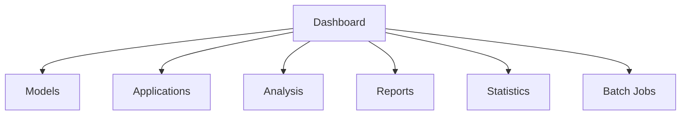

# User Guide

Complete guide for using the ThesisApp platform to analyze AI-generated applications.

## Getting Started

### What is ThesisApp?

ThesisApp is a comprehensive platform for analyzing AI-generated applications across multiple dimensions including security, performance, code quality, and AI-powered reviews. The platform supports various AI models and provides detailed insights into the quality and characteristics of generated code.

### Key Features

- **Multi-Model Support**: Analyze applications from OpenAI, Anthropic, and other providers
- **Comprehensive Analysis**: Security scanning, performance testing, code quality checks
- **Real-time Monitoring**: Live progress updates during analysis execution
- **Batch Processing**: Run multiple analyses simultaneously
- **Interactive Dashboard**: Modern web interface with real-time updates
- **Detailed Reports**: Export analysis results in various formats

### System Requirements

- **Web Browser**: Modern browser with JavaScript enabled (Chrome, Firefox, Safari, Edge)
- **Network**: Internet connection for model synchronization and AI analysis
- **Optional**: Docker for running local analyzer services

## Dashboard Overview

### Main Navigation

The platform is organized into several main sections:



**Dashboard**: Overview of system status and recent activity
**Models**: Browse and manage AI models
**Applications**: View generated applications and their details
**Analysis**: Start and monitor analysis jobs
**Reports**: View and export analysis results
**Statistics**: Platform usage and performance metrics
**Batch Jobs**: Manage large-scale analysis operations

## Working with Models

### Model Browser

The Models page displays all available AI models with their capabilities and status.

**Model Information Includes:**
- Provider (OpenAI, Anthropic, etc.)
- Model name and version
- Context window size
- Pricing information
- Capability flags (function calling, vision, etc.)
- Installation status

### Model Filters

Use the sidebar filters to find specific models:
- **Provider**: Filter by AI provider
- **Free Models**: Show only free models
- **Installed**: Show models with local applications
- **Capabilities**: Filter by specific features

### Model Details

Click on any model card to view detailed information:
- Complete capability matrix
- Pricing breakdown
- Associated generated applications
- Analysis history
- Performance metrics

## Managing Applications

### Application Overview

The Applications page shows all AI-generated applications in the system.

**Application Information:**
- Model used for generation
- Application number and type
- Generation status
- Available components (backend/frontend)
- Container status with timestamp tracking
- Port assignments

### Application Status Management

The system provides intelligent status tracking for all applications:

**Status Types:**
- **🟢 Running**: Containers are active and application is accessible
- **🔴 Stopped**: Containers exist but are not running
- **⚪ Not Created**: Docker Compose file exists but containers haven't been built
- **🔴 No Compose**: Missing docker-compose.yml file
- **❓ Unknown**: Status is being determined

**Status Accuracy Features:**
- **Database Cache**: Status is stored in database for fast display
- **Docker Sync**: Regular checks ensure accuracy with actual container state
- **Age Tracking**: Tooltips show when status was last verified
- **Fresh Status**: Recent checks (< 5 minutes) are considered reliable

**Manual Status Refresh:**
If you notice status inconsistencies:

1. **Individual Refresh**: Click any application's status to check Docker state
2. **Bulk Refresh**: Click the "Refresh All Statuses" button (🔄) in the toolbar
3. **Automatic Updates**: Status updates automatically when starting/stopping containers

**Status Troubleshooting:**

*Container shows "Running" but app isn't accessible:*
- Click the bulk refresh button to sync with Docker
- Check if containers actually exist with `docker ps`
- Verify port availability

*Status seems outdated:*
- Hover over status badge to see last check time
- Use bulk refresh to force update from Docker
- Check Docker daemon connectivity

### Starting Applications

To run a generated application:

1. Navigate to the Applications page
2. Find the desired application
3. Click **Start** in the Actions column
4. Wait for containers to initialize
5. Access the application via provided links

**Container Management:**
- **Start**: Launch application containers
- **Stop**: Shutdown running containers
- **Restart**: Restart containers
- **Logs**: View container logs

### Application Details

Click on an application to view:
- Generated code structure
- Container configuration
- Port mappings
- Analysis history
- Performance metrics

## Running Analysis

### Security Analysis

Security analysis examines code for vulnerabilities and security issues.

**To Start Security Analysis:**

1. Go to Analysis → Security
2. Select target application
3. Configure analysis tools:
   - **Bandit**: Python security linter
   - **Safety**: Dependency vulnerability scanner
   - **ESLint**: JavaScript security rules
   - **PyLint**: Python code quality
4. Set analysis parameters:
   - Severity threshold
   - Maximum issues per tool
   - Timeout duration
5. Click **Start Analysis**

**Security Analysis Results:**
- Total issues found
- Severity breakdown
- Detailed findings per tool
- Remediation recommendations

### Performance Testing

Performance testing evaluates application responsiveness and scalability.

**To Start Performance Test:**

1. Go to Analysis → Performance
2. Select target application
3. Configure test parameters:
   - **Test Type**: Load, stress, or spike testing
   - **Users**: Number of concurrent users
   - **Duration**: Test duration in seconds
   - **Spawn Rate**: User ramp-up rate
4. Click **Start Test**

**Performance Results:**
- Requests per second
- Response time percentiles
- Error rates
- Resource utilization

### ZAP Security Scanning

OWASP ZAP provides dynamic application security testing.

**To Start ZAP Scan:**

1. Go to Analysis → ZAP Security
2. Enter target application URL
3. Configure scan settings:
   - **Scan Type**: Active or passive scanning
   - **Spider Depth**: How deep to crawl
   - **Scan Duration**: Maximum scan time
4. Click **Start Scan**

**ZAP Results:**
- Risk level breakdown
- Vulnerability details
- Attack vectors identified
- Remediation guidance

### AI Analysis

AI-powered code review using advanced language models.

**To Start AI Analysis:**

1. Go to Analysis → AI Review
2. Select target application
3. Choose analyzer model (GPT-4, Claude, etc.)
4. Customize analysis prompt (optional)
5. Click **Start Analysis**

**AI Analysis Results:**
- Overall code quality score
- Security assessment
- Maintainability rating
- Improvement suggestions
- Code architecture feedback

## Monitoring Analysis Progress

### Real-time Updates

All analyses provide real-time progress updates:

**Progress Indicators:**
- Current analysis step
- Percentage complete
- Estimated time remaining
- Tool-specific progress

**Status Types:**
- **Pending**: Analysis queued for execution
- **Running**: Analysis in progress
- **Completed**: Analysis finished successfully
- **Failed**: Analysis encountered errors
- **Cancelled**: Analysis stopped by user

### Analysis Dashboard

The Analysis Dashboard shows:
- All active analyses
- Recent completions
- System resource usage
- Queue status

## Batch Operations

### Creating Batch Jobs

For analyzing multiple applications simultaneously:

1. Go to Batch → New Batch Job
2. Configure batch parameters:
   - **Job Name**: Descriptive name for the batch
   - **Analysis Types**: Select which analyses to run
   - **Model Filter**: Target specific models
   - **Application Filter**: Select applications by number
3. Set execution options:
   - **Parallel Execution**: Run analyses concurrently
   - **Timeout**: Maximum time per analysis
   - **Priority**: Job priority level
4. Click **Create Batch Job**

### Monitoring Batch Progress

The Batch Jobs page displays:
- Overall batch progress
- Individual task status
- Failed task details
- Resource utilization
- Estimated completion time

### Batch Results

Once complete, batch jobs provide:
- Summary statistics
- Aggregated results
- Comparison matrices
- Export options

## Viewing Reports

### Analysis Reports

Individual analysis reports include:

**Executive Summary:**
- Key findings
- Risk assessment
- Recommendations

**Detailed Results:**
- Tool-specific findings
- Code snippets with issues
- Severity classifications
- Remediation steps

**Technical Details:**
- Configuration used
- Execution timeline
- Resource consumption
- Error logs (if any)

### Comparative Reports

Compare results across:
- Different models
- Multiple applications
- Various analysis types
- Time periods

### Export Options

Reports can be exported as:
- **PDF**: Formatted report document
- **JSON**: Raw data for further processing
- **CSV**: Tabular data for spreadsheet analysis
- **HTML**: Interactive web report

## Sample Generation

### Code Generation

Generate new code samples using AI models:

1. Go to Sample Generation
2. Select AI model
3. Specify application requirements:
   - **Framework**: Backend/frontend frameworks
   - **Features**: Required functionality
   - **Complexity**: Simple to advanced
4. Click **Generate**

### Generation Results

Generated samples include:
- Complete application code
- Documentation
- Setup instructions
- Configuration files

### Generation History

Track all generation requests:
- Success/failure rates
- Generation time
- Model performance
- Popular templates

## System Administration

### Health Monitoring

The System Status page shows:
- Service health (Flask, Celery, Analyzers)
- Resource utilization
- Active connections
- Error rates

### Configuration

**Analysis Settings:**
- Default timeouts
- Resource limits
- Tool configurations
- Model preferences

**System Settings:**
- Logging levels
- Cache settings
- Rate limits
- Security options

### Maintenance

**Regular Tasks:**
- Log rotation
- Database cleanup
- Cache clearing
- Container updates

## Troubleshooting

### Common Issues

**Analysis Not Starting:**
- Check application status
- Verify analyzer services are running
- Review error logs
- Check resource availability

**Slow Performance:**
- Monitor system resources
- Check network connectivity
- Review concurrent analysis limits
- Examine database performance

**Container Issues:**
- Verify Docker is running
- Check port conflicts
- Review container logs
- Restart services if needed

### Getting Help

**Log Files:**
- Application logs: `logs/app.log`
- Celery logs: `logs/celery_worker.log`
- Analyzer logs: Available through UI

**Health Checks:**
- System health: `/health` endpoint
- Service status: Analysis dashboard
- Container status: Applications page

**Support Channels:**
- Documentation: Platform help section
- Error reports: Built-in error reporting
- System logs: Comprehensive logging

### Performance Tips

**Optimal Usage:**
- Run analyses during off-peak hours
- Use batch jobs for multiple analyses
- Monitor resource usage
- Clean up old results regularly

**Resource Management:**
- Limit concurrent analyses
- Use appropriate timeout values
- Monitor disk space
- Regular maintenance

## API Access

### REST API

The platform provides a comprehensive REST API for programmatic access:

**Authentication:**
- Session-based (web UI)
- API key authentication (programmatic)

**Endpoints:**
- Model management: `/api/models/`
- Application control: `/api/applications/`
- Analysis operations: `/api/analysis/`
- Batch management: `/api/batch/`

### WebSocket API

Real-time updates via WebSocket:
- Analysis progress
- System status
- Live metrics

**Connection:**
```javascript
const ws = new WebSocket('ws://localhost:5000/ws');
ws.onmessage = function(event) {
    const data = JSON.parse(event.data);
    // Handle real-time updates
};
```

## Best Practices

### Security

- Keep API keys secure
- Regular security scans
- Monitor access logs
- Update dependencies

### Performance

- Optimize analysis configurations
- Use appropriate batch sizes
- Monitor resource usage
- Regular maintenance

### Data Management

- Regular backups
- Clean old results
- Monitor disk usage
- Archive completed projects

This user guide provides comprehensive coverage of all platform features and capabilities.